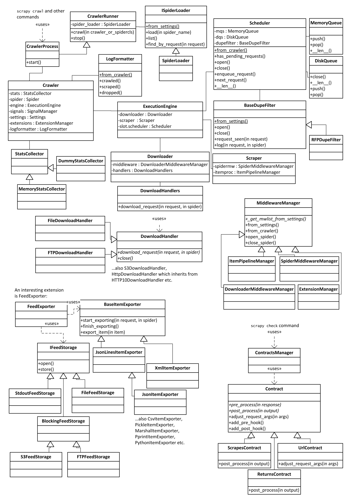

### 8.6　中间件延伸

本节是为好奇的读者提供的，而不再是开发者。如果只是编写基础或中级的Scrapy扩展的话，你并不需要了解这些内容。

如果查看 `scrapy/settings/default_settings.py` 文件，就会发现在默认设置中有很多类名。Scrapy大量使用了依赖注入机制，可以让我们自定义和扩展许多内部对象。例如，一些人可能希望支持除了文件、HTTP、HTTPS、S3以及FTP这些在DOWNLOAD_HANDLERS_BASE设置中定义好的协议以外的更多协议。要想实现这一点，只需要创建一个下载处理器类，并在DOWNLOAD_HANDLERS设置中添加映射即可。最困难的部分是找出你的自定义类必须包含哪些接口（即需要实现哪些方法），因为大部分接口都不是显式的。你必须阅读源代码，查看这些类是如何使用的。最好的办法是从已有的实现开始，将其修改为令自己满意的版本。不过，这些接口在近期的Scrapy版本中已经逐渐趋于稳定，因此我将尝试在图8.4中将它们和Scrapy核心类一起记录成文档（这里省略了前面已经提及的中间件架构）。

<b class="my_markdown">图8.4　Scrapy接口和核心对象</b>

核心类位于图8.4的左上角。当人们使用 `scrapy crawl` 时，Scrapy就会使用 `CrawlerProcess` 对象创建我们熟悉的 `Crawler` 对象。 `Crawler` 对象是最重要的Scrapy类。它包括 `settings` 、 `signals` 以及 `spider` 。在名为 `extensions.crawler.engine` 的 `ExtensionManager` 对象中，还包含所有的扩展，这将带领我们来到另一个非常重要的类—— `ExecutionEngine` 。在该类中，包含了 `Scheduler` 、 `Downloader` 以及 `Scraper` 。URL通过 `Scheduler` 进行计划，通过 `Downloader` 下载，通过 `Scraper` 进行后置处理。毫无疑问， `Downloader` 包含 `DownloaderMiddleware` 和 `DownloadHandler` ，而 `Scraper` 包含 `SpiderMiddleware` 和 `ItemPipeline` 。4个 `MiddlewareManager` 也都拥有其自己的小架构。在Scrapy中，feed输出是以扩展的形式实现的，即 `FeedExporter` 。它包含两个独立的结构，一个用于定义输出格式，而另一个用于存储类型。这就允许我们可以通过调整输出的URL将S3的XML文件导出为命令行上的Pickle编码输出。这两个结构还可以使用 `FEED_STORAGES` 和 `FEED_EXPORTERS` 设置进行独立扩展。最后， `scrapy check` 命令使用的contract也有其自身的结构，可以使用 `SPIDER_CONTRACTS` 设置进行扩展。

