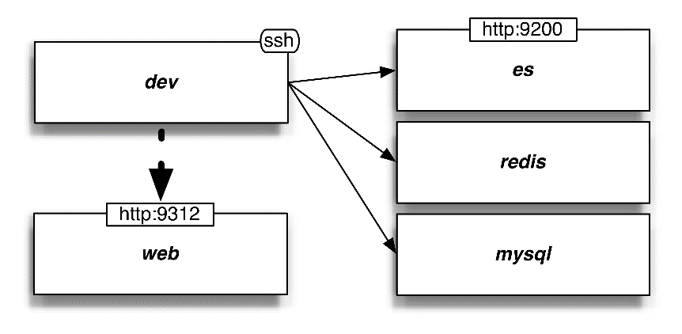

### 第9章　管道秘诀

上一章讨论了使用Scrapy中间件的编程技术。本章将通过展示各种常见用例（包括消费REST API、数据库接口、处理CPU密集型任务以及与遗留服务的接口），重点关注编写正确而高效的管道。

在本章中，我们将会使用几个新的服务器，你可以在图9.1的右侧看到这些服务器。

<b class="my_markdown">图9.1　本章使用的系统</b>

Vagrant应该已经为我们创建好了这些服务器，我们可以从dev服务器中使用其主机名进行ping操作，例如 `ping es` 或 `ping mysql` 。话不多说，让我们从REST API开始探索吧。

