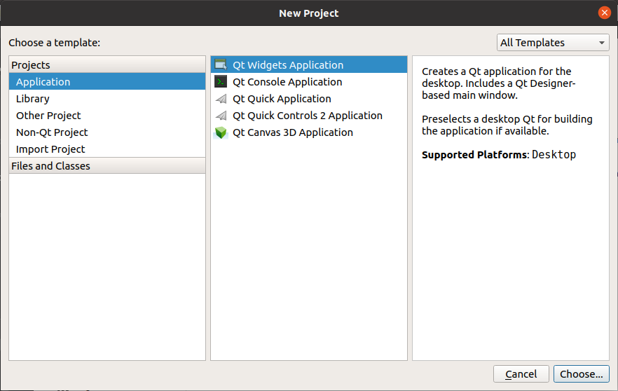

Qt Creator可以创建多种项目，在最左侧的列表框中单击“Application”，中间的列表框中列出了可以创建的应用程序的模板，各类应用程序如下。

+ Qt Widgets Application，支持桌面平台的有图形用户界面（Graphic User Interface，GUI）界面的应用程序。GUI的设计完全基于C++语言，采用Qt提供的一套C++类库。
+ Qt Console Application，控制台应用程序，无GUI界面，一般用于学习C/C++语言，只需要简单的输入输出操作时可创建此类项目。
+ Qt Quick Application，创建可部署的Qt Quick 2应用程序。Qt Quick是Qt支持的一套GUI开发架构，其界面设计采用QML语言，程序架构采用C++语言。利用Qt Quick可以设计非常炫的用户界面，一般用于移动设备或嵌入式设备上无边框的应用程序的设计。
+ Qt Quick Controls 2 Application，创建基于Qt Quick Controls 2组件的可部署的Qt Quick 2应用程序。Qt Quick Controls 2组件只有Qt 5.7及以后版本才有。
+ Qt Canvas 3D Application，创建Qt Canvas 3D QML项目，也是基于QML语言的界面设计，支持3D画布。