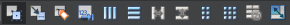

在设计窗体的上方有一个工具栏，用于调整设计器进入不同的状态，以及进行布局设计，工具栏上各按钮的功能见表2-5。

<b class="my_markdown">表2-5　UI设计器工具栏各按钮的功能</b>

| 按钮及快捷键                                                 | 功能                                                         |
| :----------------------------------------------------------- | :----------------------------------------------------------- |
| Edit Widget (F3)                 | 界面设计进入编辑状态，就是正常的设计状态                     |
| Edit Signals/Slots(F4)           | 进入信号与槽的可视化设计状态                                 |
| Edit Buddies                     | 进入伙伴关系编辑状态，可以设置一个Label与一个组件成为伙伴关系 |
| Edit Tab Order                   | 进入Tab顺序编辑状态，Tab顺序是在键盘上按Tab键时，输入焦点在界面各组件之间跳动的顺序 |
| Lay Out Horizontally (Ctrl+H)    | 将窗体上所选组件水平布局                                     |
| Lay Out Vertically (Ctrl+L)      | 将窗体上所选组件垂直布局                                     |
| Lay Out Horizontally in Splitter | 将窗体上所选组件用一个分割条进行水平分割布局                 |
| Lay Out Vertically in Splitter   | 将窗体上所选组件用一个分割条进行垂直分割布局                 |
| Lay Out in a Form Layout         | 将窗体上所选组件按窗体布局                                   |
| Lay Out in a Grid                | 将窗体上所选组件网格布局                                     |
| Break Layout                     | 解除窗体上所选组件的布局，也就是打散现有的布局               |
| Adjust Size(Ctrl+J)              | 自动调整所选组件的大小                                       |