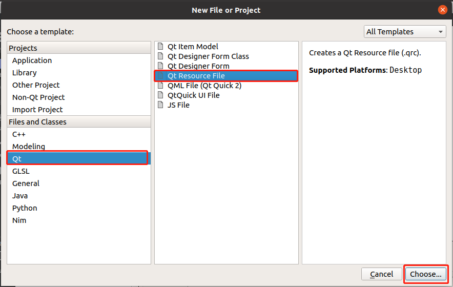
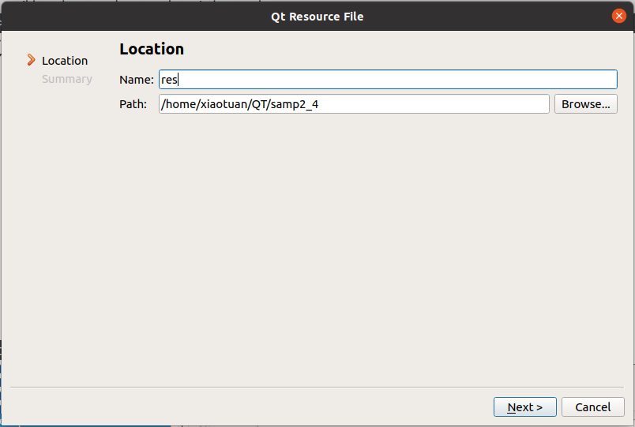

[toc]

### 1. 创建资源文件

1. 执行菜单 `File` -> `New File or Project...`，在弹出的对话框中，在 `Files and Classes` 列表中选择 `Qt`，在中间列表中选择 `Qt Resource File` 然后点击 `Choose...` 按钮。

   

2. 在弹出的对话框中输入资源文件名，并选择资源文件存放路径，然后单击 `Next` 按钮。

   

3. 在弹出的对话框中选择要将资源文件添加到哪个工程，然后单击 `Finish` 按钮完成创建资源文件。

   

### 2. 添加资源

1. 在工程列表中双击 `Resources` 文件夹下的 `res.qrc` 文件。

2. 在 `res.qrc` 文件编辑窗口中，单击底部 `Add` 按钮，在下拉列表中选择 `Add Prefix` 项添加一个资源分类，在下面的 Prefix 编辑框中修改分类名称。

   

3. 在资源编辑窗口中选择要添加资源的资源分类，然后点击底部的 `Add` 按钮，在弹出的列表中选择 `Add Files` ，在弹出的窗口中选择要添加的文件即可。

   > 注意：资源文件必须预先拷贝到工程目录下，最好放在以资源分类名命名的文件夹中。

4. 依次点击添加的资源，在下面的 `Alias` 编辑窗口中输入资源的别名。（非必要）

   