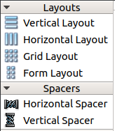

<b class="my_markdown">表2-4　组件面板上用于布局的组件</b>

| 布局组件                                      | 功能                                                         |
| :-------------------------------------------- | :----------------------------------------------------------- |
| Vertical Layout   | 垂直方向布局，组件自动在垂直方向上分布                       |
| Horizontal Layout | 水平方向布局，组件自动在水平方向上分布                       |
| Grid Layout       | 网格状布局，网状布局大小改变时，每个网格的大小都改变         |
| Form Layout       | 窗体布局，与网格状布局类似，但是只有最右侧的一列网格会改变大小 |
| Horizontal Spacer | 一个用于水平分隔的空格                                       |
| Vertical Spacer   | 一个用于垂直分隔的空格                                       |

