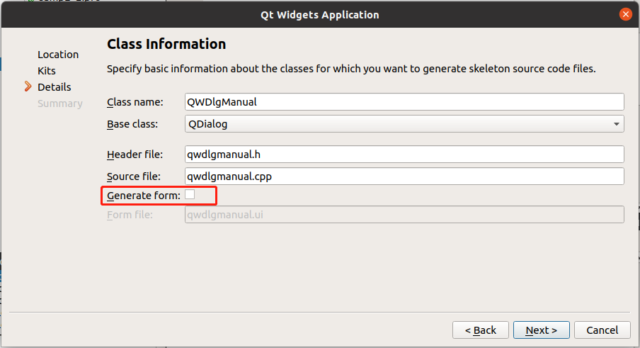

[toc]

### 1. 创建工程

在创建工程时，在 `Details` 步骤处，取消 `Generate form` 后的勾选，即不创建 ui 文件。



### 2. 界面创建

**qwdlgmanual.h**

```cpp
#ifndef QWDLGMANUAL_H
#define QWDLGMANUAL_H

#include <QDialog>
#include <QCheckBox>
#include <QRadioButton>
#include <QPlainTextEdit>
#include <QPushButton>

class QWDlgManual : public QDialog
{
    Q_OBJECT

private:
    QCheckBox       *chkBoxUnder;
    QCheckBox       *chkBoxItalic;
    QCheckBox       *chkBoxBold;
    QRadioButton    *rBtnBlack;
    QRadioButton    *rBtnRed;
    QRadioButton    *rBtnBlue;
    QPlainTextEdit  *txtEdit;
    QPushButton     *btnOk;
    QPushButton     *btnCancel;
    QPushButton     *btnClose;

    void    initUI();   // UI 创建与初始化
    void    initSignalSlots();  // 初始化信号与槽的链接

private slots:
    void on_chkBoxUnder(bool checked);  // Underline 的槽函数
    void on_chkBoxItalic(bool checked); // Italic 的槽函数
    void on_chkBoxBold(bool checked);   // Bold 的槽函数
    void setTextFontColor();    // 设置字体颜色

public:
    QWDlgManual(QWidget *parent = 0);
    ~QWDlgManual();
};

#endif // QWDLGMANUAL_H
```

**qwdlgmanual.cpp**

```cpp
#include "qwdlgmanual.h"
#include <QHBoxLayout>

QWDlgManual::QWDlgManual(QWidget *parent)
    : QDialog(parent)
{
    initUI();   // 界面创建
    initSignalSlots();  // 信号与槽的关联
    setWindowTitle("Form created mannually");
}

QWDlgManual::~QWDlgManual()
{

}

void QWDlgManual::on_chkBoxUnder(bool checked)
{
    QFont font = txtEdit->font();
    font.setUnderline(checked);
    txtEdit->setFont(font);
}

void QWDlgManual::on_chkBoxItalic(bool checked)
{
    QFont font = txtEdit->font();
    font.setItalic(checked);
    txtEdit->setFont(font);
}

void QWDlgManual::on_chkBoxBold(bool checked)
{
    QFont font = txtEdit->font();
    font.setBold(checked);
    txtEdit->setFont(font);
}

void QWDlgManual::setTextFontColor()
{
    QPalette plet = txtEdit->palette();
    if (rBtnBlack->isChecked()) {
        plet.setColor(QPalette::Text, Qt::black);
    } else if (rBtnBlue->isChecked()) {
        plet.setColor(QPalette::Text, Qt::blue);
    } else if (rBtnRed->isChecked()) {
        plet.setColor(QPalette::Text, Qt::red);
    }
    txtEdit->setPalette(plet);
}

void QWDlgManual::initUI()
{
    // 创建 Underline，Italic, Bold 3 个 CheckBox，并水平布局
    chkBoxUnder = new QCheckBox(tr("Underline"));
    chkBoxItalic = new QCheckBox(tr("Italic"));
    chkBoxBold = new QCheckBox(tr("Bold"));
    QHBoxLayout *HLay1 = new QHBoxLayout;
    HLay1->addWidget(chkBoxUnder);
    HLay1->addWidget(chkBoxItalic);
    HLay1->addWidget(chkBoxBold);
    // 创建 Black，Red，Blue 3 个 RadioButton，并水平布局
    rBtnBlack = new QRadioButton(tr("Black"));
    rBtnBlack->setChecked(true);
    rBtnRed = new QRadioButton(tr("Red"));
    rBtnBlue = new QRadioButton(tr("Blue"));
    QHBoxLayout *HLay2 = new QHBoxLayout;
    HLay2->addWidget(rBtnBlack);
    HLay2->addWidget(rBtnRed);
    HLay2->addWidget(rBtnBlue);
    // 创建确定，取消，退出 3 个 PushButton，并水平布局
    btnOk = new QPushButton(tr("确定"));
    btnCancel = new QPushButton(tr("取消"));
    btnClose = new QPushButton(tr("退出"));
    QHBoxLayout *HLay3 = new QHBoxLayout;
    HLay3->addStretch();
    HLay3->addWidget(btnOk);
    HLay3->addWidget(btnCancel);
    HLay3->addStretch();
    HLay3->addWidget(btnClose);
    // 创建文本框，并设置初始字体
    txtEdit = new QPlainTextEdit;
    txtEdit->setPlainText("Hello world\n\nIt is my demo");
    QFont font = txtEdit->font();   // 获取字体
    font.setPointSize(20);  // 修改字体大小
    txtEdit->setFont(font); // 设置字体
    // 创建垂直布局，并设置为主布局
    QVBoxLayout *VLay = new QVBoxLayout;
    VLay->addLayout(HLay1); // 添加字体类型组
    VLay->addLayout(HLay2); // 添加字体颜色组
    VLay->addWidget(txtEdit);   // 添加 PlainTextEdit
    VLay->addLayout(HLay3); // 添加按键组
    setLayout(VLay);    // 设置为窗体的主布局
}

void QWDlgManual::initSignalSlots()
{
    connect(chkBoxUnder, SIGNAL(clicked(bool)), this, SLOT(on_chkBoxUnder(bool)));
    connect(chkBoxItalic, SIGNAL(clicked(bool)), this, SLOT(on_chkBoxItalic(bool)));
    connect(chkBoxBold, SIGNAL(clicked(bool)), this, SLOT(on_chkBoxBold(bool)));
    connect(rBtnBlack, SIGNAL(clicked(bool)), this, SLOT(setTextFontColor()));
    connect(rBtnRed, SIGNAL(clicked(bool)), this, SLOT(setTextFontColor()));
    connect(rBtnBlue, SIGNAL(clicked(bool)), this, SLOT(setTextFontColor()));
    connect(btnOk, SIGNAL(clicked()), this, SLOT(close()));
    connect(btnCancel, SIGNAL(clicked()), this, SLOT(close()));
    connect(btnClose, SIGNAL(clicked()), this, SLOT(close()));
}
```

