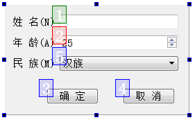

在 UI 设计器工具栏上单击 “Edit Tab Order” 按钮进入Tab 顺序编辑状态（如图 2-10 所示）。Tab 顺序是指在程序运行时，按下键盘上的 Tab 键时输入焦点的移动顺序。一个好的用户界面，在按 Tab 键时，焦点应该以合理的顺序在界面上移动，而不是随意地移动。

进入 Tab 顺序编辑状态后，在界面上会显示具有 Tab 顺序组件的编号，依次按希望的顺序单击组件，就可以重排 Tab 顺序了。没有输入焦点的组件是没有 Tab 顺序的，如 Label 组件。