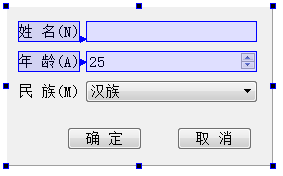
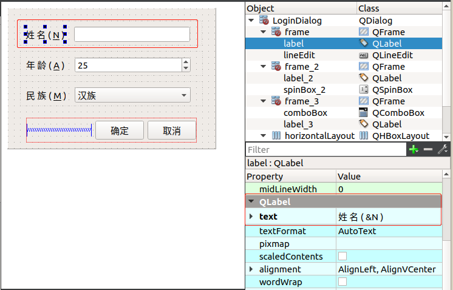

在UI设计工具栏上单击“Edit Buddies”按钮可以进入伙伴关系编辑状态，如设计一个窗体时，进入伙伴编辑状态之后的界面如图2-9所示。

伙伴关系（Buddy）是指界面上一个Label和一个组件相关联，如图2-9中的伙伴关系编辑状态，单击一个Label，按住鼠标左键，然后拖向一个组件，就建立了Label和组件之间的伙伴关系。

伙伴关系是为了在程序运行时，在窗体上用快捷键快速将输入焦点切换到某个组件上。例如，在上图的界面上，设定“姓名”标签的Text属性为“姓名(&N)”，其中符号“&”用来指定快捷字符，界面上并不显示“&”，这里指定快捷字母为N。那么程序运行时，用户按下Alt+N，输入焦点就会快速切换到“姓名”关联的输入框内。

