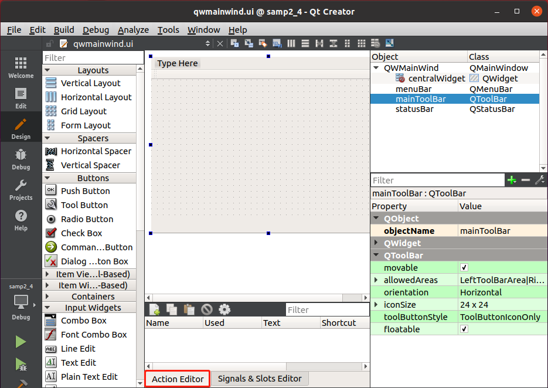
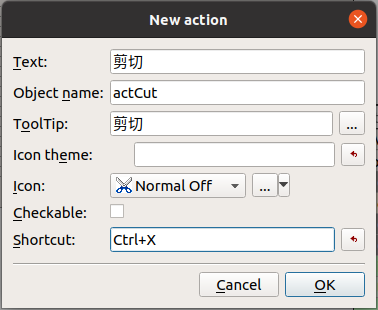
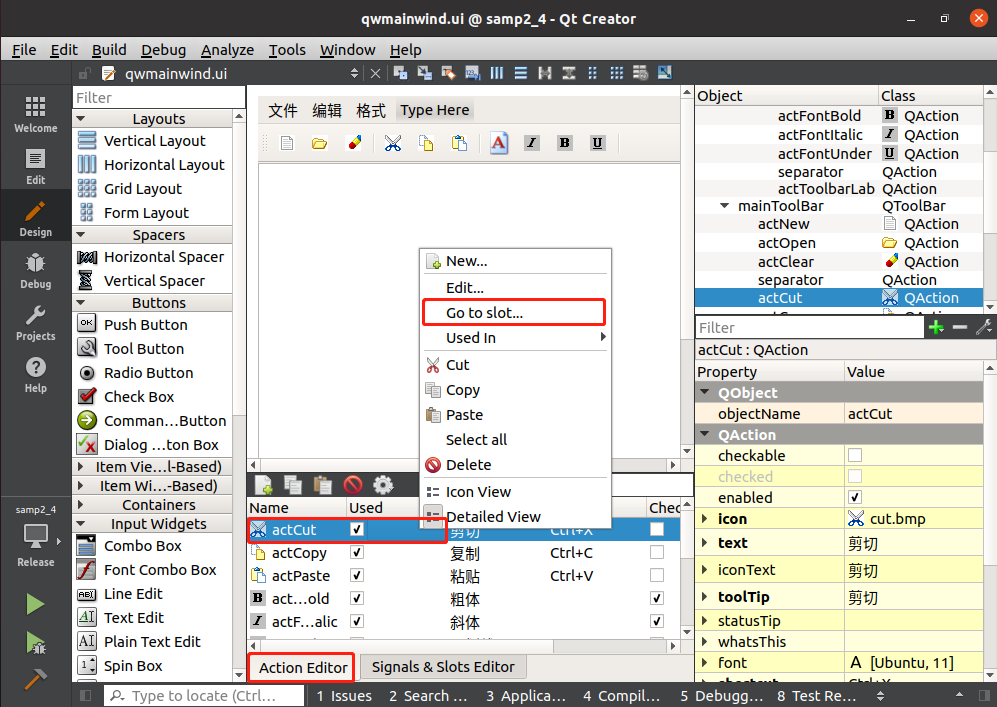

1. 在项目文件目录树里双击 UI 视图文件 "qwmainwind.ui"，进入 UI 设计器，在窗体的下方有一个 `Action Editor` 的面板。

   

2. 在 `Action` 编辑器的上方有一个工具栏，可以新建、复制、粘贴、删除 `Action`，还可以设置 `Action` 列表的显示方式。若要编辑某个 `Action`，在列表里双击该 `Action` 即可。

   

3. 单击工具栏上的 `New` 按钮可以新建一个 Action。新建或编辑 Action 的对话框如下所示。

   

   在此对话框里有以下的一些设置：

   + Text：Action 的显示文字，该文字会作为菜单标题或工具栏按钮标题显示。若该标题后面有省略号，如 "打开..."，则在工具栏按钮上显示会自动忽略省略号，只显示 "打开"。
   + Object name：该 Action 的 objectName。应该遵循自己的命名法则，如以 "act" 开头表示这是一个 Action。如果一个界面上 Action 比较多，还可以分组命名，如 actFileOpen、actionEditCut等。
   + ToolTip：这个文字内容是当鼠标在一个菜单项或工具栏按钮上短暂停留时出现的提示文字。
   + Icon：设置 Action 的图标，单击其右侧的按钮可以从资源文件里选择图标，或者直接选择图片文件作为图标。
   + Checkable：设置 Action 是否可以被复选，如果选中此项，那么该 Action 就类似于 QCheckbox 可以改变其复选状态。
   + Shortcut：设置快捷键，将输入光标移动到 Shortcut 旁边的编辑框里，然后按下想要设置的快捷键接可。
   
4. 为 Action 添加信号与槽

   可以在 Action 处单击鼠标右击，在弹出的菜单中选择 `Go to slot...` 菜单，其后参照 [可视化生成槽函数原型和框架](./信号与槽/可视化生成槽函数原型和框架.md) 文章操作。

   

​	如果设置的信号与槽不是自定义的，可以参照 [设置信号与槽](./信号与槽/设置信号与槽.md) 文章进行操作。