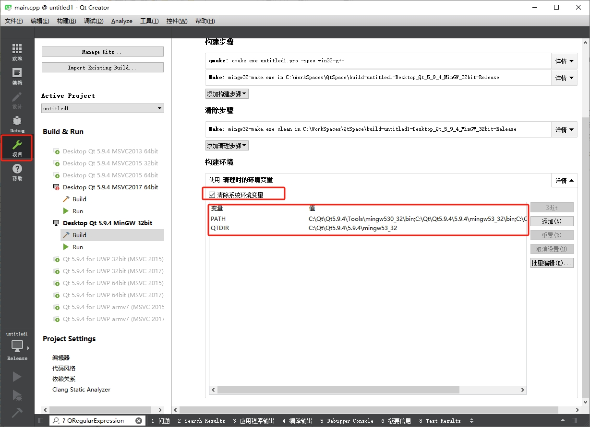

运行 `Qt` 生成的可执行文件时，`Windows` 系统报 "由于找不到 Qt5Cored.dll，无法继续执行代码。重新安装程序可能会解决此问题。" 的错误对话框。这是因为 `Qt` 库和执行文件没有添加到系统环境变量中导致的，可以通过如下步骤进行解决：

1. 在打开工程的 `Qt` 应用界面中，点击侧边栏中的 "项目" 选，在右边的 "构建环境" 项中勾选 "清除系统环境变量"。

   

2. 将下方的环境变量添加到系统变量中，比如上面的 `PATH` 变量值添加到系统的 `Path` 环境变量中，新建一个名为 `QTDIR` 的环境变量，其值为 `QTDIR` 环境变量的值。