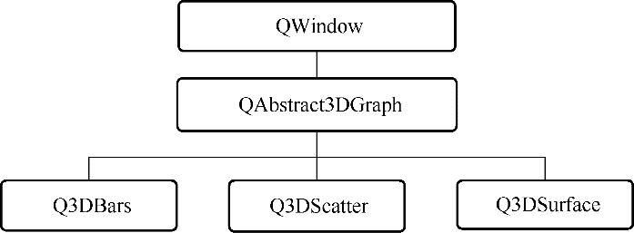
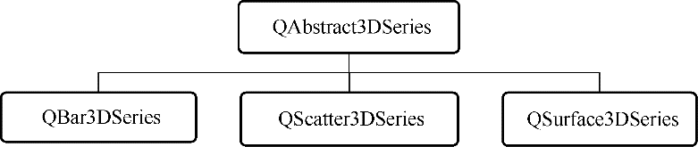
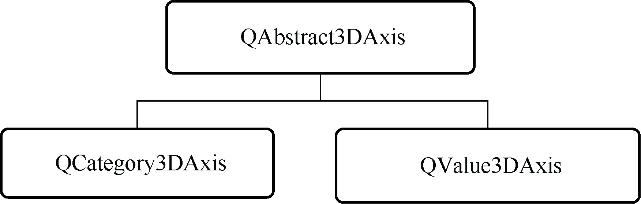
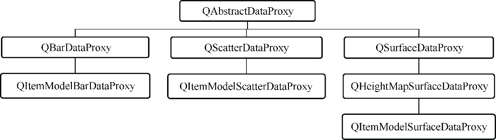

### 10.1　Data Visualization模块概述

Data Visualization的三维显示功能主要由3种三维图形类来实现，分别是三维柱状图类Q3DBars，三维空间散点类Q3DScatter，三维曲面类Q3DSurface。这3个类的父类是QAbstract3 DGraph，是从QWindow继承而来的，继承关系如图10-1所示。


<center class="my_markdown"><b class="my_markdown">图10-1　三种Data　Visualization图形类的继承关系</b></center>

Data Visualization与Qt Charts类似，都基于Qt的图形视图结构，所以一个三维图形也是由图表、序列、坐标轴等元素组成的。Q3DBars、Q3DScatter、Q3DSurface相当于Qt Charts中的QChart，而每一种三维图形对应一种三维序列，Data Visualization中的3种序列类见图10-2。


<center class="my_markdown"><b class="my_markdown">图10-2　三种三维图形序列类</b></center>

一种序列类只能用于某种三维图形类，如QBar3DSeries只能用作三维柱状图Q3DBars的序列，而不能作为三维散点图Q3DScatter的序列。在一个图中可以有多个同类型的序列，如三维曲面图Q3DSurface中可以有多个QSurface3DSeries序列，用于显示不同的曲面。

与QChart有坐标轴类一样，三维图形也有坐标轴类。有两种三维坐标轴类，QValue3DAxis用于数值型坐标轴，QCategory3DAxis用于文字型坐标轴，它们都继承自QAbstract3DAxis（如图10-3所示）。


<center class="my_markdown"><b class="my_markdown">图10-3　两种用于三维图形的坐标轴</b></center>

Data Visualization模块中有数据代理（data proxy）类，数据代理类就是与序列对应，用于存储序列的数据的类。因为三维图形类型不一样，存储数据的结构也不一样，例如三维散点序列QScatter3DSeries存储的是一些三维数据点的坐标，只需要用一维数组或列表就可以存储这些数据，而QSurface3DSeries序列存储的数据点在水平面上是均匀网格分布的，需要二维数组才可以存储相应的数据。为此，对于每一种序列，都有一个数据代理类，它们都继承自QAbstractDataProxy，每个数据代理类还有一个基于项数据模型的数据代理子类（如图10-4所示）。


<center class="my_markdown"><b class="my_markdown">图10-4　数据代理类的继承关系</b></center>

对于三维曲面序列QSurface3DSeries，还有一个专门用于显示地图高程数据的数据代理类QHeightMapSurfaceDataProxy，可以将一个图片表示的高程数据显示为三维曲面。用户也可以根据需要从QAbstractDataProxy继承，定义自己的数据代理类。

要在项目中使用Data Visualization模块，需要在项目配置文件中添加下面一行语句：

```css
Qt += datavisualization
```

在使用Data Visualization模块中的类的头文件或源程序文件中，还需要加入下面两行语句。如果只需使用模块中的部分类，可以单独包含某些类。

```css
#include <QtDataVisualization>
using namespace QtDataVisualization;
```

