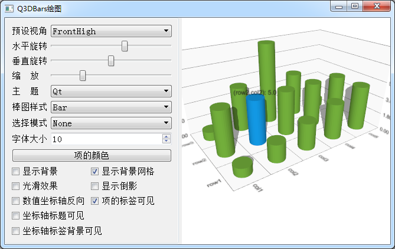

### 10.2.1　实例功能

通过一个三维柱状图的实例来说明使用Data Visualization的类绘制三维图形的基本原理。实例samp10_1使用Q3DBars绘制一个三维柱状图，并在界面上对其一些常见属性和操作进行控制，程序运行效果如图10-5所示。

<b class="my_markdown">图10-5　三维柱状图绘图</b>

实例samp10_1运行时，右侧是用Q3DBars绘制的三维柱状图；左侧是对三维柱状图的一些操作和属性设置，包括预设视角的选择，水平、垂直方向的旋转以及缩放，属性设置包括图表主题、选择方式、棒图项的样式，以及一些显示效果的设置。

无需额外编程或设置，程序运行时在图表单击左键可以选择图表中的某个项、某个列或行（与选择方式的设置有关），按住鼠标右键时上下、左右移动可以进行水平和垂直方向的旋转，鼠标滚轮可以进行缩放。

