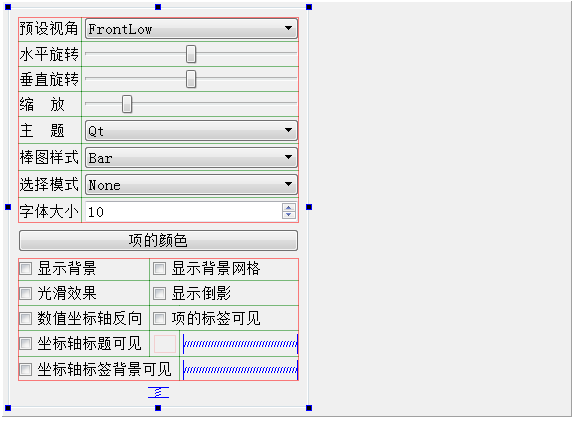

### 10.2.2　主窗口设计

实例samp10_1是主窗口继承自QMainWindow的应用程序，可视化创建主窗体。

由于三维图形类Q3DBars、Q3DScatter和Q3DSurface都是从QWindow继承而来的（见图10-1），不能简单使用QWidget组件作为Q3DBars组件的容器，也就是不能在主窗口上放置一个QWidget组件，然后作为Q3DBars组件的容器，而是需要使用QWidget::createWindowContainer()动态创建QWidget作为Q3DBars的容器。

在UI设计器中设计主窗体的界面如图10-6所示，只设计用于三维图表属性控制的界面组件，用一个QGroupBox组件容纳所有这些三维属性控制界面组件，将这个QGroupBox组件命名为groupBox。为groupBox内的组件设计好布局，删除主窗口的工具栏、菜单栏和状态栏。窗口右侧区域是空白，是为动态创建Q3DBars的QWidget容器预留的空间。

主窗口类的头文件mainwindow.h中的定义如下：

```css
#include   <QMainWindow>
#include   <QtDataVisualization>
using namespace QtDataVisualization;
class MainWindow : public QMainWindow
{
   Q_OBJECT
private:
   QWidget *graphContainer;  //图表的容器
   Q3DBars *graph3D;   //图表
   QBar3DSeries *series;   //图表的序列
   void   iniGraph3D(); //创建图表
public:
   explicit MainWindow(QWidget *parent = 0);
   ~MainWindow();
private:
   Ui::MainWindow *ui;
};
```


<center class="my_markdown"><b class="my_markdown">图10-6　UI设计器中设计的主窗口界面</b></center>

在MainWindow类中，定义了私有变量graphContainer作为三维图表的容器，它在MainWindow的构造函数中创建。还定义三维图表和序列的私有变量graph3D和series，是为了在程序里便于直接引用。

iniGraph3D()函数用于初始化创建图表，在构造函数里调用。

