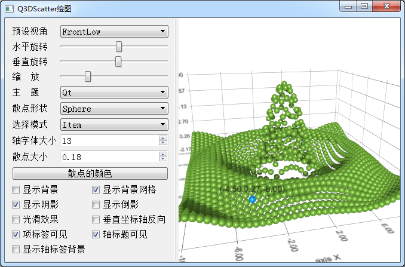

### 10.3.1　绘制三维散点图

绘制三维散点图采用Q3DScatter类，绘图序列是QScatter3DSeries类。实例samp10_2演示如何绘制三维散点图，实例运行界面如图10-7所示，绘制了一个“墨西哥草帽”的散点图。

程序的界面与实例samp10_1类似，左侧是控制面板，右侧是绘图区，项目的创建和界面元素的布局也相同。

主窗口类MainWindow的主要定义如下（省略了界面组件的槽函数定义）：


<center class="my_markdown"><b class="my_markdown">图10-7　实例samp10_2运行效果</b></center>

```css
class MainWindow : public QMainWindow
{
   Q_OBJECT
private:
   QWidget    *graphContainer;//图表的容器
   Q3DScatter   *graph3D;      //散点图
   QScatter3DSeries  *series;  //散点序列
   void   iniGraph3D();      //初始化绘图
public:
   explicit MainWindow(QWidget *parent = 0);
   ~MainWindow();
private:
   Ui::MainWindow *ui;
};
```

在其中定义了绘制三维散点图的Q3DScatter类图表对象graph3D，以及绘图序列QScatter3　DSeries类的散点序列series。

iniGraph3D()函数用于图表的创建，在构造函数里完成图表的创建。下面是主窗口构造函数和iniGraph3D()函数的代码。

```css
MainWindow::MainWindow(QWidget *parent) :   QMainWindow(parent),
   ui(new Ui::MainWindow)
{
   ui->setupUi(this);
   iniGraph3D();
   QSplitter   *splitter=new QSplitter(Qt::Horizontal);
   splitter->addWidget(ui->groupBox);
   splitter->addWidget(graphContainer);
   this->setCentralWidget(splitter);
}
void MainWindow::iniGraph3D()
{
   graph3D = new Q3DScatter();
   graphContainer = QWidget::createWindowContainer(graph3D); 
   QScatterDataProxy *proxy = new QScatterDataProxy(); //数据代理
   series = new QScatter3DSeries(proxy);  //创建序列
   series->setItemLabelFormat("(@xLabel @yLabel @zLabel)");
   series->setMeshSmooth(true);
   graph3D->addSeries(series);
//创建坐标轴
   graph3D->axisX()->setTitle("axis X");
   graph3D->axisX()->setTitleVisible(true);
   graph3D->axisY()->setTitle("axis Y");
   graph3D->axisY()->setTitleVisible(true);
   graph3D->axisZ()->setTitle("axis Z");
   graph3D->axisZ()->setTitleVisible(true);
   graph3D->activeTheme()->setLabelBackgroundEnabled(false);
   series->setMesh(QAbstract3DSeries::MeshSphere); //数据点为圆球
   series->setItemSize(0.2);//取值范围 0~1
   int N=41;
   int itemCount=N*N;
   QScatterDataArray *dataArray = new QScatterDataArray();
   dataArray->resize(itemCount);
   QScatterDataItem *ptrToDataArray = &dataArray->first();
//墨西哥草帽,-10:0.5:10， N=41
   float x,y,z;
   int i,j;
   x=-10;
   for (i=1 ; i <=N; i++)
   {
      y=-10;
      for ( j =1; j <=N; j++)
      {
         z=qSqrt(x*x+y*y);
         if (z!=0)
            z=10*qSin(z)/z;
         else
            z=10;
         ptrToDataArray->setPosition(QVector3D(x,z,y));
         ptrToDataArray++;
         y+=0.5;
      }
      x+=0.5;
   }
   series->dataProxy()->resetArray(dataArray);
}
```

在iniGraph3D()函数中，程序显式地创建了数据代理组件，并在序列创建时将此数据代理传递给序列。

```css
QScatterDataProxy *proxy = new QScatterDataProxy(); //数据代理
series = new QScatter3DSeries(proxy);  //创建序列
```

每一种序列都有其对应的数据代理类，与散点序列对应的数据代理类是QScatterDataProxy。

散点序列的每一个点都是一个QScatterDataItem类，它存储一个散点的三维坐标和旋转角度信息。QScatterDataArray是QScatterDataItem类的向量的类型定义，定义如下：

```css
QVector<QScatterDataItem> QScatterDataArray;
```

所以，QScatterDataArray实际就是一个一维数组，数组的元素是QScatterDataItem对象。创建QScatterDataArray对象dataArray，并预设其大小。

```css
QScatterDataArray *dataArray = new QScatterDataArray();
dataArray->resize(itemCount);
```

程序中根据数学公式计算“墨西哥草帽”每个散点的坐标，并且保存到数组dataArray里，最后将此数组设置为数据代理的数据内容，即：

```css
series->dataProxy()->resetArray(dataArray);
```

> **注意**
> 在此实例中，“墨西哥草帽”的数据点在水平面上是均匀分布的，所以相当于在水平面上做了网格划分，每个网格里面都有一个数据点。但是散点图并不要求数据点规则分布，它只是根据每个散点的三维坐标和旋转方向绘图。

