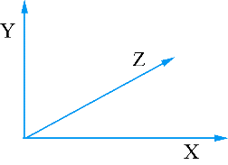

### 10.3.2　三维坐标轴的方向

由于三维散点图是根据数据点的三维坐标绘图，所以3个坐标轴都是QValue3DAxis类型的坐标轴，在iniGraph3D()函数中，为3个坐标轴标注了轴标题，在绘制出来的三维图形中会发现，从正前方看所绘制的三维图时，3个坐标轴的正向分布如图10-8所示。


<center class="my_markdown"><b class="my_markdown">图10-8　三维图缺省的坐标方向</b></center>

在此坐标系中，东西方向为X轴，南北方向为Z轴，且向北方向为正，垂直方向为Y轴，向上为正。所以，在iniGraph3D()函数中，计算墨西哥草帽的散点坐标时采用的是笛卡尔坐标，水平面是X和Y，垂直方向是Z，所以计算出的(x, y, z)坐标添加作为散点的坐标时，使用的语句如下：

```css
ptrToDataArray->setPosition(QVector3D(x,z,y));
```

