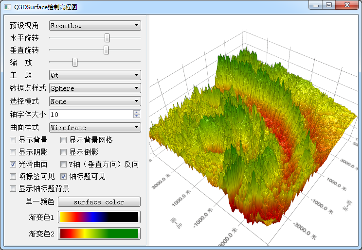
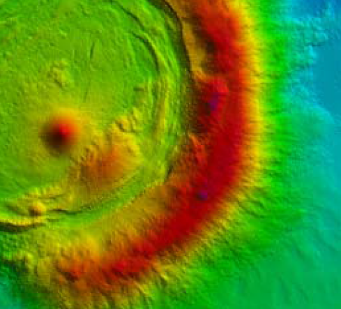
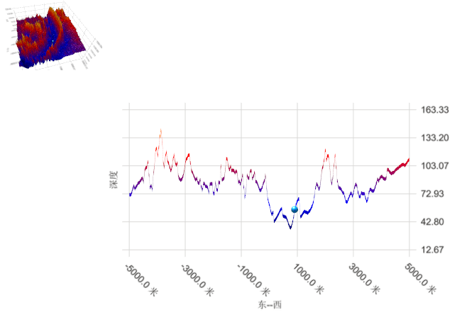

### 10.4.2　三维地形图

#### 1．绘制三维地形图

当为QSurface3DSeries序列使用QHeightMapSurfaceDataProxy数据代理时，数据代理可以从一个含有高程数据的图片中读入数据，绘制地形图。图10-10是实例samp10_4运行界面，右侧的三维曲面是一个地形图。


<center class="my_markdown"><b class="my_markdown">图10-10　实例samp10_4运行界面</b></center>

实例samp10_4的程序结构与实例samp10_3相同，只是数据代理类定义为QHeightMapSurface DataProxy类，下面是MainWindow类的定义部分。

```css
class MainWindow : public QMainWindow
{   Q_OBJECT
private:
   QWidget    *graphContainer;
   Q3DSurface        *graph3D;      //三维图表
   QSurface3DSeries   *series;      //序列
   QHeightMapSurfaceDataProxy   *proxy; //数据代理
   void   iniGraph3D();
public:
   explicit MainWindow(QWidget *parent = 0);
};
```

iniGraph3D()函数实现绘图，其完整代码如下：

```css
void MainWindow::iniGraph3D()
{
   graph3D = new Q3DSurface();
   graphContainer = QWidget::createWindowContainer(graph3D); 
//创建坐标轴
   QValue3DAxis *axisX=new QValue3DAxis;   //X,东西
   axisX->setTitle("东--西");
   axisX->setTitleVisible(true);
   axisX->setLabelFormat("%.1f 米");
   axisX->setRange(-5000,5000);
   graph3D->setAxisX(axisX);
   QValue3DAxis *axisY=new QValue3DAxis; //Y，深度
   axisY->setTitle("深度");
   axisY->setTitleVisible(true);
   axisY->setAutoAdjustRange(true);
   graph3D->setAxisY(axisY);
   QValue3DAxis *axisZ=new QValue3DAxis;   //Z, 南北
   axisZ->setTitle("南--北");
   axisZ->setLabelFormat("%.1f 米");
   axisZ->setTitleVisible(true);
   axisZ->setRange(-5000,5000);
   graph3D->setAxisZ(axisZ);
   graph3D->activeTheme()->setLabelBackgroundEnabled(false);
//创建数据代理
   QImage heightMapImage(":/map/sea.png");
   proxy = new QHeightMapSurfaceDataProxy(heightMapImage);
   proxy->setValueRanges(-5000, 5000, -5000, 5000);
   series = new QSurface3DSeries(proxy);
   series->setItemLabelFormat("(@xLabel, @zLabel): @yLabel");
   series->setFlatShadingEnabled(false);
   series->setMeshSmooth(true);
   series->setDrawMode(QSurface3DSeries::DrawSurface);
   graph3D->addSeries(series);
}
```

在项目中创建资源文件，并且导入一个高程图片文件sea.png，原始图片如图10-11所示，图片的各个点的颜色与高程有关。


<center class="my_markdown"><b class="my_markdown">图10-11　原始的高程图片</b></center>

该图片用于创建QHeightMapSurfaceDataProxy数据代理，并且导入图片的数据。

```css
QImage heightMapImage(":/map/sea.png");
proxy = new QHeightMapSurfaceDataProxy(heightMapImage);
proxy->setValueRanges(-5000, 5000, -5000, 5000);
```

QHeightMapSurfaceDataProxy支持多种图片文件格式，可以是彩色图也可以是灰度图。由于图片信息不包含平面坐标范围，所以需要使用setValueRanges()设置图片数据的平面坐标范围，其函数原型如下：

```css
void setValueRanges(float minX, float maxX, float minZ, float maxZ)
```

高程数据从图片中读取，如果是灰度图，就将像素的颜色值作为高度，如果是彩色图，就以红、绿、蓝3种颜色的平均值作为高度值。使用灰度图处理速度更快，所以，最好使用QImage:: Format_RGB32格式的32位灰度图片。

#### 2．切片选择模式

使用QAbstract3DGraph类的setSelectionMode(SelectionFlags mode)设置选择模式时，可以设置为切片选择模式。控制面板上的“选择模式”组合选择框提供了None、Item、Row Slice和Column Slice 4种选择模式，组合选择框的响应代码如下：

```css
void MainWindow::on_cBoxSelectionMode_currentIndexChanged(int index)
{//选择模式
   switch(index)
   { case 0:   //none
      graph3D->setSelectionMode(QAbstract3DGraph::SelectionNone);
      break;
    case 1:   //Item
      graph3D->setSelectionMode(QAbstract3DGraph::SelectionItem);
      break;
    case 2:   //Row Slice
      graph3D->setSelectionMode(QAbstract3DGraph::SelectionItemAndRow
                      | QAbstract3DGraph::SelectionSlice);
      break;
    case 3:   //Column Slice
      graph3D->setSelectionMode(QAbstract3DGraph::SelectionItemAndColumn
                      | QAbstract3DGraph::SelectionSlice);
      break;
   }
}
```

当设置为Row Slice或Column Slice选择模式时，在三维图上单击一个位置后，图表会自动切换到切片显示模式，如图10-12所示。

在此状态下，中间显示选择的项所在行或列的切片图，左上角显示缩小的三维图。在左上角的三维图上再单击一下，就会恢复原始的显示状态。

在Q3DSurface图中，可以显示多个曲面或地形图，还可以通过addCustomItem(QCustom3DItem *item)函数添加自定义三维对象，QCustom3DItem类对象可以是由其他三维建模软件建立的三维对象，由此可以显示较复杂的三维场景。


<center class="my_markdown"><b class="my_markdown">图10-12　切片显示状态</b></center>


