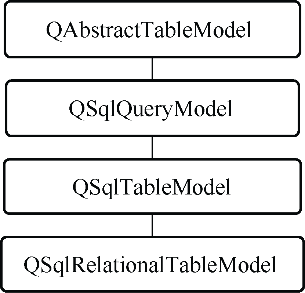

### 11.1.3　Qt SQL模块的主要类

Qt SQL提供的主要类的简要功能描述见表11-6。

<b class="my_markdown">表11-6　Qt SQL模块包含的主要类的功能</b>

| 类名称 | 功能描述 |
| :-----  | :-----  | :-----  | :-----  |
| QSqlDatabase | 用于建立与数据库的连接 |
| QSqlDriver | 用于访问具体的SQL数据库的底层抽象类 |
| QSqlDriverCreator | 为某个具体的数据库驱动提供SQL驱动的模板类 |
| QSqlDriverCreatorBase | 所有SQL驱动器的基类 |
| QSqlDriverPlugin | 用于定制QSqlDriver插件的抽象基类 |
| QSqlError | SQL数据库错误信息，可以用于访问上一次出错的信息 |
| QSqlField | 操作数据表或视图（view）的字段的类 |
| QSqlIndex | 操作数据库的索引的类 |
| QSqlQuery | 执行各种SQL语句的类 |
| QSqlQueryModel | SQL查询结果数据的只读数据模型（data model），用于SELECT查询结果数据记录的只读显示 |
| QSqlRecord | 封装了数据记录操作的类 |
| QSqlRelation | 用于存储SQL外键信息的类，用于QSqlRelationalTableModel数据源中设置代码字段与关联数据表的关系 |
| QSqlRelationalDelegate | 用于QSqlRelationalTableModel的一个代码字段的显示和编辑代理组件，一般是一个QComboBox组件，下拉列表中自动填充代码表的代码字段对应的实际内容 |
| QSqlRelationalTableModel | 用于一个数据表的可编辑的数据模型，支持代码字段的外键 |
| QSqlResult | 访问SQL数据库的抽象接口 |
| QSqlTableModel | 编辑一个单一数据表的数据模型类 |
| QDataWidgetMapper | 用于界面组件与字段之间实现映射，实现字段内容自动显示的类 |

QSqlDatabase用于建立与数据库的连接，一般是先加载需要的数据库驱动，然后设置数据库的登录参数，如主机地址、用户名、登录密码等，如果是单机型数据库，如SQLite，只需设置数据库文件即可。

数据库的操作一般需要将数据库的内容在界面上进行显示和编辑，Qt采用 Model/View结构进行数据库内容的界面显示。QTableView是常用的数据库内容显示视图组件，用于数据库操作的数据模型类有QSqlQueryModel、QSqlTableModel和QSqlRelationalTableModel，这几个类的继承关系见图11-2。

<b class="my_markdown">图11-2　数据库相关数据模型类的继承关系</b>

QSqlQueryModel通过设置SELECT语句查询获取数据库的内容，但是QSqlQueryModel的数据是只读的，不能进行编辑。

QSqlTableModel直接设置一个数据表的名称，可以获取数据表的全部记录，其结果是可编辑的，设置为界面上的QTableView组件的数据模型后就可以显示和编辑数据。

QSqlRelationalTableModel编辑一个数据表，并且可以将代码字段通过关系与代码表关联，将代码字段的编辑转换为直观的内容选择编辑。

QSqlQuery是另外一个经常使用的类，它可以执行任何SQL语句，特别是没有返回记录的语句，如UPDATE、INSERT、DELETE等，通过SQL语句对数据库直接进行编辑修改。

