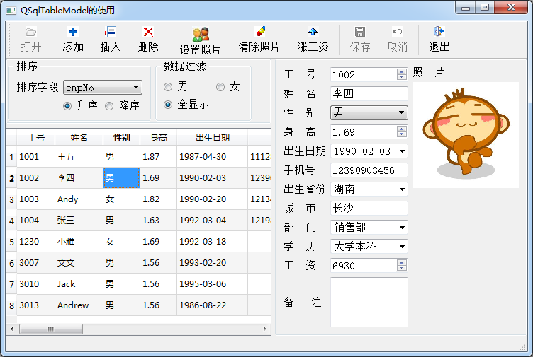

### 11.2.1　实例功能

实例samp11_1使用QSqlTableModel显示实例数据库demodb中employee数据表的内容，实现编辑、插入、删除记录的操作，实现数据的排序和记录过滤，还实现BLOB类型字段Photo中存储照片的显示、导入等操作，运行界面如图11-3所示。

<b class="my_markdown">图11-3　实例samp11_1运行界面</b>

在图11-3的中，左侧数据表格是一个QTableView组件，设置一个QSqlTableModel类的变量作为数据模型后就可以显示数据表的内容。右侧的一些编辑框、下拉列表框等。界面组件通过QDataWidgetMapper类的实例设置为与某个字段关联，自动显示字段的内容。但是没有现成的组件可以通过字段映射显示Photo字段中的照片。为此使用一个QLabel组件，通过其pixmap属性显示图片，所以照片的显示、导入和清除需要单独操作，并且与数据模块的记录移动保持同步，如同将此界面组件与Photo字段映射了一样。

QTableView显示内容有缺省的代理组件，一般是自动使用QLineEdit组件。但是对于某些字段期望通过下拉列表框来选择输入，例如“性别”和“部门”这两个字段。为此，还设计了自定义数据代理类，“性别”和“部门”两个字段使用QComboBox进行编辑。

工具栏上的按钮根据当前状态自动可用或禁用，特别是“保存”和“取消”两个按钮在数据表的内容被修改后自动变为可用，当保存或取消修改后又变为不可用。

