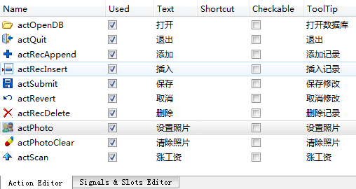

### 11.2.2　主窗口设计

实例samp11_1是一个主窗口继承自QMainWindow的应用程序，使用UI设计器可视化设计界面。设计的Action如图11-4所示，使用Action创建工具栏按钮，其他界面组件和布局不再详述。


<center class="my_markdown"><b class="my_markdown">图11-4　主窗口里设计的Action</b></center>

以下是主窗口类MainWindow的定义（一些通用的部分，自动生成的界面组件的槽函数省略了）。

```css
#include   <QtSql>
#include   <QDataWidgetMapper>
class MainWindow : public QMainWindow
{
   Q_OBJECT
private:
   QSqlDatabase  DB;                    //数据库连接
   QSqlTableModel  *tabModel;           //数据模型
   QItemSelectionModel *theSelection;   //选择模型
   QDataWidgetMapper   *dataMapper;     //数据映射
   QWComboBoxDelegate   delegateSex;    //自定义数据代理，性别
   QWComboBoxDelegate   delegateDepart; //自定义数据代理，部门
   void   openTable();                  //打开数据表
   void   getFieldNames();              //获取字段名称,填充“排序字段”的comboBox
public:
   explicit MainWindow(QWidget *parent = 0);
   ~MainWindow();
private slots:
    void on_currentChanged(const QModelIndex &current, const QModelIndex &previous);
    void on_currentRowChanged(const QModelIndex &current, const QModelIndex &previous);
}
```

MainWindow类中定义了几个私有变量。

+ QSqlDatabase DB，用于加载数据库驱动和建立与数据库之间的连接。
+ QSqlTableModel *tabModel，用于指定某一个数据表，作为数据表的数据模型。
+ QItemSelectionModel *theSelection，作为tabModel的选择模型，提供currentChanged()、currentRowChanged()等信号，在tabModel选择的字段发生变化、当前记录发生变化时发射信号，以便程序进行响应。例如在currentChanged()信号发射时，检查tabModel是否有数据被修改，从而更新界面上“保存”和“取消”两个按钮的使能状态。
+ QDataWidgetMapper *dataMapper用于实现界面组件与tabModel的字段之间的映射。例如界面上的QLineEdit类型的dbEditName组件与数据表的Name字段映射，当前记录变化时会自动更新显示当前记录的Name字段的数据。
+ QWComboBoxDelegate是自定义的基于QComboBox的代理类，delegateSex和delegateDepart用作tableView中“性别”和“部门”字段的代理组件。

私有函数openTable()用于打开数据表，getFieldNames()用于获取数据表employee的所有字段的名称，并填充界面上“排序字段”后的ComboBox组件。

定义了两个槽函数，功能如下。

+ on_currentChanged()用于检查数据表内容是否有修改，从而更新“保存”和“取消”两个按钮的使能状态。
+ on_currentRowChanged()用于在当前记录发生变化时，从新的当前记录里提取Photo字段的内容，并作为界面上的QLabel类型的dblabPhoto组件的pixmap显示出来。

MainWindow的构造函数代码如下，主要是对tableView的一些显示属性的设置。

```css
MainWindow::MainWindow(QWidget *parent) : QMainWindow(parent), ui(new Ui::MainWindow)
{
   ui->setupUi(this);
   this->setCentralWidget(ui->splitter);
//   tableView显示属性设置
   ui->tableView->setSelectionBehavior(QAbstractItemView::SelectItems);
   ui->tableView->setSelectionMode(QAbstractItemView::SingleSelection);
   ui->tableView->setAlternatingRowColors(true);
}
```

