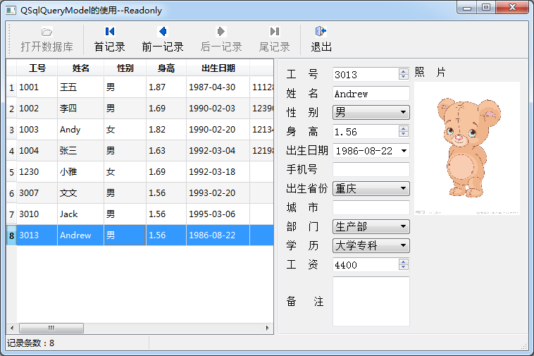

### 11.3.2　使用QSqlQueryModel实现数据查询

#### 1．实例功能

使用QSqlQueryModel可以从一个数据表或多个数据表里查询数据，只需设计好SELECT语句即可。实例samp11_2使用QSqlQueryModel从employee表里查询记录，并在界面上显示，运行窗口见图11-5。

窗口工具栏上几个工具栏按钮只有打开数据库和记录移动功能，记录移动通过调用QdataWidget- Mapper类的记录移动功能实现。窗口上没有数据编辑和保存功能，因为QSqlQueryModel查询出来的数据是只读的。

主窗口类的定义部分如下（去除了界面组件自动生成的槽函数的定义）：

```css
class MainWindow : public QMainWindow
{
   Q_OBJECT
private:
   QSqlDatabase  DB; //数据库
   QSqlQueryModel  *qryModel; //数据模型
   QItemSelectionModel  *theSelection; //选择模型
   QDataWidgetMapper   *dataMapper;//数据界面映射
   void   openTable();//打开数据表
   void   refreshTableView();//移动记录时刷新TableView的当前行
public:
   explicit MainWindow(QWidget *parent = 0);
   ~MainWindow();
private slots:
//selectionModel的行发生了变化
    void on_currentRowChanged(const QModelIndex &current, const QModelIndex &previous);
};
```


<center class="my_markdown"><b class="my_markdown">图11-5　实例samp11_2运行窗口</b></center>

这里定义了QSqlQueryModel类型的数据模型变量qryModel，也定义了数据库、选择模型和数据界面映射的变量。refreshTableView()函数用于记录移动后刷新tableView上的当前行位置。

自定义槽函数on_currentRowChanged()在选择模型的当前行变化时，处理Photo字段的查询与照片显示。

#### 2．打开数据库

工具栏上的“打开数据库”按钮对应actOpenDB，选择SQLite数据库文件，然后调用openTable()函数打开数据库。槽函数on_actOpenDB_triggered()的代码与实例samp11_1完全一样，这里不再列出。

openTable()用于查询数据，建立界面显示等具体操作，其代码如下：

```css
void MainWindow::openTable()
{//打开数据表
   qryModel=new QSqlQueryModel(this);
   qryModel->setQuery("SELECT EmpNo, Name, Gender, Height, Birthday, Mobile, Province, City, Department , Education, Salary FROM employee ORDER BY EmpNo");
   if (qryModel->lastError().isValid())
   {
      QMessageBox::critical(this, "错误", 
            "数据表查询错误,错误信息\n"+qryModel->lastError().text(),
            QMessageBox::Ok,QMessageBox::NoButton);
      return;
   }
   qryModel->setHeaderData(0,Qt::Horizontal,"工号");
   qryModel->setHeaderData(1,Qt::Horizontal,"姓名");
   qryModel->setHeaderData(2,Qt::Horizontal,"性别");
   qryModel->setHeaderData(3,Qt::Horizontal,"身高");
   qryModel->setHeaderData(4,Qt::Horizontal,"出生日期");
   qryModel->setHeaderData(5,Qt::Horizontal,"手机");
   qryModel->setHeaderData(6,Qt::Horizontal,"省份");
   qryModel->setHeaderData(7,Qt::Horizontal,"城市");
   qryModel->setHeaderData(8,Qt::Horizontal,"部门");
   qryModel->setHeaderData(9,Qt::Horizontal,"学历");
   qryModel->setHeaderData(10,Qt::Horizontal,"工资");
   theSelection=new QItemSelectionModel(qryModel); 
connect(theSelection,SIGNAL(currentRowChanged(QModelIndex,QModelIndex)),
             this,SLOT(on_currentRowChanged(QModelIndex,QModelIndex)));
   ui->tableView->setModel(qryModel);
   ui->tableView->setSelectionModel(theSelection);
//创建数据映射
   dataMapper= new QDataWidgetMapper();
   dataMapper->setSubmitPolicy(QDataWidgetMapper::AutoSubmit);
   dataMapper->setModel(qryModel);
   dataMapper->addMapping(ui->dbSpinEmpNo,0);//"EmpNo";
   dataMapper->addMapping(ui->dbEditName,1);//"Name";
   dataMapper->addMapping(ui->dbComboSex,2);//"Gender";
   dataMapper->addMapping(ui->dbSpinHeight,3);//"Height";
   dataMapper->addMapping(ui->dbEditBirth,4);//"Birthday";
   dataMapper->addMapping(ui->dbEditMobile,5);//"Mobile";
   dataMapper->addMapping(ui->dbComboProvince,6);//"Province";
   dataMapper->addMapping(ui->dbEditCity,7);//"City";
   dataMapper->addMapping(ui->dbComboDep,8);//"Department";
   dataMapper->addMapping(ui->dbComboEdu,9);//"Education";
   dataMapper->addMapping(ui->dbSpinSalary,10);//"Salary";
   dataMapper->toFirst();
   ui->actOpenDB->setEnabled(false);
}
```

程序首先创建了QSqlQueryModel类型的私有变量qryModel，然后调用setQuery()函数设置了SELECT查询语句，SELECT语句从employee表里查询除了Memo和Photo之外的所有其他字段。

使用setHeaderData()函数为每个字段设置显示标题，为使代码简化，这里直接使用了字段的序号。

为qryModel创建了选择模型theSelection，并且将其currentRowChanged()信号与自定义槽函数on_currentRowChanged()关联起来。这个自定义槽函数用来在记录移动时，查询出Memo和Photo字段的内容，并在界面上显示出来。

下面是槽函数on_currentRowChanged()的代码：

```css
void MainWindow::on_currentRowChanged(const QModelIndex &current, const QModelIndex &previous)
{
   Q_UNUSED(previous);
   if (!current.isValid())
   {  ui->dbLabPhoto->clear();
      return;
   }
   dataMapper->setCurrentModelIndex(current); //更新数据映射的行号
   bool first=(current.row()==0); //是否首记录
   bool last=(current.row()==qryModel->rowCount()-1);//是否尾记录
   ui->actRecFirst->setEnabled(!first); //更新使能状态
   ui->actRecPrevious->setEnabled(!first);
   ui->actRecNext->setEnabled(!last);
   ui->actRecLast->setEnabled(!last);
   int curRecNo=theSelection->currentIndex().row();
   QSqlRecord  curRec=qryModel->record(curRecNo); //获取当前记录
   int empNo=curRec.value("EmpNo").toInt();
   QSqlQuery query; //查询当前EmpNo的Memo和Photo字段的数据
   query.prepare("select EmpNo, Memo, Photo from employee where EmpNo = :ID");
   query.bindValue(":ID",empNo);
   query.exec();
   query.first();
   QVariant   va=query.value("Photo");
   if (!va.isValid())  //图片字段内容为空
     ui->dbLabPhoto->clear();
   else
   {//显示照片
     QByteArray data=va.toByteArray();
     QPixmap pic;
     pic.loadFromData(data);
     ui->dbLabPhoto->setPixmap(pic.scaledToWidth( 
              ui->dbLabPhoto->size().width()));
}
   QVariant   va2=query.value("Memo");//显示备注
   ui->dbEditMemo->setPlainText(va2.toString());
}
```

这个函数实现3个功能，第1个功能是更新数据映射的行号，即：

```css
dataMapper->setCurrentModelIndex(current);
```

使窗口上的字段关联的显示组件刷新显示当前记录的内容。

第2个功能是根据当前行号，判断是否是首记录或尾记录，以此更新界面上4个记录移动的Action的使能状态。

第3个功能是获取当前记录的EmpNo字段的值（即员工编号），然后用一个QSqlQuery变量query执行查询语句，只查询出这个员工的Memo和Photo字段的数据，然后在界面元件上显示。这里使用了QSqlQuery类，它用来执行任意的SQL语句。

在QSqlQueryModel类的变量qryModel里设置SELECT语句时，并没有查询所有字段，因为Photo是BLOB字段，全部查询出来后必然占用较大内存，而且在做记录遍历时，如果存在BLOB字段数据，执行速度会很慢。所以，这个实例里将普通字段的查询用QSqlQueryModel来查询并显示，而Memo和Photo字段数据的查询采用按需查询的方式，这样可以减少内存消耗，提高记录遍历时的执行速度。

openTable()函数剩余的部分是设置tableView的数据模型和选择模型，然后创建数据界面映射变量dataMapper，设置各个界面组件与字段的映射关系。

#### 3．记录移动

用于数据映射的QDataWidgetMapper类设置数据模型后，总是指向数据模型的当前记录。QDataWidgetMapper有4个函数进行当前记录的移动，分别是toFirst()、toLast()、toNext()和toPrevious()。当前记录移动时，会引起数据模型关联的选择模型发射currentRowChanged()信号，也就会执行关联的自定义槽函数on_currentRowChanged()。

工具栏上有4个记录移动的按钮，它们调用QDataWidgetMapper的记录移动函数实现记录移动，4个Action的槽函数代码如下：

```css
void MainWindow::on_actRecFirst_triggered()
{ //首记录
   dataMapper->toFirst();
   refreshTableView();
}
void MainWindow::on_actRecPrevious_triggered()
{ //前一条记录
   dataMapper->toPrevious();
   refreshTableView();
}
void MainWindow::on_actRecNext_triggered()
{//后一条记录
   dataMapper->toNext();
   refreshTableView();
}
void MainWindow::on_actRecLast_triggered()
{//最后一条记录
   dataMapper->toLast();
   refreshTableView();
}
```

使用QDataWidgetMapper的记录移动操作后，QDataWidgetMapper会移动到新的记录上，映射了字段的界面组件也会自动显示新记录的字段的数据。但是，tableView的当前行并不会自动变化，所以需要调用refreshTableView()函数刷新tableView的显示，refreshTableView()函数的代码如下：

```css
void MainWindow::refreshTableView()
{//刷新tableView的当前选择行
   int index=dataMapper->currentIndex();
   QModelIndex curIndex=qryModel->index(index,1);
   theSelection->clearSelection();//清空选择项
   theSelection->setCurrentIndex(curIndex,QItemSelectionModel::Select); 
}
```

