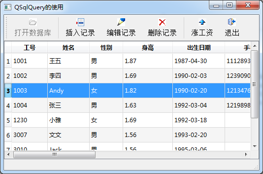
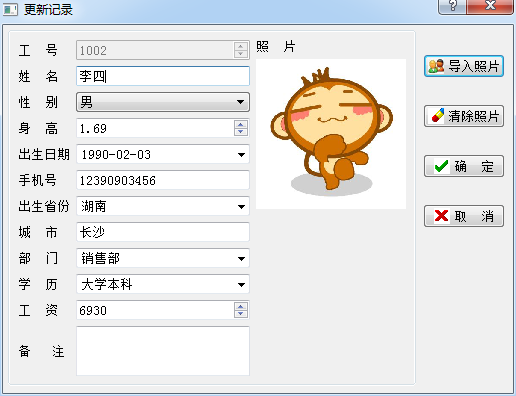

### 11.4.2　QSqlQueryModel和QSqlQuery联合使用

#### 1．数据表显示

QSqlQueryModel可以查询数据并作为数据模型，实现数据的显示，QSqlQuery可以执行UPDATE、INSERT、DELETE等SQL语句实现数据的编辑修改。

实例samp11_3通过联合使用QSqlQueryModel和QSqlQuery组件实现数据表的显示和编辑修改，图11-6是实例samp11_3运行主窗口。


<center class="my_markdown"><b class="my_markdown">图11-6　实例samp11_3运行窗口</b></center>

主窗口类定义如下（去掉了一些自动生成的部分）：

```css
class MainWindow : public QMainWindow
{   Q_OBJECT
private:
   QSqlDatabase  DB; //数据库
   QSqlQueryModel  *qryModel; //数据库模型
   QItemSelectionModel  *theSelection; //选择模型
   void   openTable();//打开数据表
   void   updateRecord(int recNo); //更新记录
public:
   explicit MainWindow(QWidget *parent = 0);
};
```

这个主窗口类的定义相比于实例samp11_2只是增加了一个updateRecord()函数。工具栏上的“打开数据库”按钮的代码与实例samp11_2完全相同，会调用openTable()连接数据库并查询数据表的数据。

本实例的openTable()函数的代码如下：

```css
void MainWindow::openTable()
{//打开数据表
   qryModel=new QSqlQueryModel(this);
   theSelection=new QItemSelectionModel(qryModel);
   qryModel->setQuery("SELECT EmpNo, Name, Gender, Height, Birthday, Mobile, Province, City, Department, Education, Salary FROM employee order by EmpNo"); 
   if (qryModel->lastError().isValid())
   {
      QMessageBox::information(this, "错误", "数据表查询错误,错误信息\n" 
   +qryModel->lastError().text(), QMessageBox::Ok,QMessageBox::NoButton);
      return;
   }
   qryModel->setHeaderData(0,Qt::Horizontal,"工号");
   qryModel->setHeaderData(1,Qt::Horizontal,"姓名");
   qryModel->setHeaderData(2,Qt::Horizontal,"性别");
   qryModel->setHeaderData(3,Qt::Horizontal,"身高");
   qryModel->setHeaderData(4,Qt::Horizontal,"出生日期");
   qryModel->setHeaderData(5,Qt::Horizontal,"手机");
   qryModel->setHeaderData(6,Qt::Horizontal,"省份");
   qryModel->setHeaderData(7,Qt::Horizontal,"城市");
   qryModel->setHeaderData(8,Qt::Horizontal,"部门");
   qryModel->setHeaderData(9,Qt::Horizontal,"学历");
   qryModel->setHeaderData(10,Qt::Horizontal,"工资");
   ui->tableView->setModel(qryModel);
   ui->tableView->setSelectionModel(theSelection);
   ui->actOpenDB->setEnabled(false);
   ui->actRecInsert->setEnabled(true);
   ui->actRecDelete->setEnabled(true);
   ui->actRecEdit->setEnabled(true);
   ui->actScan->setEnabled(true);
}
```

openTable()函数创建了QSqlQueryModel类对象qryModel，从数据表employee里查询出除了Memo和Photo之外的其他字段，并作为界面上的tableView的数据模型。还创建了选择模型theSelection，但是没有为选择模型的currentRowChanged()信号关联槽函数，因为不需要在记录移动时做什么处理。由于使用QSqlQueryModel作为tableView的数据源，在tableView里是无法编辑修改数据的。

#### 2．编辑记录对话框

由于在tableView上无法编辑修改数据，只是作为一个只读的数据显示，在主窗口工具栏上提供了“插入记录”“编辑记录”“删除记录”3个按钮对数据进行编辑。“插入记录”和“编辑记录”都会打开一个对话框，编辑一条记录的所有字段数据，确认插入后用QSqlQuery执行一条INSERT语句插入一条记录，确认编辑时用QSqlQuery执行一个UPDATE语句更新一条记录。

设计了一个对话框WDialogData，用于编辑一条记录的所有字段的数据，在“插入记录”和“编辑记录”时调用此对话框，对话框运行界面如图11-7所示。


<center class="my_markdown"><b class="my_markdown">图11-7　设计时的WDialogData对话框界面</b></center>

WDialogData类的定义如下：

```css
class WDialogData : public QDialog
{
   Q_OBJECT
private:
   QSqlRecord  mRecord; //保存一条记录的数据
public:
   explicit WDialogData(QWidget *parent = 0);
   ~WDialogData();
   void   setUpdateRecord(QSqlRecord &recData); //更新记录
   void   setInsertRecord(QSqlRecord &recData); //插入记录
   QSqlRecord  getRecordData();//获取录入的数据
private slots:
   void on_btnClearPhoto_clicked(); //清理照片
   void on_btnSetPhoto_clicked(); //设置照片
private:
   Ui::WDialogData *ui;
};
```

QSqlRecord类型的私有变量mRecord用于存储一条记录的数据。

插入一条记录时，创建对话框后调用setInsertRecord()函数初始化对话框的数据；编辑一条记录时，创建对话框后调用setUpdateRecord ()函数初始化对话框的数据。

对话框确认修改后，调用getRecordData()时，界面数据存入mRecord，并将mRecord作为返回值，返回编辑后的一条记录的数据。

对话框WDialogData的所有自定义函数，以及对话框上的“导入照片”“清除照片”按钮的代码如下，程序代码比较简单，这里不再过多解释。

```css
void WDialogData::setUpdateRecord(QSqlRecord &recData)
{ //编辑记录，更新记录数据到界面
   mRecord=recData;
   ui->spinEmpNo->setEnabled(false); //员工编号不允许编辑
   setWindowTitle("更新记录");
//根据recData的数据更新界面显示
   ui->spinEmpNo->setValue(recData.value("EmpNo").toInt());
   ui->editName->setText(recData.value("Name").toString());
   ui->comboSex->setCurrentText(recData.value("Gender").toString());
   ui->spinHeight->setValue(recData.value("Height").toFloat());
   ui->editBirth->setDate(recData.value("Birthday").toDate());
   ui->editMobile->setText(recData.value("Mobile").toString());
  ui->comboProvince->setCurrentText(recData.value("Province").toString());
   ui->editCity->setText(recData.value("City").toString());
   ui->comboDep->setCurrentText(recData.value("Department").toString());
   ui->comboEdu->setCurrentText(recData.value("Education").toString());
   ui->spinSalary->setValue(recData.value("Salary").toInt());
   ui->editMemo->setPlainText(recData.value("Memo").toString());
   QVariant   va=recData.value("Photo");
   if (!va.isValid())  //图片字段内容为空
      ui->LabPhoto->clear();
   else
   {
      QByteArray data=va.toByteArray();
      QPixmap pic;
      pic.loadFromData(data);
      ui->LabPhoto->setPixmap(pic.scaledToWidth(
                  ui->LabPhoto->size().width()));
   }
}
void WDialogData::setInsertRecord(QSqlRecord &recData)
{//插入记录，无需更新界面显示，但是要存储recData的字段结构
   mRecord=recData; //保存recData到内部变量
   ui->spinEmpNo->setEnabled(true); //插入的记录，员工编号允许编辑
   setWindowTitle("插入新记录");
   ui->spinEmpNo->setValue(recData.value("EmpNo").toInt());
}
QSqlRecord WDialogData::getRecordData()
{ //"确定"按钮后，界面数据保存到记录mRecord
   mRecord.setValue("EmpNo",ui->spinEmpNo->value());
   mRecord.setValue("Name",ui->editName->text());
   mRecord.setValue("Gender",ui->comboSex->currentText());
   mRecord.setValue("Height",ui->spinHeight->value());
   mRecord.setValue("Birthday",ui->editBirth->date());
   mRecord.setValue("Mobile",ui->editMobile->text());
   mRecord.setValue("Province",ui->comboProvince->currentText());
   mRecord.setValue("City",ui->editCity->text());
   mRecord.setValue("Department",ui->comboDep->currentText());
   mRecord.setValue("Education",ui->comboEdu->currentText());
   mRecord.setValue("Salary",ui->spinSalary->value());
   mRecord.setValue("Memo",ui->editMemo->toPlainText());
//照片编辑时已经修改了mRecord的Photo字段的值
   return  mRecord; //以记录作为返回值
}
void WDialogData::on_btnClearPhoto_clicked()
{ //清除照片
   ui->LabPhoto->clear();
   mRecord.setNull("Photo"); //Photo字段清空
}
void WDialogData::on_btnSetPhoto_clicked()
{//设置照片
   QString aFile=QFileDialog::getOpenFileName(this,"选择图片", "",  "照片(*.jpg)");
   if (aFile.isEmpty())
      return;
   QByteArray data;
   QFile* file=new QFile(aFile); 
   file->open(QIODevice::ReadOnly);
   data = file->readAll();
   file->close();
   mRecord.setValue("Photo",data); //图片保存到Photo字段
   QPixmap pic;
   pic.loadFromData(data);
 ui->LabPhoto->setPixmap(pic.scaledToWidth(ui->LabPhoto->size().width()));
}
```

#### 3．编辑记录

单击主窗口工具栏上的“编辑记录”按钮，或在tableView上双击某条记录，会编辑当前记录，代码如下：

```css
void MainWindow::on_actRecEdit_triggered()
{//编辑当前记录
   int curRecNo=theSelection->currentIndex().row(); 
   updateRecord(curRecNo);
}
void MainWindow::on_tableView_doubleClicked(const QModelIndex &index)
{ //tableView上双击,编辑当前记录
   int curRecNo=index.row();
   updateRecord(curRecNo);
}
```

两个槽函数都会调用updateRecord()函数，并且以记录的序号作为传递参数。updateRecord()函数实现当前记录的编辑，代码如下：

```css
void MainWindow::updateRecord(int recNo)
{ //更新一条记录
   QSqlRecord  curRec=qryModel->record(recNo); //获取当前记录
   int empNo=curRec.value("EmpNo").toInt();//获取EmpNo
   QSqlQuery query; //查询出当前记录的所有字段
   query.prepare("select * from employee where EmpNo = :ID");
   query.bindValue(":ID",empNo);
   query.exec();
   query.first();
   if (!query.isValid()) //是否为有效记录
      return;
   curRec=query.record();
   WDialogData   *dataDialog=new WDialogData(this);
   Qt::WindowFlags   flags=dataDialog->windowFlags();
   dataDialog->setWindowFlags(flags | Qt::MSWindowsFixedSizeDialogHint); 
   dataDialog->setUpdateRecord(curRec);//调用对话框函数更新数据和界面
   int ret=dataDialog->exec();// 以模态方式显示对话框
   if (ret==QDialog::Accepted) //OK键被按下
   {
    QSqlRecord  recData=dataDialog->getRecordData(); //获得对话框返回的记录
    query.prepare("update employee set Name=:Name, Gender=:Gender,"
" Height=:Height, Birthday=:Birthday, Mobile=:Mobile, Province=:Province,"
" City=:City,Department=:Department, Education=:Education, Salary=:Salary,"
" Memo=:Memo, Photo=:Photo  where EmpNo = :ID");
     query.bindValue(":Name",recData.value("Name"));
     query.bindValue(":Gender",recData.value("Gender"));
     query.bindValue(":Height",recData.value("Height"));
     query.bindValue(":Birthday",recData.value("Birthday"));
     query.bindValue(":Mobile",recData.value("Mobile"));
     query.bindValue(":Province",recData.value("Province"));
     query.bindValue(":City",recData.value("City"));
     query.bindValue(":Department",recData.value("Department"));
     query.bindValue(":Education",recData.value("Education"));
     query.bindValue(":Salary",recData.value("Salary"));
     query.bindValue(":Memo",recData.value("Memo"));
     query.bindValue(":Photo",recData.value("Photo"));
     query.bindValue(":ID",empNo);
     if (!query.exec())
         QMessageBox::critical(this, "错误",
                  "记录更新错误\n"+query.lastError().text(),
                  QMessageBox::Ok,QMessageBox::NoButton);
     else//重新执行SQL语句查询
         qryModel->query().exec();
   }
   delete dataDialog;
}
```

函数updateRecord(int recNo)根据行号recNo从qryModel获取当前记录的EmpNo字段的值，即员工编号，然后使用一个QSqlQuery对象从数据表里查询出这一个员工的所有字段的一条记录。使用QsqlQuery时用到了参数SQL语句：

```css
query.prepare("select * from employee where EmpNo = :ID");
query.bindValue(":ID",empNo);
query.exec();
```

由于EmpNo是数据表employee的主键字段，不允许出现重复，所以只会查询出一条记录，查询出的一条完整记录保存到变量curRec。

然后创建WDialogData类型的对话框dataDialog，调用setUpdateRecord(curRec)将完整记录传递给对话框。对话框执行后，如果是“确定”返回，则通过getRecordData()函数获取对话框编辑后的记录数据：

```css
QSqlRecord  recData=dataDialog->getRecordData();
```

recData里包含了编辑后的最新数据，然后使用QSqlQuery对象执行带参数的UPDATE语句更新一条记录。更新成功后，将数据模型qryModel的SELECT 语句重新执行一次，可刷新tableView的显示。

#### 4．插入记录

工具栏上的“插入记录”可以插入一条新记录，代码如下：

```css
void MainWindow::on_actRecInsert_triggered()
{//插入记录
   QSqlQuery query;
   query.exec("select * from employee where EmpNo =-1"); //只查询字段信息
   QSqlRecord curRec=query.record();//获取当前记录,实际为空记录
   curRec.setValue("EmpNo",qryModel->rowCount()+3000);
   WDialogData   *dataDialog=new WDialogData(this);
   Qt::WindowFlags   flags=dataDialog->windowFlags();
   dataDialog->setWindowFlags(flags | Qt::MSWindowsFixedSizeDialogHint); 
   dataDialog->setInsertRecord(curRec); //插入记录
   int ret=dataDialog->exec();// 以模态方式显示对话框
   if (ret==QDialog::Accepted) //OK键被按下
   {
     QSqlRecord  recData=dataDialog->getRecordData();
  query.prepare("INSERT INTO employee (EmpNo,Name,Gender, Height,Birthday, "
"Mobile,Province, City,Department,Education,Salary,Memo,Photo) "
" VALUES(:EmpNo,:Name, :Gender,:Height,:Birthday, :Mobile, :Province,"
  " :City, :Department, :Education,:Salary,:Memo,:Photo)");
     query.bindValue(":EmpNo",recData.value("EmpNo"));
     query.bindValue(":Name",recData.value("Name"));
     query.bindValue(":Gender",recData.value("Gender"));
     query.bindValue(":Height",recData.value("Height"));
     query.bindValue(":Birthday",recData.value("Birthday"));
     query.bindValue(":Mobile",recData.value("Mobile"));
     query.bindValue(":Province",recData.value("Province"));
     query.bindValue(":City",recData.value("City"));
     query.bindValue(":Department",recData.value("Department"));
     query.bindValue(":Education",recData.value("Education"));
     query.bindValue(":Salary",recData.value("Salary"));
     query.bindValue(":Memo",recData.value("Memo"));
     query.bindValue(":Photo",recData.value("Photo"));
     if (!query.exec())
         QMessageBox::critical(this, "错误",
                   "插入记录错误\n"+query.lastError().text(),
                   QMessageBox::Ok,QMessageBox::NoButton);
     else //重新执行SQL语句查询
         qryModel->query().exec();
   }
   delete dataDialog;
}
```

程序首先用QSqlQuery类对象query执行一个SQL语句“select * from employee where EmpNo =-1”，这样不会查询到任何记录，目的就是得到一条空记录curRec。

创建WDialogData类型的对话框dataDialog后，调用setInsertRecord()函数对话框进行初始化设置。

对话框dataDialog运行“确认”返回后，使用query执行INSERT语句插入一条新记录。若插入记录执行成功，需要重新执行数据模型qryModel的SQL语句查询数据，才会更新界面上的tableView的显示。

#### 5．删除记录

工具栏上的“删除记录”删除tableView上的当前记录，代码如下：

```css
void MainWindow::on_actRecDelete_triggered()
{//删除当前记录
   int curRecNo=theSelection->currentIndex().row();
   QSqlRecord  curRec=qryModel->record(curRecNo); //获取当前记录
   if (curRec.isEmpty()) //当前为空记录
      return;
   int empNo=curRec.value("EmpNo").toInt();//获取员工编号
   QSqlQuery query;
   query.prepare("delete  from employee where EmpNo = :ID");
   query.bindValue(":ID",empNo);
   if (!query.exec())
      QMessageBox::critical(this, "错误", 
            "删除记录出现错误\n"+query.lastError().text(),
             QMessageBox::Ok,QMessageBox::NoButton);
   else //重新执行SQL语句查询
      qryModel->query().exec();
}
```

从数据模型的当前记录中获取员工编号，然后使用一个QSqlQuery类的对象执行一条DELETE语句删除这条记录。

删除记录后需要重新设置数据模型qryModel的SQL语句并查询数据，以更新数据和tableView的显示。

#### 6．记录遍历

工具栏上的“涨工资”按钮通过记录遍历，修改所有记录的Salary字段的值，其实现代码如下：

```css
void MainWindow::on_actScan_triggered()
{//涨工资，记录遍历
   QSqlQuery qryEmpList; 
   qryEmpList.exec("SELECT EmpNo,Salary FROM employee ORDER BY EmpNo");
   qryEmpList.first();
   QSqlQuery qryUpdate;                                   //临时 QSqlQuery
   qryUpdate.prepare("UPDATE employee SET Salary=:Salary WHERE EmpNo = :ID");
   while (qryEmpList.isValid())                           //当前记录有效
   {
      int   empID=qryEmpList.value("EmpNo").toInt();      //获取EmpNo
      float  salary=qryEmpList.value("Salary").toFloat(); //获取Salary
      salary=salary+1000;                                 //涨工资
      qryUpdate.bindValue(":ID",empID);
      qryUpdate.bindValue(":Salary",salary);              //设置SQL语句参数
      qryUpdate.exec(); //执行update
      if (!qryEmpList.next()) //移动到下一条记录，并判断是否到末尾了
         break;
   }
   qryModel->query().exec();//重新查询数据，更新tableView的显示
   QMessageBox::information(this, "提示", "涨工资计算完毕",
                      QMessageBox::Ok,QMessageBox::NoButton);
}
```

程序里使用了两个QSqlQuery类变量，qryEmpList查询EmpNo和Salary两个字段的全部记录，qryUpdate用于执行一个带参数的UPDATE语句，每次更新一条记录。

遍历qryEmpList的所有记录，QSqlQuery有first()、previous()、next()、last()等函数记录移动，若到了最后一条记录后再执行next()，将返回false，以此判断是否遍历完所有记录。

