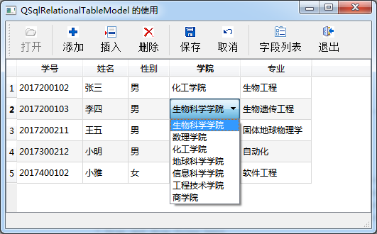

### 11.5.1　关系型数据表和实例功能

从图11-2的类继承关系图上看，QSqlRelationalTableModel是QSqlTableModel的子类。QSqlRelationalTableModel可以处理关系数据表，所谓关系数据表，是指将主表里的某个字段存储为代码型字段，而代码的具体意义在另外一个数据表里。

表11-5给出了studInfo的字段定义，studInfo数据表实际存储的数据示例见表11-12，字段departID和majorID存储的是学院代码和专业代码。

<b class="my_markdown">表11-12　表studInfo的数据记录示例</b>

| 序号 | studID | name | gender | departID | majorID |
| :-----  | :-----  | :-----  | :-----  | :-----  | :-----  | :-----  | :-----  |
| 1 | 2017200211 | 张三 | 男 | 20 | 2003 |
| 2 | 2017200102 | 李四 | 男 | 10 | 1002 |
| 3 | 2017300212 | 小明 | 男 | 50 | 5001 |
| 4 | 2017400102 | 小雅 | 女 | 50 | 5002 |

学院代码字段departID的具体意义在数据表departments里定义，departments表的字段结构见表11-3，departments表的示例数据见表11-13。

<b class="my_markdown">表11-13　表departments的数据记录示例</b>

| 序号 | departID | department |
| :-----  | :-----  | :-----  | :-----  | :-----  |
| 1 | 10 | 生物科学学院 |
| 2 | 20 | 数理学院 |
| 3 | 50 | 化工学院 |

同样，专业数据表majors定义了专业代码及其专业名称，majors表的字段结构见表11-4，majors表的示例数据见表11-14。majors数据表不仅定义了专业代码的意义，还使用了学院代码字段departID，与departments数据表发生关联。

<b class="my_markdown">表11-14　表majors的数据记录示例</b>

| 序号 | majorID | major | departID |
| :-----  | :-----  | :-----  | :-----  | :-----  | :-----  |
| 1 | 1001 | 生物遗传学 | 10 |
| 2 | 1002 | 生物工程 | 10 |
| 3 | 5001 | 计算机网络 | 50 |
| 4 | 5002 | 自动化 | 50 |

在数据库设计中使用代码字段和代码表的好处；一是可以减少数据表的存储量，一个大的数据表存储代码远比存储具体文字用的存储空间少；二是代码表示的文字可能会被修改，例如学院的名称可能会修改，这时只需修改代码表里一条记录而已。

QSqlRelationalTableModel类专门用来编辑这种具有代码字段的数据表，可以很方便地将代码字段与关系数据表建立关系，在显示和编辑数据表时，直接使用关系数据表的代码意义字段的内容。实例samp11_4演示关系型数据表使用的方法，图11-8是程序运行界面。

<b class="my_markdown">图11-8　实例samp11_4编辑数据表studInfo的界面</b>

实例samp11_4使用QSqlRelationalTableModel作为tableView的数据源，显示和编辑studInfo数据表。学院和专业两个字段与代码表建立了关系，tableView中直接显示这两个字段的文字内容，编辑时有一个下拉列表框，列表框里是代码表里全部代码意义文字。

