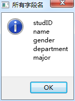

### 11.5.2　关系型数据模型功能实现

#### 1．主窗口类定义

主窗口类定义如下，定义了一个QSqlRelationalTableModel类型的变量tabModel作为数据模型。

```css
class MainWindow : public QMainWindow
{
   Q_OBJECT
private:
   QSqlDatabase  DB;                   //数据库连接
   QSqlRelationalTableModel  *tabModel;//数据模型
   QItemSelectionModel *theSelection;  //选择模型
   void   openTable();                 //打开数据表
public:
   explicit MainWindow(QWidget *parent = 0);
   ~MainWindow();
private slots:
  void on_currentChanged(const QModelIndex &current, const QModelIndex &previous);
};
```

#### 2．打开数据表

主窗口工具栏的“打开”按钮选择数据库文件demodb.db3，然后调用openTable()打开数据表，openTable()函数的代码如下：

```css
void MainWindow::openTable()
{//打开数据表
   tabModel=new QSqlRelationalTableModel(this,DB);
   tabModel->setTable("studInfo"); //设置数据表
   tabModel->setEditStrategy(QSqlTableModel::OnManualSubmit);  
   tabModel->setSort(0,Qt::AscendingOrder);
   tabModel->setHeaderData(0,Qt::Horizontal,"学号");
   tabModel->setHeaderData(1,Qt::Horizontal,"姓名");
   tabModel->setHeaderData(2,Qt::Horizontal,"性别");
   tabModel->setHeaderData(3,Qt::Horizontal,"学院");
   tabModel->setHeaderData(4,Qt::Horizontal,"专业");
//设置代码字段的查询关系数据表
   tabModel->setRelation(3, 
        QSqlRelation("departments","departID","department")); //学院
   tabModel->setRelation(4,
        QSqlRelation("majors","majorID","major"));//专业
   theSelection=new QItemSelectionModel(tabModel);
   connect(theSelection,SIGNAL(currentChanged(QModelIndex,QModelIndex)),
         this,SLOT(on_currentChanged(QModelIndex,QModelIndex)));
   ui->tableView->setModel(tabModel);
   ui->tableView->setSelectionModel(theSelection);
//为关系型字段设置缺省代理组件
   ui->tableView->setItemDelegate(
                    new QSqlRelationalDelegate(ui->tableView)); 
   tabModel->select(); //打开数据表
   ui->actOpenDB->setEnabled(false);
   ui->actRecAppend->setEnabled(true);
   ui->actRecInsert->setEnabled(true);
   ui->actRecDelete->setEnabled(true);
   ui->actFields->setEnabled(true);
}
```

QSqlRelationalTableModel类的主要函数与QSqlTableModel相同，有一个新的函数setRelation()用于设置代码字段的关联数据表和关联字段。setRelation()函数的定义如下：

```css
void setRelation(int column, const QSqlRelation &relation)
```

其中column是主表中代码字段的序号，relation是QSqlRelation类型的表示关联数据表的关系。设置代码字段departID的关系的代码如下：

```css
tabModel->setRelation(3,
             QSqlRelation("departments","departID","department")); 
```

第1个参数（数字3）是departID字段在studInfo表中的字段序号。

第2个参数用QSqlRelation("departments","departID","department")创建了一个QSqlRelation类型对象，其中，参数"departments"是代码表departments，参数"departID"是代码字段名称，参数"department"是代码意义字段名称。

openTable()函数中还有关键的一行：

```css
ui->tableView->setItemDelegate(new QSqlRelationalDelegate(ui->tableView));
```

这是在tableView中为代码字段创建缺省的关系型代理组件，这样在tableView中编辑代码字段的内容时，才会出现一个下拉列表框，列出代码表的所有可选内容。

#### 3．实际字段列表

使用QSqlRelationalTableModel类设置代码字段的关系后，在tableView中以代码意义显示代码字段的内容，其实际字段有没有变化呢？

工具栏上的按钮“字段列表”列出了tabModel的所有字段的名称，其代码如下：

```css
void MainWindow::on_actFields_triggered()
{//获取字段列表
   QSqlRecord  emptyRec=tabModel->record();//获取空记录，只有字段名
   QString  str;
   for (int i=0;i<emptyRec.count();i++)
      str=str+emptyRec.fieldName(i)+'\n';
   QMessageBox::information(this, "所有字段名", str, 
                QMessageBox::Ok,QMessageBox::NoButton);
}
```

字段列表的对话框如图11-9所示，可以看到两个代码字段departID和majorID被代码表中的代码意义字段department和major替换了。但是在界面上修改数据后，数据能以代码的形式保存到原数据表里。


<center class="my_markdown"><b class="my_markdown">图11-9　tabModel的字段列表</b></center>

#### 4．其他功能的实现

工具栏上其他“添加”“插入”“删除”“保存”“取消”等按钮的功能的实现与实例samp11_1相同，自定义槽函数on_currentChanged()的实现也与samp11_1相同，这些功能的实现就不具体介绍了。


