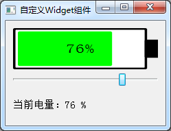

### 12.1.1　自定义Widget子类QmyBattery

Qt的UI设计器提供了很多GUI设计的界面组件，可以满足常见的界面设计需求。但是某些时候需要设计特殊的界面组件，而在UI设计器的组件面板里根本没有合适的组件，这时就需要设计自定义的界面组件。

所有界面组件的基类是QWidget，要设计自定义的界面组件，可以从QWidget继承一个自定义的类，重定义其paintEvent()事件，利用Qt的绘图功能绘制组件外观，并实现需要的其他功能。

例如，假设需要设计一个如图12-1所示的电池电量显示组件，用于电池使用或充电时显示其电量，但是在UI设计器的组件面板里是没有这样一个现成的组件的。这就需要设计一个自定义的Widget组件。


<center class="my_markdown"><b class="my_markdown">图12-1　实例samp12_1运行时界面</b></center>

为此，设计一个从QWidget继承的类QmyBattery。创建C++类，可以单击Qt Creator的“File”→“New File or Project”菜单项，在出现的对话框里选择C++组里的C++ Class，在向导中设置类的名称，并选择基类为QWidget。

定义QmyBattery类的qmybattery.h文件的完整代码如下：

```css
#include   <QWidget>
#include   <QColor>
class QmyBattery : public QWidget
{
   Q_OBJECT
private:
   QColor  mColorBack=Qt::white;    //背景颜色
   QColor  mColorBorder=Qt::black;  //电池边框颜色
   QColor  mColorPower=Qt::green;   //电量柱颜色
   QColor  mColorWarning=Qt::red;   //电量短缺时的颜色
   int  mPowerLevel=60;             //电量0-100
   int  mWarnLevel=20;              //电量低警示阈值
protected:
   void   paintEvent(QPaintEvent *event) Q_DECL_OVERRIDE;
public:
   explicit QmyBattery(QWidget *parent = 0);
   void   setPowerLevel(int pow);   //设置当前电量
   int    powerLevel();
   void   setWarnLevel(int warn);   //设置电量低阈值
   int    warnLevel();
   QSize   sizeHint();              //缺省大小
signals:
   void   powerLevelChanged(int );
public slots:
};
```

在private部分定义了几个私有变量，主要是各种颜色的定义、当前电量值mPowerLevel和电量低阈值mWarnLevel。

protected部分重定义了paintEvent()事件，在第8章中介绍过，QWidget类的paintEvent()事件用于界面绘制，在此事件里，可以使用QPainter的各种绘图功能绘制自己需要的界面。

public部分定义了用于读取和设置当前电量值、电量低阈值的函数，还定义了sizeHint()函数，用于返回组件缺省大小。

定义了一个信号powerLevelChanged(int)，在当前电量值改变时发射该信号，使用QmyBattery类时可以设计槽函数对此信号做处理。

下面是QmyBattery类的实现代码，复杂一点的部分是paintEvent()事件函数里绘制界面的功能实现，这里设置了窗口逻辑坐标，所以，当组件大小变化时，绘制的电池大小也会自动变化。QPainter绘图的功能在第8章有详细介绍，这里不再详细解释。

```css
#include  "qmybattery.h"
#include  <QPainter>
void QmyBattery::paintEvent(QPaintEvent *event)
{  //界面组件的绘制
   Q_UNUSED(event);
   QPainter   painter(this);
   QRect rect(0,0,width(),height());
   painter.setViewport(rect);//设置Viewport
   painter.setWindow(0,0,120,50); // 设置窗口大小，逻辑坐标
   painter.setRenderHint(QPainter::Antialiasing);
   painter.setRenderHint(QPainter::TextAntialiasing);
//绘制电池边框
   QPen   pen;//设置画笔
   pen.setWidth(2); 
   pen.setColor(mColorBorder); 
   pen.setStyle(Qt::SolidLine); 
   pen.setCapStyle(Qt::FlatCap); 
   pen.setJoinStyle(Qt::BevelJoin); 
   painter.setPen(pen);
   QBrush  brush;//画刷
   brush.setColor(mColorBack); 
   brush.setStyle(Qt::SolidPattern); 
   painter.setBrush(brush);
   rect.setRect(1,1,109,48);
   painter.drawRect(rect);//绘制电池边框
   brush.setColor(mColorBorder); 
   painter.setBrush(brush);
   rect.setRect(110,15,10,20);
   painter.drawRect(rect); //画电池正极头
//画电池柱
   if (mPowerLevel>mWarnLevel)
   {  //正常颜色电量柱
      brush.setColor(mColorPower); 
      pen.setColor(mColorPower); 
   }
   else
   { //电量低电量柱
      brush.setColor(mColorWarning); 
      pen.setColor(mColorWarning); 
   }
   painter.setBrush(brush);
   painter.setPen(pen);
   if (mPowerLevel>0)
   {
      rect.setRect(5,5,mPowerLevel,40);
      painter.drawRect(rect);//画电池柱
   }
//绘制电量百分比文字
   QFontMetrics   textSize(this->font());
   QString powStr=QString::asprintf("%d%%",mPowerLevel);
   QRect textRect=textSize.boundingRect(powStr);//得到字符串的rect
   painter.setFont(this->font());
   pen.setColor(mColorBorder); 
   painter.setPen(pen);
   painter.drawText(55-textRect.width()/2,
            23+textRect.height()/2,  powStr);
}
void QmyBattery::setPowerLevel(int pow)
{ //设置当前电量值
   mPowerLevel=pow;
   emit powerLevelChanged(pow); //发射信号
   repaint();
}
int QmyBattery::powerLevel()
{ //返回当前电量值
   return mPowerLevel;
}
void QmyBattery::setWarnLevel(int warn)
{//设置电量低阈值
   mWarnLevel=warn;
   repaint();
}
int QmyBattery::warnLevel()
{//返回电量低阈值
   return  mWarnLevel;
}
QSize QmyBattery::sizeHint()
{//缺省大小,调整比例
   int H=this->height();
   int W=H*12/5;
   QSize   size(W,H);
   return size;
}
```

