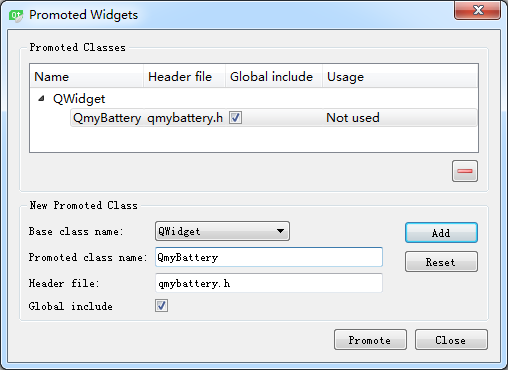

### 12.1.2　自定义Widget组件的使用

实现了QmyBattery类之后，若是用代码创建QmyBattery类对象，其使用与一般的组件类是一样的；若是在UI设计器中使用QmyBattery，则需要采用提升法（promotion）。

实例samp12_1是一个基于QWidget的应用程序，使用UI设计器设计主窗体时，在窗体上放置一个QWidget类组件，然后鼠标右键调出其快捷菜单，单击“Promote to”菜单项，会出现如图12-2所示的对话框。


<center class="my_markdown"><b class="my_markdown">图12-2　Widget组件提升对话框</b></center>

此对话框里，在基类名称下拉列表框里选择QWidget，将提升后的类名称设置为QmyBattery，头文件名称会自动生成。可以将设置添加到已提升类的列表里，以便重复使用。设置后，单击“Promote”按钮，就可以将此QWidget组件提升为QmyBattery类。提升后，在Property Editor里，会看到这个组件的类名称变为了QmyBattery。然后，将其objectName更改为battery。

虽然界面上放置的QWidget组件被提升为了QmyBattery类，但是在这个组件的“Go to slot”对话框里并没有QmyBattery类的powerLevelChanged(int ) 信号，无法采用可视化方法生成信号的槽函数。

在主窗口上放置一个QSlider组件和一个QLabel组件。滑动标尺改变数值时，设置为battery的当前电量值，其valueChanged()信号的槽函数代码如下：

```css
void MainWindow::on_slider_valueChanged(int value)
{ //滑动改变电量值
  ui->battery->setPowerLevel(value);
  QString  str=QStringLiteral("当前电量：")+QString::asprintf("%d %%",value);
  ui->LabInfo->setText(str);
}
```

实例运行时就可以得到如图12-1所示的运行界面。battery的各种参数采用其缺省的设置，battery的当前电量值改变时，内部会调用paintEvent()事件代码重新绘制电池显示效果。

