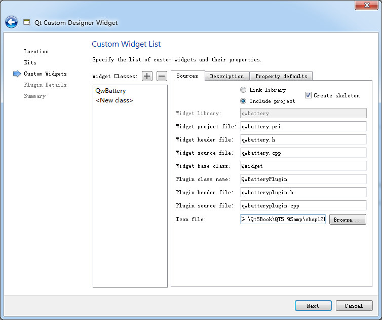
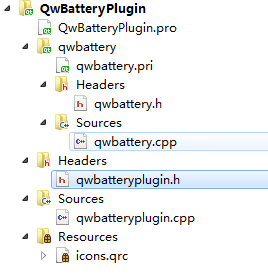

### 12.2.1　创建Qt Designer Widget插件项目

Qt提供两种设计插件的API，可以用于扩展Qt的功能。高级（high-level）API用于设计插件以扩展Qt的功能，例如定制数据库驱动、图像格式、文本编码、定制样式等，Qt Creator里大量采用了插件，单击Qt Creator的主菜单栏的“Help”→“About Plugins”菜单项，会显示Qt Creator里已经安装的各种插件。

低级（low-level）API用于创建插件以扩展自己编写应用程序的功能，最常见的就是将自定义Widget组件安装到UI设计器里，用于窗口界面设计。

本节创建一个与12.1节的QmyBattery功能一样的类QwBattery，但是采用创建Qt Designer插件的方式来创建这个类，并将其安装到UI设计器的组件面板里。

要创建UI设计器插件类，单击Qt Creator的“File”→“New File or Project”菜单，在出现的对话框里选择“Other Project”分组的“Qt Custom Designer Widget”项目，会出现一个向导对话框。按照这个向导的操作逐步完成项目创建。

第1步是设置插件项目的名称和保存路径，本实例设置项目名称为QwBatteryPlugin。

第2步是选择项目编译器，可以选择多个编译器，在编译时，再选择具体的编译器。但是实际上只有MSVC2015 32bit编译器是能用的。

注意　使用Qt创建的Widget插件，若要在Qt Creator的UI设计器里正常显示，编译插件的编译器版本必须和编译Qt Creator的版本一致。

Qt 5.9的Qt Creator是基于MSVC2015 32bit编译器编译的（单击Qt Creator的“Help”→“About Qt Creator”菜单，出现的对话框里会显示Qt Creator的版本信息和使用的编译器信息）。所以，为了在Qt Creator里设计窗体时能够正常显示插件，只能使用Qt 5.9 MSVC2015 32bit编译器。

第3步是设置自定义QWidget类的名称（见图12-3），只需在左侧的Widget classes列表里设置类名，右侧就会自动设置缺省的文件名，这里添加一个类QwBattery。还可以选择一个图标文件作为自定义组件在UI设计器组件面板里的显示图标。

<b class="my_markdown">图12-3　设置界面组件类的名称</b>

在图12-3的Description页还可以设置Group、Tooltip和What’s this等信息，Group是自定义组件在组件面板里的分组名称，这里设置为“My Widget”。

第4步是显示和设置插件、资源文件名称。本实例缺省的插件名称是qwbatteryplugin，资源文件名称为icons.qrc，一般用缺省的即可。

第5步，完成设置，生成项目。

完成设置后生成的项目的文件组织结构如图12-4所示，这些文件包括以下几个。

<b class="my_markdown">图12-4　插件项目文件组织结构</b>

+ QwBatteryPlugin.pro 是插件项目的项目文件，用于实现插件接口。
+ qwbatteryplugin.h和qwbatteryplugin.cpp是插件的头文件和实现文件。
+ icons.qrc是插件项目的资源文件，存储了图标。
+ qwbattery.pri是包含在QwBatteryPlugin.pro项目中的一个项目文件（图12-3中选择“Include project”），用于管理自定义组件类。
+ qwbattery.h和qwbattery.cpp是自定义类QwBattery的头文件和实现文件。

