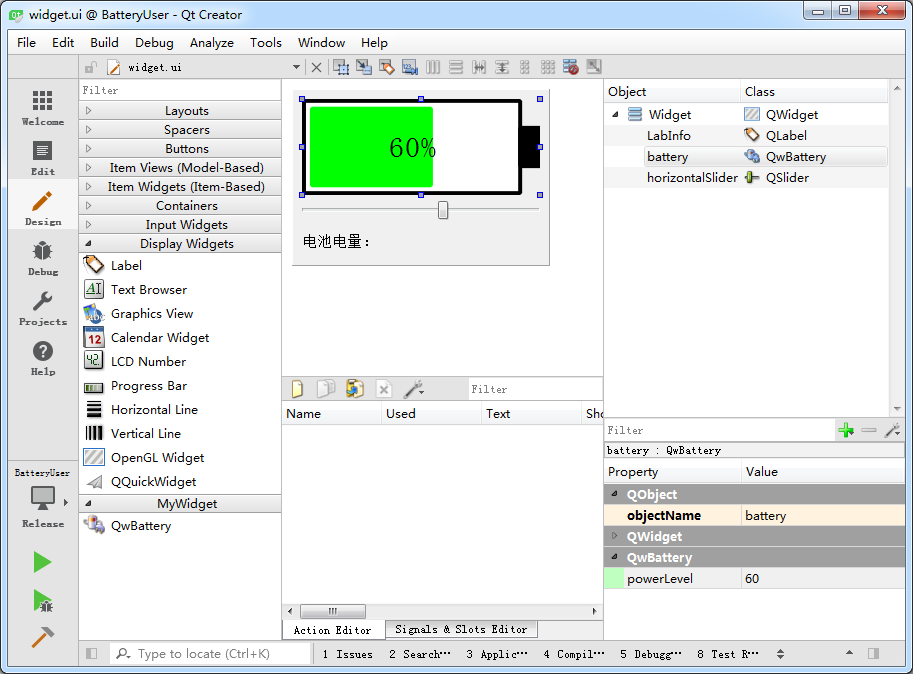
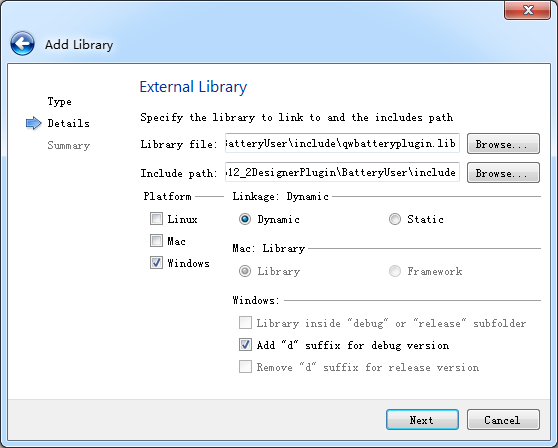

### 12.2.4　使用自定义插件

在Qt Creator的UI设计器的组件面板里能正常显示自定义的QwBattery组件后，就可以在窗体设计时使用QwBattery组件了。

创建一个基于QWidget的实例应用程序BatteryUser。设计窗体时，从组件面板上拖放一个QwBattery到窗体上，窗体的功能与实例samp12_1的窗体相同，但是在设计窗体时，就能直接看到QwBattery绘制的电池图形，在属性编辑器里可以编辑QwBattery组件的powerLevel属性（见图12-5），在其“Go to slot”对话框里会出现自定义的信号powerLevelChanged(int)，可以为此信号设计槽函数。


<center class="my_markdown"><b class="my_markdown">图12-5　使用QwBattery组件的窗体设计</b></center>

下面的代码实现的是利用滑动条设置battery的当前电量值，在battery的powerLevelChanged()信号的槽函数里，将当前电量值显示在标签里，程序运行后就可以实现与图12-1相同的功能。

```css
void MainWindow::on_horizontalSlider_valueChanged(int value)
{ //拖动slider改变 battery的电量值
   ui->battery->setPowerLevel(value);
}
void MainWindow::on_battery_powerLevelChanged(int arg1)
{ //电量值改变时，在标签中显示
   QString  str=QStringLiteral("当前电量：")+QString::asprintf("%d %%",arg1);
   ui->LabInfo->setText(str);
}
```

> **注意**
> 项目BatteryUser只能用MSVC2015 32bit编译器进行编译，因为使用的Widget插件类QwBattery是用MSVC2015 32bit编译的。

要正常编译项目BatteryUser，还需要做以下设置。

+ 在项目的源文件目录下创建一个include子目录（名称随个人喜好设置），将QwBattery类定义的头文件qwbattery.h、插件的debug和release两种模式编译生成的库文件qwbatteryplugin.lib以及qwbatteryplugind.lib复制到此目录下，项目在编译链接时需要使用此头文件和库文件。
+ 在项目管理器中，选中BatteryUser项目节点并单击右键，在快捷菜单中单击“Add Library…”，在出现的向导对话框第一步中，选择库类型时，将外部库“External Library”选中，因为本项目需要使用的是已经编译好的库文件。
+ 在向导的第二步（见图12-6），单击“Library file”编辑框后面的按钮，选择include目录下的库文件qwbatteryplugin.lib，会自动填充“Include path”编辑框。在平台选择中可以只选择一个windows平台，连接方式选择Dynamic，下方的Add “d” suffix for debug version表示在debug版本的库名称后面添加一个字母“d”，以便编译器自动区分release和debug版本的库文件。


<center class="my_markdown"><b class="my_markdown">图12-6　向项目添加插件的库文件</b></center>

完成“Add Library”对话框的设置后，Qt Creator会自动修改项目文件BatteryUser.pro的内容，在其中添加了以下几行：

```css
win32:CONFIG(release, debug|release): LIBS += -L$$PWD/include/ -lqwbatteryplugin
else:win32:CONFIG(debug, debug|release): LIBS += -L$$PWD/include/ -lqwbatteryplugind
INCLUDEPATH += $$PWD/include
DEPENDPATH += $$PWD/include
```

LIBS用于设置添加的库文件，会判断当前项目是以debug还是release模式编译，自动加入qwbatteryplugin.lib或qwbatteryplugind.lib库文件。

INCLUDEPATH 和DEPENDPATH用于设置头文件目录和项目依赖项目录，都指向项目路径下的include目录。

这样设置后，项目就可以在release或debug模式下编译了，同样只能使用MSVC2015 32bit编译器。

> **注意**
> 要运行应用程序，还需要将插件的DLL文件复制到编译后的release或debug版本的可执行文件目录下，在本例中就是qwbatteryplugin.dll文件或qwbatteryplugind.dll文件，因为应用程序运行需要相应的DLL文件。在应用程序发布时，也需要将DLL文件随同应用程序发布。

自定义Widget插件的功能使得我们可以扩展Qt Creator的组件种类，设计自己需要的组件。也有许多第三方Widget插件可供直接使用，减少自己编程的工作量，例如QWT就是一套非常好的开源Widget插件。

