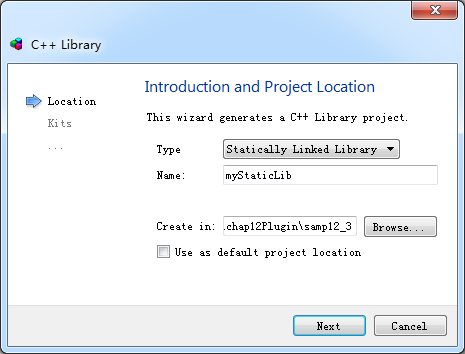
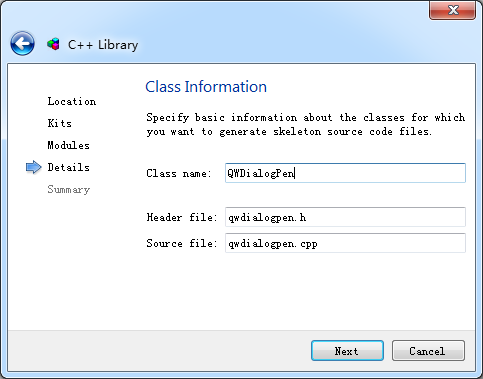

### 12.3.1　创建静态链接库

创建一个静态链接库项目，设计各种需要导出的类，包括具有UI的窗体类、对话框类，编译后可以生成一个lib文件（MSVC编译器生成后缀为“.lib”的文件，MinGW编译器生成后缀为“.a”的文件），在另一个应用程序里使用这个lib文件和类的头文件（不需要cpp源文件），就可以静态编译到应用程序里。这种方式适合于在小组开发时，每个人负责自己的部分，使用其他人设计的代码时只能使用而不能看到或修改源代码，便于项目代码的管理。

创建静态链接库项目，单击Qt Creator的“File”→“New File or Project”菜单项，在出现的“New File or Project”对话框中选择Projects组里的Library，在右侧的具体类别中再选择C++ Library，单击“Choose...”按钮后出现如图12-7所示的向导对话框。

在此对话框的Type下拉列表框里选择“Statically Linked Library”，并给项目命名，例如myStaticLib，再选择项目保存目录。单击“Next”按钮后选择编译器，再下一步选择需要包含的Qt 模块，再下一步是类定义页面（见图12-8），在其中输入类的名称。


<center class="my_markdown"><b class="my_markdown">图12-7　创建静态链接库项目向导对话框</b></center>


<center class="my_markdown"><b class="my_markdown">图12-8　创建静态链接库项目向导的类信息页面</b></center>

本实例将9.3节设计的一个QPen属性设置对话框QWDialogPen作为静态库的导出类，所以在图12-8的类定义界面上输入的类名称为QWDialogPen，头文件和源程序文件名会自动生成。在图12-8中单击“Next”按钮，再下一步结束即可。

这样生成的静态库项目myStaticLib包括3个文件：myStaticLib.pro、qwdialogpen.h和qwdialogpen.cpp。

我们希望将9.3节设计的一个QPen属性设置对话框QWDialogPen作为静态库的类，为此将9.3节QWDialogPen类相关的3个文件qwdialogpen.h、qwdialogpen.cpp和qwdialogpen.ui复制到myStaticLib项目的源文件目录下，覆盖自动生成的两个文件，并且将qwdialogpen.ui添加到项目中。

QWDialogPen类相关的3个文件在9.3节有详细介绍，添加到静态库项目myStaticLib之后无需做任何修改，所以其内容不再详述。

项目配置文件myStaticLib.pro是对本项目的设置，其内容如下：

```css
QT      += widgets
TARGET = myStaticLib
TEMPLATE = lib
CONFIG += staticlib
SOURCES +=   qwdialogpen.cpp
HEADERS +=   qwdialogpen.h
unix {
   target.path = /usr/lib
   INSTALLS += target
}
FORMS +=   qwdialogpen.ui
```

TEMPLATE=lib 定义项目模板是库，而不是应用程序。

CONFIG += staticlib 配置项目为静态库。

TARGET = myStaticLib定义项目编译后生成的目标文件名称是myStaticLib。

> **注意**
> 静态库项目可以使用MinGW或MSVC编译器编译，但是项目编译生成的文件与使用的编译器有关。若使用MSVC编译，编译后会生成一个库文件myStaticLib.lib；若使用MinGW编译，编译后会生成一个库文件libmyStaticLib.a。

release和debug模式下编译生成的都是相同的文件名，并不会为debug版本自动添加一个字母“d”，但是在release和debug模式下编译应用程序时，需要使用相应版本的库文件。

