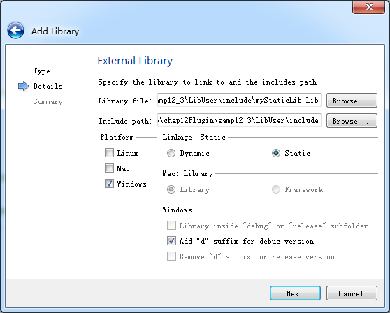

### 12.3.2　静态链接库的使用

创建一个基于QMainWindow的应用程序LibUser，在项目源程序目录下新建一个include目录，根据使用的编译器复制不同的文件。

+ 若使用MSVC编译器，将静态库项目myStaticLib下的qwdialogpen.h和release版本的myStaticLib.lib复制到这个include目录下，将debug版本的myStaticLib.lib更名为myStaticLibd.lib复制到这个include目录下。
+ 若使用MinGW编译器，就将libmyStaticLib.a和libmyStaticLibd.a（debug版本）复制到include目录里。

在项目管理目录树里右键单击LibUser项目，在快捷菜单里单击“Add Library...”菜单项，在出现的向导对话框里首先选择添加的库类型为“External Library”，在向导第二步设置需要导入的静态库文件（见图12-9）。


<center class="my_markdown"><b class="my_markdown">图12-9　设置添加的静态库信息</b></center>

首先选择需要导入的库文件myStaticLib.lib，连接类型里必须选择Static，因为这是静态库，勾选Add “d” suffix for debug version，使得在debug模式下编译应用程序时将自动调用debug版本的库文件myStaticLibd.lib。

设置完成后，Qt Creator将自动更改项目配置文件LibUser.pro，增加以下的内容，主要是设置了包含文件和依赖项的路径，增加了LIBS设置。

```css
win32:CONFIG(release, debug|release): LIBS += -L$$PWD/include/ -lmyStaticLib
else:win32:CONFIG(debug, debug|release): LIBS += -L$$PWD/include/ -lmyStaticLibd
INCLUDEPATH += $$PWD/include
DEPENDPATH += $$PWD/include
win32-g++:CONFIG(release, debug|release): PRE_TARGETDEPS += $$PWD/include/libmyStaticLib.a
else:win32-g++:CONFIG(debug, debug|release): PRE_TARGETDEPS += $$PWD/include/  libmyStaticLibd.a
else:win32:!win32-g++:CONFIG(release, debug|release): PRE_TARGETDEPS += $$PWD/include/  myStaticLib.lib
else:win32:!win32-g++:CONFIG(debug, debug|release): PRE_TARGETDEPS += $$PWD/include/  myStaticLibd.lib
```

编译应用程序LibUser，使用MSVC或MinGW编译器，在release或debug模式下都可以编译，运行程序效果如图12-10所示。单击“设置Pen”按钮可以设置划线的Pen属性，并在主窗体上绘制一个矩形框。


<center class="my_markdown"><b class="my_markdown">图12-10　应用程序LibUser运行效果</b></center>

主窗体程序比较简单，MainWindow类中新增的定义如下：

```css
class MainWindow : public QMainWindow
{
private:
   QPen   mPen;
protected:
   void   paintEvent(QPaintEvent *event) Q_DECL_OVERRIDE;
};
```

paintEvent()事件在窗体上绘制一个矩形，使用了QPen类型的私有变量mPen作为绘图的画笔。action_Pen的响应代码调用静态库里的QWDialogPen的静态函数getPen设置画笔属性。

```css
void MainWindow::paintEvent(QPaintEvent *event)
{//绘图
   Q_UNUSED(event);
   QPainter   painter(this);
   QRect rect(0,0,width(),height()); //viewport矩形区
   painter.setViewport(rect);//设置Viewport
   painter.setWindow(0,0,100,50); // 设置窗口大小，逻辑坐标
   painter.setPen(mPen);
   painter.drawRect(10,10,80,30);
}
void MainWindow::on_action_Pen_triggered()
{//设置Pen
   bool   ok=false;
   QPen   pen=QWDialogPen::getPen(mPen,ok);
   if (ok)
   {  mPen=pen;
      this->repaint();
   }
}
```

本实例将一个可视化设计的对话框QWDialogPen封装到一个静态库里，也可以将任何C++类、函数封装到静态库，其实现方法是一样的。

