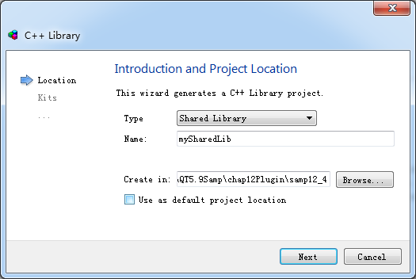

### 12.4.1　创建共享库

除了静态库，Qt还可以创建共享库，也就是Windows平台上的动态链接库。动态链接库项目编译后生成DLL文件，DLL文件在windows平台上应用广泛。DLL文件是在应用程序运行时加载的，不像静态库那样在编译期间就连编到应用程序里。若更新了DLL文件版本，只要接口未变，应用程序依然可以调用。

创建共享库项目，单击Qt Creator的“File”→“New File or Project”菜单项，在New File or Project对话框中选择Projects组里的Library，在右侧的具体类别中再选择C++ Library，单击“Choose…”按钮后出现如图12-11所示的向导对话框。


<center class="my_markdown"><b class="my_markdown">图12-11　创建共享库向导对话框</b></center>

在此对话框的Type下拉列表框里选择Shared Library，并给项目命名，例如mySharedLib，再选择项目保存目录。单击“Next”按钮后选择编译器，下一步选择需要包含的Qt 模块，再下一步是类定义页面，在其中输入类的名称，这里仍然输入类名称为QWDialogPen（界面与图12-8完全一样），再下一步结束即可。

由向导生成的mySharedLib项目包含文件mySharedLib.pro、qwdialogpen.h 和qwdialogpen.cpp。此外还有一个特殊的头文件mysharedlib_global.h，文件的内容如下：

```css
#include <QtCore/qglobal.h>
#if defined(MYSHAREDLIB_LIBRARY)
#  define MYSHAREDLIBSHARED_EXPORT Q_DECL_EXPORT
#else
#  define MYSHAREDLIBSHARED_EXPORT Q_DECL_IMPORT
#endif
```

这里定义了符号MYSHAREDLIBSHARED_EXPORT用于替代Qt的宏Q_DECL_EXPORT或Q_DECL_IMPORT。

一个共享库导出给用户使用的类、符号、函数等都需要用宏Q_DECL_EXPORT来定义导出，一个使用共享库的应用程序需要通过Q_DECL_IMPORT导入共享库里的可用对象。

在mySharedLib.pro文件里增加了符号MYSHAREDLIB_LIBRARY的定义，下面是mySharedLib.pro文件的主要内容：

```css
Qt   += widgets
TARGET = mySharedLib
TEMPLATE = lib
DEFINES += MYSHAREDLIB_LIBRARY
```

自动生成的qwdialogpen.h文件里的内容是对QWDialogPen类的定义，在类名称前使用了宏MYSHAREDLIBSHARED_EXPORT，定义QWDialogPen为一个导出的类。

```css
#include "mysharedlib_global.h"
class MYSHAREDLIBSHARED_EXPORT QWDialogPen
{
public:
   QWDialogPen();
};
```

将12.3节静态库项目里的文件qwdialogpen.h、qwdialogpen.cpp和qwdialogpen.ui复制到本项目目录下，覆盖自动生成的初始文件，但是修改文件qwdialogpen.h里的类的定义，在类名称前增加MYSHAREDLIBSHARED_EXPORT宏，并加入mysharedlib_global.h的包含语句。

项目的文件准备好之后就可以编译生成DLL文件，根据使用的编译器不同，生成的文件有些区别。

+ 若使用MSVC编译，编译后会生成mySharedLib.dll和mySharedLib.lib两个文件，mySharedLib.dll在运行应用程序时调用，mySharedLib.lib在应用程序隐式调用动态链接库时使用。
+ 若使用MinGW编译，编译后会生成mySharedLib.dll和libmySharedLib.a两个文件，mySharedLib.dll在运行应用程序时调用，libmySharedLib.a在应用程序隐式调用动态链接库时使用。

采用debug和release不同模式生成的文件只能当应用程序在debug或release模式下编译或调用。

