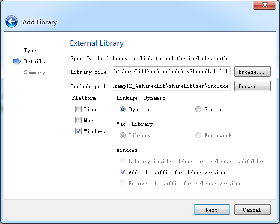
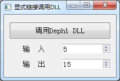

### 12.4.2　使用共享库

#### 1．共享库的调用方式

调用动态链接库有两种形式，隐式链接（implicit linking）调用和显式链接（explicit linking）调用。

隐式链接调用是在编译应用程序时，有动态库的lib文件（或.a文件）和h头文件，知道DLL中有哪些接口类和函数，编译时就隐式地生成必要的链接信息，使用DLL中的类或函数时根据h头文件中的定义使用即可。应用程序运行时将自动加载DLL文件。隐式链接调用主要用于同一种编程软件（如Qt）生成的代码的共享。

显式链接调用是只有DLL文件，知道DLL里的函数原型，使用QLibrary类对象在应用程序里动态加载DLL文件，声明函数原型，并使用DLL里的函数。这种方式需要在应用程序里声明函数原型，并解析DLL里的函数。

#### 2．隐式链接调用共享库

创建一个基于QMainWindow的应用程序shareLibUser，程序功能与12.3节的LibUser项目一样，将LibUser项目的mainwindow相关3个文件mainwindow.h、mainwindow.cpp和mainwindow.ui复制到shareLibUser项目下，替换自动生成的文件。

在shareLibUser项目文件目录下新建一个include目录，将mySharedLib项目的两个头文件qwdialogpen.h和mysharedlib_global.h复制到此目录下。若使用MSVC编译器，则将release版本的mySharedLib.lib复制到此目录下，debug版本的mySharedLib.lib更名为mySharedLibd.lib复制到此目录下；若使用MinGW编译器，则复制release版本的libmySharedLib.a，debug版本的libmySharedLib.a更名为libmySharedLibd.a复制到此目录下。

为应用程序增加动态链接库，右键单击shareLibUser项目节点，在快捷菜单里单击“Add Library…”菜单项，在出现的向导对话框里首先选择添加的库类型为“External Library”，在向导第二步设置导入的动态库文件（见图12-12）。


<center class="my_markdown"><b class="my_markdown">图12-12　为项目添加动态链接库</b></center>

在图12-12中，选择项目include目录下的mySharedLib.lib文件或libmySharedLib.a作为库文件，其他设置如图12-12所示。

完成后在shareLibUser.pro文件中自动增加项目设置的语句如下：

```css
win32:CONFIG(release, debug|release): LIBS += -L$$PWD/include/ -lmySharedLib
else:win32:CONFIG(debug, debug|release): LIBS += -L$$PWD/include/ -lmySharedLibd
INCLUDEPATH += $$PWD/include
DEPENDPATH += $$PWD/include
```

项目编译时，会根据当前是release还是debug模式，自动添加相应的库文件。这里添加库文件只是使用了动态库的导出定义，而不是将库的实现代码连接到应用程序的可执行文件里。

主窗体类MainWindow的功能与12.3节的程序完全一致，调用共享库里的类QWDialogPen也无需特别说明，只需包含头文件qwdialogpen.h即可。

shareLibUser项目可以用MinGW或MSVC编译器编译，运行效果与图12-10完全一样。

> **注意**
> 必须将动态链接库文件mySharedLib.dll复制到可执行文件的目录下，程序才可以正常运行。mySharedLib.dll的debug和release版本必须分别用于应用程序的debug和release版本，否则运行时出错。

使用动态链接库可以很方便地扩展应用程序的功能，但是DLL文件需要随应用程序一起发布，并且编译DLL和应用程序的Qt版本最好保持一致，否则需要考虑二进制兼容问题。

#### 3．显式链接调用共享库

显式链接调用共享库是在应用程序运行时才加载共享库文件，并调用库里的函数的。应用程序编译时无需共享库的任何文件，只需知道函数名和函数的原型即可。所以，这种方式可以调用其他语言编写的DLL文件，例如用Delphi生成的一个DLL文件。

显式链接调用共享库是通过QLibrary类实现的。QLibrary是与平台无关的，用于在运行时载入共享库，一个QLibrary对象只对一个共享库进行操作。

一般在QLibrary的构造函数中传递一个文件名，可以是带路径的绝对文件名，也可以是不带后缀的单独文件名。QLibrary会根据运行的平台自动查找不同后缀的共享库文件，例如Unix上是“.so”，Mac上是“.dylib”，Windows上是“.dll”。

作为示例，用Delphi编写一个DLL项目，生成一个DelphiDLL.dll文件，这个文件里只有一个函数，函数的原型为：

```css
function triple(N:integer):integer;
```

它会计算传递参数N的3倍值并返回。

在Qt Creator里创建一个基于QMainWindow的应用程序DelphiDLLUser，设计一个简单的界面，运行时如图12-13所示。单击按钮时将根据输入，调用动态链接库DelphiDLL.dll里的triple()函数，计算结果并显示在输出编辑框里。


<center class="my_markdown"><b class="my_markdown">图12-13　DelphiDLLUser运行界面</b></center>

按钮的槽函数代码如下：

```css
void MainWindow::on_pushButton_clicked()
{
   QLibrary myLib("DelphiDLL");
   if (myLib.isLoaded())
     QMessageBox::information(this,"信息","DelphiDLL.DLL已经被载入,第1处");
   typedef int (*FunDef)(int); 
   FunDef myTriple = (FunDef) myLib.resolve("triple"); //解析DLL中的函数
   int V=myTriple(ui->spinInput->value()); //调用函数
   ui->spinOutput->setValue(V);
   if (myLib.isLoaded())
     QMessageBox::information(this,"信息","DelphiDLL.DLL已经被载入,第2处");
}
```

在定义QLibrary对象实例myLib时传递了共享库文件名“DelphiDLL”，这里不需要给出后缀名。DelphiDLL.dll文件必须在应用程序同一目录、系统目录或可搜索目录下。

QLibrary有几个函数用于DLL文件的载入与卸载：load()用于手动载入DLL文件到内存里，一般无需手工调用此函数，在DLL里的函数第一次被使用时QLibrary会自动调用此函数；isLoaded()用于判断DLL是否已经被载入内存；unload()用于将DLL从内存中卸载。

一个动态链接库在内存里只能有一个实例，也就是即使有多处调用了这个动态链接库里的函数，它也只会被载入一次，如果不是所有的实例都使用unload()卸载它，那么它会在应用程序退出时才卸载。

在槽函数on_pushButton_clicked()的代码里，有两处QMessageBox显示信息。在运行应用程序，第一次单击按钮时，只有第2处信息框显示，说明声明了QLibrary对象后，动态链接库没有立即被载入内存；第二次单击按钮时，两处信息框会先后显示，说明动态链接库上次载入内存后，还在内存里。

显式调用动态链接库里的函数，需要声明函数原型的类型，即：

```css
typedef int (*FunDef)(int);
```

然后使用QLibrary的resolve()函数解析需要调用的函数。

```css
FunDef myTriple = (FunDef) myLib.resolve("triple");
```

这样就定义了一个函数myTriple，用于实现DLL文件里的函数"triple"的功能，当然重新声明的函数名称可以和DLL里的函数名称完全相同。

如果DelphiDLL.dll文件没有复制到应用程序目录下，则编译和启动应用程序都不会出错，只有单击按钮调用DLL里的函数时才会出错。所以，要使应用程序正常运行，需要将DelphiDLL.dll文件复制到应用程序目录下。


