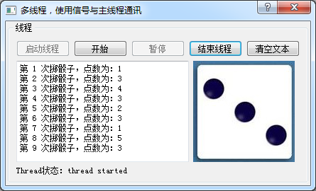

### 13.1.3　掷骰子的多线程应用程序

使用QDiceThread类，设计一个应用程序samp13_1，程序运行界面如图13-1所示。


<center class="my_markdown"><b class="my_markdown">图13-1　掷骰子多线程应用程序samp13_1运行界面</b></center>

窗体上方的几个按钮用于控制线程的启动与停止，控制开始与暂停掷骰子。中间的文本框显示次数和点数，右边根据点数显示资源文件里面的一个图片，图片存储在项目的资源文件里。下方的一个标签根据QDiceThread的started()和finished()两个信号显示线程的状态。

窗口类是从QDialog继承的类Dialog，其类定义如下（省略了按钮槽函数的定义）：

```css
class Dialog : public QDialog
{
   Q_OBJECT
private:
   QDiceThread   threadA;
protected:
   void   closeEvent(QCloseEvent *event);
public:
   explicit Dialog(QWidget *parent = 0);
   ~Dialog();
private slots:
//自定义槽函数
   void   onthreadA_started();
   void   onthreadA_finished();
   void   onthreadA_newValue(int seq, int diceValue);
private:
   Ui::Dialog *ui;
};
```

这里定义了一个QDiceThread类型的变量threadA，重定义了closeEvent()事件，自定义了3个槽函数。

Dialog类的构造函数代码如下：

```css
Dialog::Dialog(QWidget *parent) : QDialog(parent),  ui(new Ui::Dialog)
{//构造函数
   ui->setupUi(this);
   connect(&threadA,SIGNAL(started()),this,SLOT(onthreadA_started()));
   connect(&threadA,SIGNAL(finished()),this,SLOT(onthreadA_finished()));
   connect(&threadA,SIGNAL(newValue(int,int)),
             this,SLOT(onthreadA_newValue(int,int)));
}
```

构造函数主要是将threadA的3个信号与Dialog自定义的3个槽函数相关联，这3个槽函数的代码如下：

```css
void Dialog::onthreadA_started()
{//线程的started()信号的响应槽函数
   ui->LabA->setText("Thread状态：thread started");
}
void Dialog::onthreadA_finished()
{//线程的 finished()信号的响应槽函数
   ui->LabA->setText("Thread状态：thread finished");
}
void Dialog::onthreadA_newValue(int seq,int diceValue)
{//QDiceThread的newValue()信号的响应槽函数，显示骰子次数和点数
   QString  str=QString::asprintf("第 %d 次掷骰子，点数为：%d",seq,diceValue);
   ui->plainTextEdit->appendPlainText(str);
   QPixmap pic; //图片显示
   QString filename=QString::asprintf(":/dice/images/d%d.jpg",diceValue);
   pic.load(filename);
   ui->LabPic->setPixmap(pic);
}
```

started()信号发射时，表示线程开始执行，在标签里显示状态文字。

finished()信号发射时，表示线程结束执行，在标签里显示状态文字。

newValue()是QDiceThread定义的信号，在掷一次骰子获得新的点数后发射，将掷骰子的次数和点数传递过来。槽函数onthreadA_newValue()获取这两个值并显示在文本框里，再根据点数从资源文件里获取相应的图片并显示。

窗口上5个按钮的代码如下：

```css
void Dialog::on_btnStartThread_clicked()
{//启动线程 按钮
   threadA.start();
   ui->btnStartThread->setEnabled(false);
   ui->btnStopThread->setEnabled(true);
   ui->btnDiceBegin->setEnabled(true);
   ui->btnDiceEnd->setEnabled(false);
}
void Dialog::on_btnStopThread_clicked()
{//结束线程 按钮
   threadA.stopThread();//结束线程的run()函数执行
   threadA.wait();
   ui->btnStartThread->setEnabled(true);
   ui->btnStopThread->setEnabled(false);
   ui->btnDiceBegin->setEnabled(false);
   ui->btnDiceEnd->setEnabled(false);
}
void Dialog::on_btnDiceBegin_clicked()
{//开始 掷骰子按钮
   threadA.diceBegin();
   ui->btnDiceBegin->setEnabled(false);
   ui->btnDiceEnd->setEnabled(true);
}
void Dialog::on_btnDiceEnd_clicked()
{//暂停 掷骰子按钮
   threadA.dicePause();
   ui->btnDiceBegin->setEnabled(true);
   ui->btnDiceEnd->setEnabled(false);
}
void Dialog::on_btnClear_clicked()
{ //清空文本 按钮
   ui->plainTextEdit->clear();
}
```

“启动线程”按钮调用线程的start()函数，start()函数会内部调用run()函数开始线程任务的执行。run()函数将内部变量m_Paused初始化为true，所以，启动线程后并不会立即开始掷骰子。

“开始”按钮调用diceBegin()函数，使threadA线程内部变量m_Paused变为false，那么run()函数里就开始每隔500毫秒产生一次骰子点数，并发射信号newValue()。

“暂停”按钮调用dicePause()函数，使threadA线程内部变量m_Paused变为true，run()函数里不再掷骰子，但是run()函数并没有结束，也就是线程并没有结束。

“结束线程”按钮调用stopThread()函数，使threadA线程内部的m_stop变为true，run()函数体的while循环结束，执行quit()后线程结束。所以，线程结束就是run()函数执行退出。

重载closeEvent()事件，在窗口关闭时确保线程被停止，代码如下：

```css
void Dialog::closeEvent(QCloseEvent *event)
{ //窗口关闭事件，必须结束线程
   if (threadA.isRunning())
   {
      threadA.stopThread();
      threadA.wait();
   }
   event->accept();
}
```

