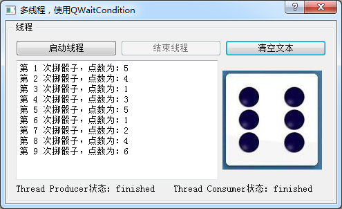

### 13.2.4　基于QWaitCondition的线程同步

在多线程的程序中，多个线程之间的同步实际上就是它们之间的协调问题。例如上一小节讲到的3个线程的例子中，假设threadDAQ写满一个缓冲区之后，threadShow和threadSaveFile才能对缓冲区进行读操作。前面采用的互斥量和基于QReadWriteLock的方法都是对资源的锁定和解锁，避免同时访问资源时发生冲突。在一个线程解锁资源后，不能及时通知其他线程。

QWaitCondition提供了另外一种改进的线程同步方法，QWaitCondition与QMutex结合，可以使一个线程在满足一定条件时通知其他多个线程，使它们及时作出响应，这样比只使用互斥量效率要高一些。例如，threadDAQ在写满一个缓冲区之后，及时通知threadShow和threadSaveFile，使它们可以及时读取缓冲区数据。

QWaitCondition提供如下一些函数：

+ wait(QMutex *lockedMutex)，解锁互斥量lockedMutex，并阻塞等待唤醒条件，被唤醒后锁定lockedMutex并退出函数；
+ wakeAll()，唤醒所有处于等待状态的线程，线程唤醒的顺序不确定，由操作系统的调度策略决定；
+ wakeOne()，唤醒一个处于等待状态的线程，唤醒哪个线程不确定，由操作系统的调度策略决定。

QWaitCondition一般用于“生产者/消费者”（producer/consumer）模型中。“生产备”产生数据，“消费者”使用数据，前述的数据采集、显示与存储的三线程例子就适用这种模型。

创建实例程序samp13_4，将掷骰子的程序修改为producer/consumer模型，一个线程类QThreadProducer专门负责掷骰子产生点数；一个线程类QThreadConsumer专门及时读取数据，并送给主线程进行显示。这两个类定义在一个文件qmythread.h里，定义代码如下：

```css
class QThreadProducer : public Qthread
{   Q_OBJECT
private:
   bool   m_stop=false; //停止线程
protected:
   void   run() Q_DECL_OVERRIDE;
public:
   QThreadProducer();
   void   stopThread();
};
class QThreadConsumer : public Qthread
{   Q_OBJECT
private:
   bool   m_stop=false; //停止线程
protected:
   void   run() Q_DECL_OVERRIDE;
public:
   QThreadConsumer();
   void   stopThread();
signals:
   void   newValue(int seq,int diceValue);
};
```

QThreadProducer用于掷骰子，但是去掉了开始和暂停的功能，线程一启动就连续地掷骰子。QThreadConsumer用于读取掷骰子的次数和点数，并用发射信号方式把数据传递出去。这两个类的实现代码在一个文件qmythread.cpp里，下面是这两个类的实现代码的主要部分：

```css
QMutex  mutex;
QWaitCondition  newdataAvailable;
int    seq=0;//序号
int    diceValue;
void QthreadProducer::run()
{
   m_stop=false;
   seq=0;
   qsrand(QTime::currentTime().msec());//随机数初始化
   while(!m_stop)//循环主体
   {
      mutex.lock();
      diceValue=qrand(); //获取随机数
      diceValue=(diceValue % 6)+1;
      seq++;
      mutex.unlock();
      newdataAvailable.wakeAll(); //唤醒所有线程，有新数据了
      msleep(500); //线程休眠
   }
}
void QthreadConsumer::run()
{
   m_stop=false;
   while(!m_stop)//循环主体
   {
      mutex.lock();
      newdataAvailable.wait(&mutex);//先解锁mutex，使其他线程可以使用mutex
      emit  newValue(seq,diceValue);
      mutex.unlock();
   }
}
```

掷骰子的次数和点数的变量定义为共享变量，这样两个线程都可以访问。定义了互斥量mutex，定义了QWaitCondition实例newdataAvailable，表示有新数据可用了。

QThreadProducer::run()函数负责每隔500毫秒掷骰子产生一次数据，新数据产生后通过等待条件唤醒所有等待的线程，即：

```css
newdataAvailable.wakeAll();
```

QThreadConsumer::run()函数中的while循环，首先需要将互斥量锁定，再执行下面的一条语句：

```css
newdataAvailable.wait(&mutex);
```

这条语句以mutex作为输入参数，内部会首先解锁mutex，使其他线程可以使用mutex，newdataAvailable进入等待状态。当QThreadProducer产生新数据使用newdataAvailable.wakeAll()唤醒所有线程后，newdataAvailable.wait(&mutex)会再次锁定mutex，然后退出阻塞状态，以执行后面的语句。

所以，使用QWaitCondition可以使QThreadConsumer线程的执行过程进入等待状态。在QThreadProducer线程满足条件后，唤醒QThreadConsumer线程及时退出等待状态，继续执行后面的程序。

使用QThreadProducer和QThreadConsumer实现掷骰子的实例程序samp13_4运行时界面如图13-2所示，与实例samp13_1的运行界面类似，只是取消了开始和暂停掷骰子的按钮，下方的状态标签显示了两个线程的状态。


<center class="my_markdown"><b class="my_markdown">图13-2　使用QWaitCondition的线程同步实例程序samp13_4运行界面</b></center>

窗口的Dialog类的定义如下（省略了按钮槽函数等一些不重要的部分）：

```css
class Dialog : public QDialog
{   Q_OBJECT
private:
   QthreadProducer   threadProducer;
   QthreadConsumer   threadConsumer;
protected:
   void   closeEvent(QCloseEvent *event);
public:
   explicit Dialog(QWidget *parent = 0);
private slots:
   void   onthreadA_started();
   void   onthreadA_finished();
   void   onthreadB_started();
   void   onthreadB_finished();
   void   onthreadB_newValue(int seq, int diceValue);
};
```

这里主要是定义了两个线程的实例，并定义了几个自定义槽函数。采用信号与槽的方式与threadConsumer建立通信并获取数据。Dialog的构造函数主要完成信号与槽函数的关联，5个自定义槽函数的代码与实例samp13_1的相同或相似，这几个函数的代码不再详细列出。

“启动线程”按钮的代码如下：

```css
void Dialog::on_btnStartThread_clicked()
{//启动线程
   threadConsumer.start();
   threadProducer.start();
   ui->btnStartThread->setEnabled(false);
   ui->btnStopThread->setEnabled(true);
}
```

两个线程启动的先后顺序不应调换，应先启动threadConsumer，使其先进入wait状态，后启动threadProducer，这样在threadProducer里wakeAll()时threadConsumer就可以及时响应，否则会丢失第一次掷骰子的数据。

“结束线程”按钮的代码如下：

```css
void Dialog::on_btnStopThread_clicked()
{//结束线程
   threadProducer.stopThread();//结束线程的run()函数执行
   threadProducer.wait();
   threadConsumer.terminate(); //可能处于等待状态，用terminate强制结束
   threadConsumer.wait();
   ui->btnStartThread->setEnabled(true);
   ui->btnStopThread->setEnabled(false);
}
```

结束线程时，若按照上面的顺序先结束threadProducer线程，则必须使用terminate()来强制结束threadConsumer线程，因为threadConsumer可能还处于条件等待的阻塞状态中，将无法正常结束线程。

