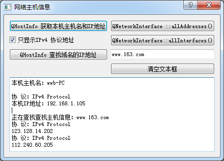

### 14.1.1　QHostInfo和QNetworkInterface类

查询一个主机的MAC地址或IP地址是网络应用程序中经常用到的功能，Qt提供了QHostInfo和QNetworkInterface类可以用于此类信息的查询。

QHostInfo的静态函数localHostName()可获取本机的主机名，静态函数fromName()可以通过主机名获取IP地址，静态函数ookupHost()可以通过一个主机名，以异步方式查找这个主机的IP地址。表14-1是QHostInfo类主要的功能函数（省略了函数中的const关键字）。

<b class="my_markdown">表14-1　QHostInfo类的主要函数</b>

| 类别 | 函数原型 | 作用 |
| :-----  | :-----  | :-----  | :-----  | :-----  |
| 公共 | 函数 | QList<QHostAddress>　addresses() | 返回与hostName()主机关联的IP地址列表 |
| HostInfoError　error() | 如果主机查找失败，返回失败类型 |
| QString　errorString() | 如果主机查找失败，返回错误描述字符串 |
| QString　hostName() | 返回通过IP查找的主机的名称 |
| int　lookupId() | 返回本次查找的ID |
| 静态 | 函数 | void　abortHostLookup(int id) | 中断主机查找 |
| QHostInfo　fromName(QString &name) | 返回指定的主机名的IP地址 |
| QString　localDomainName() | 返回本机DNS域名 |
| QString　localHostName() | 返回本机主机名 |
| int　lookupHost(QString &name, QObject receiver, char member) | 以异步方式根据主机名查找主机的IP地址，并返回一个表示本次查找的ID，可用于abortHostLookup() |

QNetworkInterface可以获得运行应用程序的主机的所有IP地址和网络接口列表。静态函数allInterfaces()返回主机上所有的网络接口的列表，一个网络接口可能包括多个的IP地址，每个IP地址与掩码或广播地址关联。如果无需知道子网掩码和广播的IP地址，使用静态函数allAddresses()可以获得主机上的所有IP地址列表。表14-2是QNetworkInterface类的主要功能函数。

<b class="my_markdown">表14-2　QNetworkInterface类的主要函数</b>

| 类别 | 函数原型 | 作用 |
| :-----  | :-----  | :-----  | :-----  | :-----  |
| 公共 | 函数 | QList<QNetworkAddressEntry>　addressEntries() | 返回该网络接口（包括子网掩码和广播地址）的IP地址列表 |
| QString　hardwareAddress() | 返回该接口的低级硬件地址，以太网里就是MAC地址 |
| QString　humanReadableName() | 返回可以读懂的接口名称，如果名称不确定，得到的就是name()函数的返回值 |
| bool　isValid() | 如果接口信息有效就返回true |
| QString　name() | 返回网络接口名称 |
| 静态 | 函数 | QList<QHostAddress>　 allAddresses() | 返回主机上所有IP地址的列表 |
| QList<QNetworkInterface>　 allInterfaces() | 返回主机上所有接口的网络列表 |

为演示这两个类的主要功能，创建一个窗口基于QDialog的应用程序samp14_1，实例运行时界面如图14-1所示。对话框界面由UI设计器设计，主要代码都是各按钮的clicked()信号的槽函数。

<b class="my_markdown">图14-1　实例samp14_1运行界面</b>

