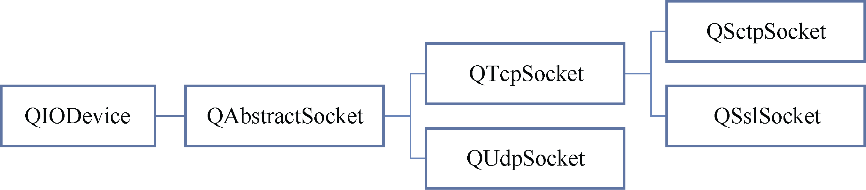
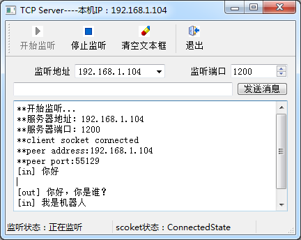
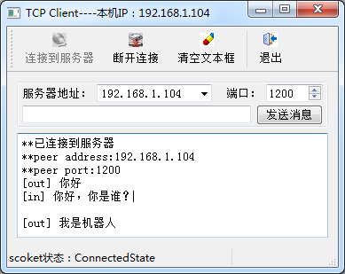

### 14.2.1　TCP通信概述

TCP(Transmission Control Protocol)是一种被大多数Internet网络协议（如HTTP 和FTP）用于数据传输的低级网络协议，它是可靠的、面向流、面向连接的传输协议，特别适合用于连续数据传输。

TCP通信必须先建立TCP连接，通信端分为客户端和服务器端（如图14-2所示）。Qt提供QTcpSocket类和QTcpServer类用于建立TCP通信应用程序。服务器端程序必须使用QTcpServer用于端口监听，建立服务器；QTcpSocket用于建立连接后使用套接字（Socket）进行通信。


<center class="my_markdown"><b class="my_markdown">图14-2　客户端与服务器端TCP通信示意图</b></center>

QTcpServer是从QObject继承的类，它主要用于服务器端建立网络监听，创建网络Socket连接。QTcpServer类的主要接口函数见表14-4（省略了函数中的const关键字，省略了缺省参数）。

<center class="my_markdown"><b class="my_markdown">表14-4　QTcpServer类的主要接口函数</b></center>

| 类型 | 函数 | 功能 |
| :-----  | :-----  | :-----  | :-----  | :-----  |
| 公共 | 函数 | void　close() | 关闭服务器，停止网络监听 |
| bool　listen() | 在给定IP地址和端口上开始监听，若成功就返回true |
| bool　isListening() | 返回true表示服务器处于监听状态 |
| QTcpSocket * nextPendingConnection() | 返回下一个等待接入的连接 |
| QHostAddress　serverAddress() | 如果服务器处于监听状态，返回服务器地址 |
| quint16　serverPort() | 如果服务器处于监听状态，返回服务器监听端口 |
| bool　waitForNewConnection() | 以阻塞方式等待新的连接 |
| 信号 | void acceptError( QAbstractSocket::SocketError socketError ) | 当接受一个新的连接发生错误时发射此信号，参数socketError描述了错误信息 |
| void　newConnection() | 当有新的连接时发射此信号 |
| 保护 | 函数 | void　incomingConnection(qintptr socketDescriptor) | 当有一个新的连接可用时，QTcpServer内部调用此函数，创建一个QTcpSocket对象，添加到内部可用新连接列表，然后发射newConnection()信号。用户若从QTcpServer继承定义类，可以重定义此函数，但必须调用addPendingConnection() |
| void　addPendingConnection(QTcpSocket *socket) | 由incomingConnection()调用，将创建的QTcpSocket添加到内部新可用连接列表 |

服务器端程序首先需要用QTcpServer::listen()开始服务器端监听，可以指定监听的IP地址和端口，一般一个服务程序只监听某个端口的网络连接。

当有新的客户端接入时，QTcpServer内部的incomingConnection()函数会创建一个与客户端连接的QTcpSocket对象，然后发射信号newConnection()。在newConnection()信号的槽函数中，可以用nextPendingConnection()接受客户端的连接，然后使用QTcpSocket与客户端通信。

所以在客户端与服务器建立TCP连接后，具体的数据通信是通过QTcpSocket完成的。QTcpSocket类提供了TCP协议的接口，可以用QTcpSocket类实现标准的网络通信协议如POP3、SMTP和NNTP，也可以设计自定义协议。

QTcpSocket是从QIODevice间接继承的类，所以具有流读写的功能。QTcpSocket和下一节要讲到的QUdpSocket的类继承关系如图14-3所示。


<center class="my_markdown"><b class="my_markdown">图14-3　QTcpSocket和QUdpSocket的类继承关系</b></center>

QTcpSocket类除了构造函数和析构函数，其他函数都是从QAbstractSocket继承或重定义的。QAbstractSocket用于TCP通信的主要接口函数见表14-5（省略了函数中的const关键字，省略了缺省参数）。

<center class="my_markdown"><b class="my_markdown">表14-5　QAbstractSocket类的主要接口函数</b></center>

| 类型 | 函数 | 功能 |
| :-----  | :-----  | :-----  | :-----  | :-----  |
| 公共 | 函数 | void　connectToHost(QHostAddress &address, quint16 port,) | 以异步方式连接到指定IP地址和端口的TCP服务器，连接成功后会发射connected()信号 |
| void　disconnectFromHost() | 断开socket，关闭成功后发射disconnected()信号 |
| bool　waitForConnected() | 等待直到建立socket连接 |
| bool　waitForDisconnected() | 等待直到断开socket连接 |
| QHostAddress　localAddress() | 返回本socket的地址 |
| quint16　localPort() | 返回本socket的端口 |
| QHostAddress　peerAddress() | 在已连接状态下，返回对方socket的地址 |
| QString　peerName() | 返回connectToHost()连接到的对方的主机名 |
| quint16　peerPort() | 在已连接状态下，返回对方socket的端口 |
| qint64　readBufferSize() | 返回内部读取缓冲区的大小，该大小决定了read()和readAll()函数能读出的数据的大小 |
| void　setReadBufferSize(qint64 size) | 设置内部读取缓冲区大小 |
| qint64　bytesAvailable() | 返回需要读取的缓冲区的数据的字节数 |
| bool　canReadLine() | 如果有行数据要从socket缓冲区读取，就返回true |
| SocketState　state() | 返回socket当前的状态 |
| 信号 | void　connected() | connectToHost()成功连接到服务器后发射此信号 |
| void　disconnected() | 当socket断开连接后发射此信号 |
| void　error(QAbstractSocket::SocketError socketError) | 当socket发生错误时发射此信号 |
| void　hostFound() | 调用connectToHost()找到主机后发射此信号 |
| void　stateChanged(QAbstractSocket::SocketState socketState) | 当socket的状态变化时发射此信号，参数socketState表示了socket当前的状态 |
| void　readyRead() | 当缓冲区有新数据需要读取时发射此信号，在此信号的槽函数里读取缓冲区的数据 |

TCP客户端使用QTcpSocket与TCP服务器建立连接并通信。

客户端的QTcpSocket实例首先通过connectToHost()尝试连接到服务器，需要指定服务器的IP地址和端口。connectToHost()是异步方式连接服务器，不会阻塞程序运行，连接后发射connected()信号。

如果需要使用阻塞方式连接服务器，则使用waitForConnected()函数阻塞程序运行，直到连接成功或失败。例如：

```css
socket->connectToHost("192.168.1.100", 1340);
  if (socket->waitForConnected(1000))
     qDebug("Connected!");
```

与服务器端建立socket连接后，就可以向缓冲区写数据或从接收缓冲区读取数据，实现数据的通信。当缓冲区有新数据进入时，会发射readyRead()信号，一般在此信号的槽函数里读取缓冲区数据。

QTcpSocket是从QIODevice间接继承的，所以可以使用流数据读写功能。一个QTcpSocket实例既可以接收数据也可以发送数据，且接收与发射是异步工作的，有各自的缓冲区。

作为演示TCP通信的实例，创建了一个TCPClient程序和一个TCPServer程序，两个程序运行时界面如图14-4和图14-5所示。


<center class="my_markdown"><b class="my_markdown">图14-4　TCPServer程序</b></center>


<center class="my_markdown"><b class="my_markdown">图14-5　TCPClient程序</b></center>

TCPServer程序具有如下的功能：

+ 根据指定IP地址（本机地址）和端口打开网络监听，有客户端连接时创建socket连接；
+ 采用基于行的数据通信协议，可以接收客户端发来的消息，也可以向客户端发送消息；
+ 在状态栏显示服务器监听状态和socket的状态。

TCPClient程序程序具有如下的功能：

+ 通过IP地址和端口号连接到服务器；
+ 采用基于行的数据通信协议，与服务器端收发消息；
+ 处理QTcpSocket的StateChange()信号，在状态栏显示socket的状态。

