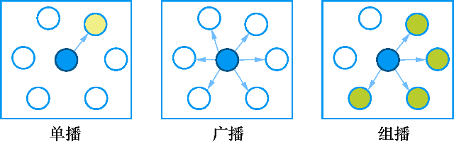

### 14.3.1　UDP通信概述

UDP (User Datagram Protocol，用户数据报协议)是轻量的、不可靠的、面向数据报（datagram）、无连接的协议，它可以用于对可靠性要求不高的场合。与TCP通信不同，两个程序之间进行UDP通信无需预先建立持久的socket连接，UDP每次发送数据报都需要指定目标地址和端口（如图14-6所示）。

QUdpSocket类用于实现UDP通信，它从QAbstractSocket类继承，因而与QTcpSocket共享大部分的接口函数。主要区别是QUdpSocket以数据报传输数据，而不是以连续的数据流。发送数据报使用函数QUdpSocket::writeDatagram()，数据报的长度一般少于512字节，每个数据报包含发送者和接收者的IP地址和端口等信息。

要进行UDP数据接收，要用QUdpSocket::bind()函数先绑定一个端口，用于接收传入的数据报。当有数据报传入时会发射readyRead()信号，使用readDatagram()函数来读取接收到的数据报。

UDP消息传送有单播、广播、组播三种模式，其示意图如图14-7所示。

<b class="my_markdown">图14-6　UDP收发器之间通信示意图</b>

<b class="my_markdown">图14-7　UDP客户端之间通信的三种模式</b>

+ 单播（unicast）模式：一个UDP客户端发出的数据报只发送到另一个指定地址和端口的UDP客户端，是一对一的数据传输。
+ 广播（broadcast）模式：一个UDP客户端发出的数据报，在同一网络范围内其他所有的UDP客户端都可以收到。QUdpSocket支持IPv4广播。广播经常用于实现网络发现的协议。要获取广播数据只需在数据报中指定接收端地址为QHostAddress::Broadcast，一般的广播地址是255.255.255.255。
+ 组播（multicast）模式：也称为多播。UDP客户端加入到另一个组播IP地址指定的多播组，成员向组播地址发送的数据报组内成员都可以接收到，类似于QQ群的功能。QUdpSocket::joinMulticastGroup()函数实现加入多播组的功能，加入多播组后，UDP数据
+ 的收发与正常的UDP数据收发方法一样。

使用广播和多播模式，UDP可以实现一些比较灵活的通信功能，而TCP通信只有单播模式，没有广播和多播模式。所以，UDP通信虽然不能保证数据传输的准确性，但是具有灵活性，一般的即时通信软件都是基于UDP通信的。

QUdpSocket类从QAbstractSocket继承而来，但是又定义了较多新的功能函数用于实现UDP特有的一些功能，如数据报读写和多播通信功能。QUdpSocket没有定义新的信号。QUdpSocket的主要功能函数见表14-6（包括从QAbstractSocket继承的函数，省略了函数中的const关键字，省略了缺省参数）。

<b class="my_markdown">表14-6　QUdpSocket类的主要接口函数</b>

| 函数 | 功能 |
| :-----  | :-----  | :-----  | :-----  |
| bool　bind(quint16 port = 0) | 为UDP通信绑定一个端口 |
| qint64　writeDatagram(QByteArray &datagram, QHostAddress &host, quint16 port) | 向目标地址和端口的UDP客户端发送数据报，返回成功发送的字节数 |
| bool　hasPendingDatagrams() | 当至少有一个数据报需要读取时，返回true |
| qint64　pendingDatagramSize() | 返回第一个待读取的数据报的大小 |
| qint64　readDatagram(char *data, qint64 maxSize) | 读取一个数据报，返回成功读取的数据报的字节数 |
| bool　joinMulticastGroup(QHostAddress &groupAddress) | 加入一个多播组 |
| bool　leaveMulticastGroup(QHostAddress &groupAddress) | 离开一个多播组 |

在单播、广播和多播模式下，UDP程序都是对等的，不像TCP通信那样分为客户端和服务器端。多播和广播的实现方式基本相同，只是数据报的目标IP地址设置不同，多播模式需要加入多播组，实现方式有较大差异。

为分别演示这三种UDP通信模式，本节设计了两个实例。Samp14_3实例演示UDP单播和广播通信，Samp14_4实例演示UDP组播通信。

