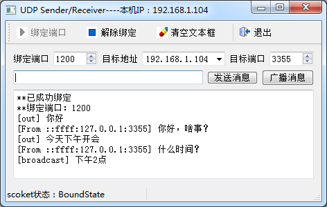
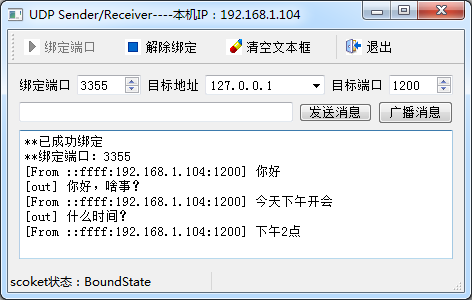

### 14.3.2　UDP单播和广播

#### 1．UDP通信实例程序功能

实例程序samp14_3实现UDP单播和广播，其主窗口是继承自QMainWindow的类，界面用UI设计器设计。程序可以进行UDP数据报的发送和接收，samp14_3的两个运行实例之间可以进行UDP通信，这两个实例可以运行在同一台计算机上，也可以运行在不同的计算机上。图14-8和图14-9是samp14_3两个实例在一台计算机上运行时通信的界面。

在同一台计算机上运行时，两个运行实例需要绑定不同的端口，例如实例A绑定端口1200，实例B绑定端口3355。实例A向实例B发送数据报时，需要指定实例B所在主机的IP地址、绑定端口作为目标地址和目标端口，这样实例B才能接收到数据报。

如果两个实例在不同计算机上运行，则可以使用相同的端口，因为IP地址不同了，不会导致绑定时发生冲突。一般的UDP通信程序都是在不同的计算机上运行的，约定一个固定的端口作为通信端口。

#### 2．主窗口类定义和构造函数

主窗口是基于QMainWindow的类MainWindow，界面采用UI设计器设计。MainWindow类的定义如下（省略了UI设计器为actions和按钮生成的槽函数声明）：


<center class="my_markdown"><b class="my_markdown">图14-8　samp14_3运行实例A（绑定端口1200）</b></center>


<center class="my_markdown"><b class="my_markdown">图14-9　samp14_3运行实例B（绑定端口3355）</b></center>

```css
class MainWindow : public QMainWindow
{
   Q_OBJECT
private:
   QLabel  *LabSocketState; //socket状态显示标签
   QUdpSocket  *udpSocket;
   QString getLocalIP();//获取本机IP地址
public:
   explicit MainWindow(QWidget *parent = 0);
   ~MainWindow();
private slots:
//自定义槽函数
   void   onSocketStateChange(QAbstractSocket::SocketState socketState);
   void   onSocketReadyRead();//读取socket传入的数据
private:
   Ui::MainWindow *ui;
};
```

QUdpSocket类型的私有变量udpSocket是用于UDP通信的socket。

定义了两个自定义槽函数，onSocketStateChange()与udpSocket的stateChange()信号关联，用于显示udpSocket当前的状态；onSocketReadyRead()信号与udpSocket的readyRead()信号关联，用于读取缓冲区的数据报。

MainWindow的构造函数主要完成udpSocket的创建、信号与槽函数的关联，代码如下：

```css
MainWindow::MainWindow(QWidget *parent) :   QMainWindow(parent),
   ui(new Ui::MainWindow)
{
   ui->setupUi(this);
   LabSocketState=new QLabel("Socket状态：");
   LabSocketState->setMinimumWidth(200);
   ui->statusBar->addWidget(LabSocketState);
   QString localIP=getLocalIP();//本机IP
   this->setWindowTitle(this->windowTitle()+"----本机IP："+localIP);
   ui->comboTargetIP->addItem(localIP);
   udpSocket=new QUdpSocket(this);
   connect(udpSocket,SIGNAL(stateChanged(QAbstractSocket::SocketState)),
         this,SLOT(onSocketStateChange(QAbstractSocket::SocketState)));
   onSocketStateChange(udpSocket->state());
   connect(udpSocket,SIGNAL(readyRead()),this,SLOT(onSocketReadyRead()));
}
```

槽函数onSocketStateChange()的功能与14.2节TCP通信程序里的完全一样，不再显示其具体代码。

#### 3．UDP通信的实现

要实现UDP数据的接收，必须先用QUdpSocket::bind()函数绑定一个端口，用于监听传入的数据报，解除绑定则使用abort()函数。程序主窗口上的“绑定端口”和“解除绑定”按钮的响应代码如下：

```css
void MainWindow::on_actStart_triggered()
{//绑定端口
   quint16  port=ui->spinBindPort->value(); //本机UDP端口
   if (udpSocket->bind(port))//绑定端口成功
   {
      ui->plainTextEdit->appendPlainText("**已成功绑定");
      ui->plainTextEdit->appendPlainText("**绑定端口："
            +QString::number(udpSocket->localPort()));
      ui->actStart->setEnabled(false);
      ui->actStop->setEnabled(true);
   }
   else
      ui->plainTextEdit->appendPlainText("**绑定失败");
}
void MainWindow::on_actStop_triggered()
{//解除绑定
   udpSocket->abort(); //解除绑定
   ui->actStart->setEnabled(true);
   ui->actStop->setEnabled(false);
   ui->plainTextEdit->appendPlainText("**已解除绑定");
}
```

绑定端口后，socket的状态变为已绑定状态“BoundState”，解除绑定后状态变为未连接状态“UnconnectedState”。

发送点对点消息和广播消息都使用QUdpSocket:: writeDatagram()函数，窗口上“发送消息”和“广播消息”两个按钮的代码如下：

```css
void MainWindow::on_btnSend_clicked()
{//发送消息 按钮
   QString    targetIP=ui->comboTargetIP->currentText(); //目标IP
   QHostAddress   targetAddr(targetIP);
   quint16    targetPort=ui->spinTargetPort->value();//目标port
   QString  msg=ui->editMsg->text();//发送的消息内容
   QByteArray  str=msg.toUtf8();
   udpSocket->writeDatagram(str,targetAddr,targetPort); //发出数据报
   ui->plainTextEdit->appendPlainText("[out] "+msg);
   ui->editMsg->clear();
   ui->editMsg->setFocus();
}
void MainWindow::on_btnBroadcast_clicked()
{ //广播消息 按钮
   quint16   targetPort=ui->spinTargetPort->value(); //目标端口
   QString  msg=ui->editMsg->text();
   QByteArray  str=msg.toUtf8();
   udpSocket->writeDatagram(str,QHostAddress::Broadcast,targetPort);
   ui->plainTextEdit->appendPlainText("[broadcast] "+msg);
   ui->editMsg->clear();
   ui->editMsg->setFocus();
}
```

使用writeDatagram()函数向一个目标用户发送消息时，需要指定目标地址和端口。

在广播消息时，只需将目标地址更换为一个特殊地址，即广播地址QHostAddress::Broadcast，一般是255.255.255.255。

QUdpSocket发送的数据报是QByteArray类型的字节数组，数据报的长度一般不超过512字节。数据报的内容可以是文本字符串，也可以自定义格式的二进制数据，文本字符串无需以换行符结束。

QUdpSocket接收到数据报后发射readyRead()信号，在关联的槽函数onSocketReadyRead()里读取缓冲区的数据报，代码如下：

```css
void MainWindow::onSocketReadyRead()
{//读取收到的数据报
   while(udpSocket->hasPendingDatagrams())
   {
      QByteArray   datagram;
      datagram.resize(udpSocket->pendingDatagramSize());
      QHostAddress   peerAddr;
      quint16 peerPort;
      udpSocket->readDatagram(datagram.data(), datagram.size(), &peerAddr,&peerPort);
      QString str=datagram.data();
      QString peer="[From "+peerAddr.toString() +":" +QString::number(peerPort)+"] ";
      ui->plainTextEdit->appendPlainText(peer+str);
   }
}
```

hasPendingDatagrams()表示是否有待读取的传入数据报。

pendingDatagramSize()返回待读取数据报的字节数。

readDatagram()函数用于读取数据报的内容，其函数原型为：

```css
qint64 QUdpSocket::readDatagram(char *data, qint64 maxSize, QHostAddress *address = Q_NULLPTR, quint16 *port = Q_NULLPTR)
```

输入参数data和maxSize是必须的，表示最多读取maxSize字节的数据到变量data里。address和port变量是可选的，用于获取数据报来源的地址和端口。上面的代码中使用了完整的参数形式，从而可以获得数据报来源的地址peerAddr和端口peerPort。如果无需获取来源地址和端口，可以采用简略形式，即：

```css
udpSocket->readDatagram(datagram.data(),datagram.size());
```

读取的数据报内容是QByteArray字节数组，因为本程序只是传输字符串，所以简单地将其转换为字符串即可。如果传输的是自定义格式的字符串或二进制数据，需要对接收到的数据进行解析。

