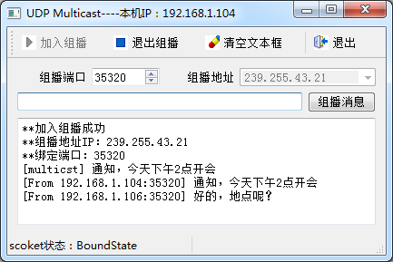
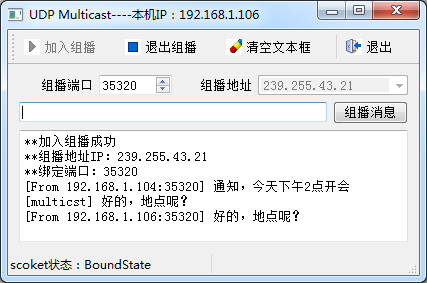

### 14.3.3　UDP组播

#### 1．UDP组播的特性

图14-7的示意图简单表示了组播的原理。UDP组播是主机之间“一对一组”的通信模式，当多个客户端加入由一个组播地址定义的多播组之后，客户端向组播地址和端口发送的UDP数据报，组内成员都可以接收到，其功能类似于QQ群。

组播报文的目的地址使用D类IP地址，D类地址不能出现在IP报文的源IP地址字段。用同一个IP多播地址接收多播数据报的所有主机构成了一个组，称为多播组（或组播组）。所有的信息接收者都加入到一个组内，并且一旦加入之后，流向组地址的数据报立即开始向接收者传输，组中的所有成员都能接收到数据报。组中的成员是动态的，主机可以在任何时间加入和离开组。

所以，采用UDP组播必须使用一个组播地址。组播地址是D类IP地址，有特定的地址段。多播组可以是永久的也可以是临时的。多播组地址中，有一部分由官方分配，称为永久多播组。永久多播组保持不变的是它的IP地址，组中的成员构成可以发生变化。永久多播组中成员的数量可以是任意的，甚至可以为零。那些没有保留下来的供永久多播组使用的IP组播地址，可以被临时多播组利用。关于组播IP地址，有如下的一些约定：

+ 224.0.0.0～224.0.0.255为预留的组播地址（永久组地址），地址224.0.0.0保留不做分配，其他地址供路由协议使用；
+ 224.0.1.0～224.0.1.255是公用组播地址，可以用于Internet；
+ 224.0.2.0～238.255.255.255为用户可用的组播地址（临时组地址），全网范围内有效；
+ 239.0.0.0～239.255.255.255为本地管理组播地址，仅在特定的本地范围内有效。

所以，若是在家庭或办公室局域网内测试UDP组播功能，可以使用的组播地址范围是239.0.0.0～239.255.255.255。

QUdpSocket支持UDP组播，joinMulticastGroup()函数使主机加入一个多播组，leaveMulticast Group()函数使主机离开一个多播组，UDP组播的特点是使用组播地址，其他的端口绑定、数据报收发等功能的实现与单播UDP完全相同。

#### 2．UDP组播实例程序的功能

设计一个UDP组播实例程序Samp14_4，在两台计算机上分别运行，进行组播通信。图14-10是运行于主机192.168.1.104上的程序，图14-11是运行于主机192.168.1.106上的程序。两个主机上的程序都加入地址为239.255.43.21的多播组，绑定端口35320进行通信。

从图14-10和图14-11可以看到，两个Samp14_4程序都可以发送和接收组播数据报，且在自己主机上发出的数据报，自己也可以接收到。


<center class="my_markdown"><b class="my_markdown">图14-10　主机A上运行的Samp14_4程序（主机地址192.168.1.104）</b></center>


<center class="my_markdown"><b class="my_markdown">图14-11　主机B上运行的Samp14_4程序（主机地址192.168.1.106）</b></center>

#### 3．组播功能的程序实现

程序的主窗口是基于QMainWindow的类MainWindow，界面由UI设计器设计，其类定义如下（忽略UI设计器生成的槽函数）：

```css
class MainWindow : public QMainWindow
{
   Q_OBJECT
private:
   QLabel  *LabSocketState;
   QUdpSocket  *udpSocket;
   QHostAddress   groupAddress; //组播地址
   QString getLocalIP(); //获取本机IP地址
public:
   explicit MainWindow(QWidget *parent = 0);
   ~MainWindow();
private slots:
//自定义槽函数
   void   onSocketStateChange(QAbstractSocket::SocketState socketState);
   void   onSocketReadyRead();//读取socket传入的数据
private:
   Ui::MainWindow *ui;
};
```

其中定义了一个QHostAddress类型变量groupAddress，用于记录组播地址。下面是MainWindow的构造函数的代码：

```css
MainWindow::MainWindow(QWidget *parent) :   QMainWindow(parent),
   ui(new Ui::MainWindow)
{
   ui->setupUi(this);
   LabSocketState=new QLabel("Socket状态：");
   LabSocketState->setMinimumWidth(200);
   ui->statusBar->addWidget(LabSocketState);
   QString localIP=getLocalIP();//本地主机名
   this->setWindowTitle(this->windowTitle()+"----本机IP："+localIP);
   udpSocket=new QUdpSocket(this);
   udpSocket->setSocketOption(QAbstractSocket::MulticastTtlOption,1);
   connect(udpSocket,SIGNAL(stateChanged(QAbstractSocket::SocketState)),
         this,SLOT(onSocketStateChange(QAbstractSocket::SocketState)));
   onSocketStateChange(udpSocket->state());
   connect(udpSocket,SIGNAL(readyRead()), this,SLOT(onSocketReadyRead()));
}
```

其中使用了QUdpSocket::setSocketOption()函数，对socket进行参数设置。

```css
udpSocket->setSocketOption(QAbstractSocket::MulticastTtlOption,1);
```

将socket的QAbstractSocket::MulticastTtlOption值设置为1。MulticastTtlOption是UDP组播的数据报的生存期，数据报每跨1个路由会减1。缺省值为1，表示多播数据报只能在同一路由下的局域网内传播。

要进行UDP组播通信，UDP客户端必须先加入UDP多播组，也可以随时退出多播组。主窗口上的“加入组播”和“退出组播”按钮的代码如下：

```css
void MainWindow::on_actStart_triggered()
{//加入组播
   QString   IP=ui->comboIP->currentText();
   groupAddress=QHostAddress(IP);//多播组地址
   quint16   groupPort=ui->spinPort->value();//端口
   if (udpSocket->bind(QHostAddress::AnyIPv4, groupPort, QUdpSocket::ShareAddress))
   {
     udpSocket->joinMulticastGroup(groupAddress); //加入多播组
     ui->plainTextEdit->appendPlainText("**加入组播成功");
     ui->plainTextEdit->appendPlainText("**组播地址IP："+IP);
     ui->plainTextEdit->appendPlainText("**绑定端口："+ QString::number(groupPort));
     ui->actStart->setEnabled(false);
     ui->actStop->setEnabled(true);
     ui->comboIP->setEnabled(false);
   }
   else
     ui->plainTextEdit->appendPlainText("**绑定端口失败");
}
void MainWindow::on_actStop_triggered()
{//退出组播
   udpSocket->leaveMulticastGroup(groupAddress);//退出组播
   udpSocket->abort(); //解除绑定
   ui->actStart->setEnabled(true);
   ui->actStop->setEnabled(false);
   ui->comboIP->setEnabled(true);
   ui->plainTextEdit->appendPlainText("**已退出组播,解除端口绑定");
}
```

加入组播之前，必须先绑定端口，绑定端口的语句是：

```css
udpSocket->bind(QHostAddress::AnyIPv4, groupPort, QUdpSocket::ShareAddress)
```

这里指定地址为QHostAddress::AnyIPv4，端口为多播组统一的一个端口。

使用QUdpSocket:: joinMulticastGroup()函数加入多播组，即：

```css
udpSocket->joinMulticastGroup(groupAddress);
```

多播组地址groupAddress由界面上的组合框里输入。注意，局域网内的组播地址的范围是239.0.0.0～239.255.255.255，绝对不能使用本机地址作为组播地址。

退出多播组，使用QUdpSocket::leaveMulticastGroup()函数，即：

```css
udpSocket->leaveMulticastGroup(groupAddress);
```

加入多播组后，发送组播数据报也是使用writeDatagram()函数，只是目标地址使用的是组播地址，在readyRead()信号的槽函数里用readDatagram()读取数据报。下面是发送和读取数据报的代码：

```css
void MainWindow::on_btnMulticast_clicked()
{//发送组播消息
   quint16   groupPort=ui->spinPort->value();
   QString   msg=ui->editMsg->text();
   QByteArray  datagram=msg.toUtf8();
   udpSocket->writeDatagram(datagram,groupAddress,groupPort);
   ui->plainTextEdit->appendPlainText("[multicst] "+msg);
   ui->editMsg->clear();
   ui->editMsg->setFocus();
}
void MainWindow::onSocketReadyRead()
{//读取数据报
   while(udpSocket->hasPendingDatagrams())
   {
      QByteArray   datagram;
      datagram.resize(udpSocket->pendingDatagramSize());
      QHostAddress   peerAddr;
      quint16 peerPort;
      udpSocket->readDatagram(datagram.data(), datagram.size(), &peerAddr, &peerPort);
      QString str=datagram.data();
      QString peer="[From "+peerAddr.toString()+":" +QString::number(peerPort)+"] ";
      ui->plainTextEdit->appendPlainText(peer+str);
   }
}
```

