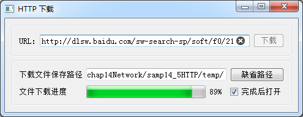

### 14.4.2　基于HTTP协议的网络文件下载

基于上述三个类，设计一个基于HTTP协议的网络文件下载程序，实例程序名称samp14_5，图14-12是程序运行下载文件时的界面。


<center class="my_markdown"><b class="my_markdown">图14-12　基于HTTP的文件下载</b></center>

在URL地址编辑框里输入一个网络文件URL地址，设置下载文件保存路径后，单击“下载”按钮就可以开始下载文件到设置的目录下。进度条可以显示文件下载进度，下载完成后还可以用缺省的软件打开下载的文件。URL里的HTTP地址可以是任何类型的文件，如html、pdf、doc、exe等。

实例samp14_5主界面是基于QMainWindow的窗口类MainWindow，使用UI设计器设计界面，删除了主窗口上的工具栏和状态栏。MainWindow类的定义如下：

```css
class MainWindow : public QMainWindow
{
   Q_OBJECT
private:
   QNetworkAccessManager networkManager;//网络管理
   QNetworkReply *reply;   //网络响应
   QFile  *downloadedFile;//下载保存的临时文件
public:
   explicit MainWindow(QWidget *parent = 0);
   ~MainWindow();
private slots:
//自定义槽函数
   void on_finished();
   void on_readyRead();
   void on_downloadProgress(qint64 bytesRead, qint64 totalBytes);
private:
   Ui::MainWindow *ui;
};
```

要下载文件，先在窗口上的URL编辑框里输入下载地址（可以使用Ctrl+V组合键粘贴URL地址），再设置下载文件保存的目录。单击“缺省路径”按钮会在程序的当前目录下创建一个临时文件夹，代码如下：

```css
void MainWindow::on_btnDefaultPath_clicked()
{//缺省路径  按钮
   QString  curPath=QDir::currentPath();
   QDir   dir(curPath);
   QString  sub="temp";
   dir.mkdir(sub);
   ui->editPath->setText(curPath+"/"+sub+"/");
}
```

输入这些设置后，单击“下载”按钮开始下载过程，“下载”按钮的响应代码如下：

```css
void MainWindow::on_btnDownload_clicked()
{//开始下载
   QString urlSpec = ui->editURL->text().trimmed();
   if (urlSpec.isEmpty())
   {   QMessageBox::information(this, "错误", "请指定需要下载的URL");
      return;
   }
   QUrl newUrl = QUrl::fromUserInput(urlSpec);
   if (!newUrl.isValid())
   {   QMessageBox::information(this, "错误",
      QString("无效URL: %1 \n 错误信息: %2").arg(urlSpec, newUrl.errorString()));
      return;
   }
   QString tempDir =ui->editPath->text().trimmed();
   if (tempDir.isEmpty())
   {  QMessageBox::information(this, "错误", "请指定保存下载文件的目录");
      return;
   }
   QString fullFileName =tempDir+newUrl.fileName(); 
   if (QFile::exists(fullFileName))
      QFile::remove(fullFileName);
   downloadedFile =new QFile(fullFileName);
   if (!downloadedFile->open(QIODevice::WriteOnly))
   {   QMessageBox::information(this, "错误","临时文件打开错误");
      return;
   }
   ui->btnDownload->setEnabled(false);
   reply = networkManager.get(QNetworkRequest(newUrl));
   connect(reply, SIGNAL(finished()), this, SLOT(on_finished()));
   connect(reply, SIGNAL(readyRead()), this, SLOT(on_readyRead()));
   connect(reply, SIGNAL(downloadProgress(qint64,qint64)),
         this, SLOT(on_downloadProgress(qint64,qint64)));
}
```

代码在读取URL地址后，将其转换为一个QUrl类变量newUrl，并检查其有效性，再检查临时文件目录，创建临时文件downloadedFile。

这些准备好之后，用QNetworkAccessManager发布网络请求，请求下载URL地址表示的文件，并创建网络响应，关键代码为：

```css
reply = networkManager.get(QNetworkRequest(newUrl));
```

reply为网络响应，将其3个信号与相关的自定义槽函数相关联，实现相应的操作。这3个槽函数的代码如下：

```css
void MainWindow::on_readyRead()
{//读取下载的数据
   downloadedFile->write(reply->readAll());
}
void MainWindow::on_downloadProgress(qint64 bytesRead, qint64 totalBytes)
{//下载进程
   ui->progressBar->setMaximum(totalBytes);
   ui->progressBar->setValue(bytesRead);
}
void MainWindow::on_finished()
{//网络响应结束
   QFileInfo fileInfo;
   fileInfo.setFile(downloadedFile->fileName());
   downloadedFile->close();
   delete downloadedFile;
   downloadedFile = Q_NULLPTR;
   reply->deleteLater(); 
   reply = Q_NULLPTR;
   if (ui->checkOpen->isChecked())
      QDesktopServices::openUrl(QUrl::fromLocalFile( 
                     fileInfo.absoluteFilePath()));
   ui->btnDownload->setEnabled(true);
}
```

在缓冲区有新下载的数据等待读取时，会发射readyRead()信号，槽函数on_readyRead()读取下载缓冲区的数据到临时文件。

downloadProgress()是表示网络操作进度的信号，传递bytesRead和totalBytes两个参数，表示已读取字节数和总的字节数；on_downloadProgress()槽函数将这两个参数用于进度条的显示，可以显示下载进度。

finished()信号在下载结束后发射，槽函数on_finished()的功能是关闭临时文件，删除文件变量和网络响应变量。然后用QDesktopServices::openUrl()函数调用缺省的应用软件打开下载的文件，例如，如果下载的是一个PDF文件，会自动用相关联的PDF阅读器软件打开此文件。


