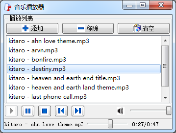

### 15.2.1　使用QMediaPlayer播放音乐文件

#### 1．音频播放器实例程序

QMediaPlayer可以播放经过压缩的音频或视频文件，如mp3、mp4、wmv等文件，QMediaPlayer可以播放单个文件，也可以和QMediaPlaylist类结合，对一个播放列表进行播放。所以使用QMediaPlayer和QMediaPlaylist可以轻松地设计一个自己的音乐或视频播放器。

QMediaPlayer的主要公共函数和槽函数见表15-2（省略了函数中的const关键字和缺省参数）。

<center class="my_markdown"><b class="my_markdown">表15-2　QMediaPlayer的主要函数</b></center>

| 函数原型 | 功能描述 |
| :-----  | :-----  | :-----  | :-----  |
| qint64　duration() | 当前文件播放时间总长，单位ms |
| void　setPosition(qint64 position) | 设置当前文件播放位置，单位ms |
| void　setMuted(bool muted) | 设置是否静音 |
| bool　isMuted() | 返回是否静音的状态，true表示静音 |
| void　setPlaylist(QMediaPlaylist *playlist) | 设置播放列表 |
| QMediaPlaylist*　playlist() | 返回设置的播放列表 |
| State　state() | 返回播放器当前的状态 |
| void　setVolume(int volume) | 设置播放音量，0至100之间 |
| void　setPlaybackRate(qreal rate) | 设置播放速度，缺省为1，表示正常速度 |
| void　setMedia(QMediaContent &media) | 设置播放媒体文件 |
| QMediaContent　currentMedia() | 返回当前播放的媒体文件 |
| void　play() | 开始播放 |
| void　pause() | 暂停播放 |
| void　stop() | 停止播放 |

使用QMediaPlayer播放媒体文件时，有几个有用的信号可以反映播放状态或文件信息。

+ stateChanged(QMediaPlayer::State state)信号在调用play()、pause()和stop()函数时发射，反映播放器当前的状态。枚举类型QMediaPlayer::State有3种取值，表示播放器的状态：

QMediaPlayer::StoppedState，停止状态；

QMediaPlayer::PlayingState，正在播放；

QMediaPlayer::PausedState，暂停播放状态。

+ durationChanged(qint64 duration)信号在文件的时间长度变化时发射，一般在切换播放文件时发射。
+ positionChanged(qint64 position)当前文件播放位置变化时发射，可以反映文件播放进度。

QMediaPlayer可以通过setMedia()函数设置播放单个文件，也可以通过setPlaylist()函数设置一个QMediaPlaylist类实例表示的播放列表，对列表文件进行播放，并且自动播放下一个文件，或循环播放等。QMediaPlayer播放的文件可以是本地文件，也可以是网络上的文件。

QMediaPlaylist记录播放媒体文件信息，可以添加、移除文件，也可以设置循环播放形式，在列表文件中自动切换文件。在当前播放文件切换时会发射currentIndexChanged()信号和currentMediaChange()信号。

使用QMediaPlayer和QMediaPlaylist的这些功能，可以实现一个完整功能的音乐播放器。图15-1是使用QMediaPlayer和QMediaPlaylist实现的一个音乐播放器实例程序samp15_1，它实现了一个音乐播放器的基本功能。


<center class="my_markdown"><b class="my_markdown">图15-1　使用QMediaPlayer和QmediaPlaylist实现的音乐播放器</b></center>

#### 2．界面设计与主窗口类的定义

实例samp15_1是一个界面基于QMainWindow的应用程序，主窗口上删除了菜单栏、工具栏和状态栏，界面采用UI设计器设计，中间是一个QListWidget组件显示播放列表的文件名。其他的界面组件和布局设计不再赘述。

下面是主窗口类的定义（省略了UI设计器自动生成的界面组件的槽函数）：

```css
class MainWindow : public QMainWindow
{
   Q_OBJECT
private:
   QMediaPlayer   *player;//播放器
   QMediaPlaylist  *playlist;//播放列表
   QString  durationTime;//总长度
   QString  positionTime;//当前播放到的位置
public:
   explicit MainWindow(QWidget *parent = 0);
private slots:
//自定义槽函数
   void onStateChanged(QMediaPlayer::State state);
   void onPlaylistChanged(int position);
   void onDurationChanged(qint64 duration);
   void onPositionChanged(qint64 position);
private:
   Ui::MainWindow *ui;
};
```

主要是定义了4个私有变量，4个自定义槽函数。

+ onStateChanged()在播放器播放状态变化时发射，以更新界面上的“播放”“暂停”“停止”按钮的使能状态。
+ onPlaylistChanged()在播放列表的当前文件变化时发射，用以更新界面上显示当前媒体文件名。
+ onDurationChanged()在文件时长变化时发射，用于更新界面上文件时间长度的显示。
+ onPositionChanged()在当前文件播放位置变化时发射，用于更新界面上的播放进度显示。

下面是MainWindow构造函数的代码，主要功能是创建player和playlist，然后进行信号与自定义槽函数的关联。

```css
MainWindow::MainWindow(QWidget *parent) :   QMainWindow(parent),
   ui(new Ui::MainWindow)
{
   ui->setupUi(this);
   player = new QMediaPlayer(this);//播放器
   playlist = new QMediaPlaylist(this);//播放列表
   playlist->setPlaybackMode(QMediaPlaylist::Loop); //循环模式
   player->setPlaylist(playlist);
   connect(player,SIGNAL(stateChanged(QMediaPlayer::State)),
         this, SLOT(onStateChanged(QMediaPlayer::State)));
   connect(player,SIGNAL(positionChanged(qint64)),
         this, SLOT(onPositionChanged(qint64)));
   connect(player,SIGNAL(durationChanged(qint64)),
         this, SLOT(onDurationChanged(qint64)));
   connect(playlist,SIGNAL(currentIndexChanged(int)),
         this, SLOT(onPlaylistChanged(int)));
}
```

下面是4个自定义槽函数的代码：

```css
void MainWindow::onStateChanged(QMediaPlayer::State state)
{//播放器状态变化，更新按钮状态
   ui->btnPlay->setEnabled(!(state==QMediaPlayer::PlayingState));
   ui->btnPause->setEnabled(state==QMediaPlayer::PlayingState);
   ui->btnStop->setEnabled(state==QMediaPlayer::PlayingState);
}
void MainWindow::onPlaylistChanged(int position)
{//播放列表变化,更新当前播放文件名显示
   ui->listWidget->setCurrentRow(position);
   QListWidgetItem  *item=ui->listWidget->currentItem();
   if (item)
      ui->LabCurMedia->setText(item->text());
}
void MainWindow::onDurationChanged(qint64 duration)
{//文件时长变化，更新进度显示
   ui->sliderPosition->setMaximum(duration);
    int   secs=duration/1000;//秒
    int   mins=secs/60; //分钟
    secs=secs % 60;//余数秒
    durationTime=QString::asprintf("%d:%d",mins,secs);
    ui->LabRatio->setText(positionTime+"/"+durationTime);
}
void MainWindow::onPositionChanged(qint64 position)
{//当前文件播放位置变化，更新进度显示
   if (ui->sliderPosition->isSliderDown())//正处于手动调整状态，不处理
      return;
   ui->sliderPosition->setSliderPosition(position);
   int   secs=position/1000;//秒
   int   mins=secs/60; //分钟
   secs=secs % 60;//余数秒
   positionTime=QString::asprintf("%d:%d",mins,secs);
   ui->LabRatio->setText(positionTime+"/"+durationTime);
}
```

#### 3．播放列表控制

窗口中间以一个QListWidget组件显示播放的文件列表，界面上显示的文件列表与playlist存储的文件列表保持同步。

窗口上方的“添加”“移除”“清空”3个按钮的代码如下：

```css
void MainWindow::on_btnAdd_clicked()
{//添加文件
    QString curPath=QDir::homePath();//获取用户目录
    QString dlgTitle="选择音频文件"; 
    QString filter="音频文件(*.mp3 *.wav *.wma);;mp3文件(*.mp3);;wav文件(*.wav);;wma文件(*.wma);;所有文件(*.*)"; 
    QStringList fileList=QFileDialog::getOpenFileNames(this, dlgTitle, curPath, filter);
    if (fileList.count()<1)
       return;
    for (int i=0; i<fileList.count();i++)
    {
      QString aFile=fileList.at(i);
      playlist->addMedia(QUrl::fromLocalFile(aFile));//添加文件
      QFileInfo   fileInfo(aFile);
      ui->listWidget->addItem(fileInfo.fileName());//添加到界面文件列表
    }
    if (player->state()!=QMediaPlayer::PlayingState)
       playlist->setCurrentIndex(0);
    player->play();
}
void MainWindow::on_btnRemove_clicked()
{//移除一个文件
   int pos=ui->listWidget->currentRow();
   QListWidgetItem *item=ui->listWidget->takeItem(pos);
   delete item;//从listWidget里删除
   playlist->removeMedia(pos); //从播放列表里删除
}
void MainWindow::on_btnClear_clicked()
{//清空列表
   playlist->clear();
   ui->listWidget->clear();
   player->stop();
}
```

用到的QMediaPlaylist的主要函数有：

+ addMedia()函数添加一个文件；
+ removeMedia()移除一个文件；
+ setCurrentIndex()设置当前播放文件序号；
+ clear()清空播放列表。

在播放列表中前移和后移使用previous()和next()函数，移动时播放列表会发射currentIndex Changed()信号，从而自动更新界面上listWidget里的当前条目。

在界面上的listWidget里双击一个条目时，切换到播放这个文件，其实现代码为：

```css
void MainWindow::on_listWidget_doubleClicked(const QModelIndex &index)
{//双击时切换播放文件
   int rowNo=index.row();
   playlist->setCurrentIndex(rowNo);
   player->play();
}
```

#### 4．播放控制

播放、暂停或停止播放器，只需调用QMediaPlayer相应函数即可，界面上3个按钮的代码如下：

```css
void MainWindow::on_btnPlay_clicked()
{//播放
   if (playlist->currentIndex()<0)
      playlist->setCurrentIndex(0);
   player->play();
}
void MainWindow::on_btnPause_clicked()
{//暂停播放
   player->pause();
}
void MainWindow::on_btnStop_clicked()
{//停止播放
   player->stop();
}
```

播放状态变化时会发射stateChanged()信号，在关联的自定义槽函数onStateChanged()里更新3个按钮的使能状态。

音量控制由一个“静音”按钮和音量滑动条控制，相关代码如下：

```css
void MainWindow::on_btnSound_clicked()
{//静音控制
   bool mute=player->isMuted();
   player->setMuted(!mute);
   if (mute)
      ui->btnSound->setIcon(QIcon(":/images/images/volumn.bmp"));
   else
      ui->btnSound->setIcon(QIcon(":/images/images/mute.bmp"));
}
void MainWindow::on_sliderVolumn_valueChanged(int value)
{//调整音量
   player->setVolume(value);
}
```

文件播放进度条在onDurationChanged()和onPositionChanged()两个自定义槽函数里会更新，显示当前文件播放进度。当拖动滑动条的滑块可以设置文件播放位置，代码如下：

```css
void MainWindow::on_sliderPosition_valueChanged(int value)
{//文件进度调控
   player->setPosition(value);
}
```

