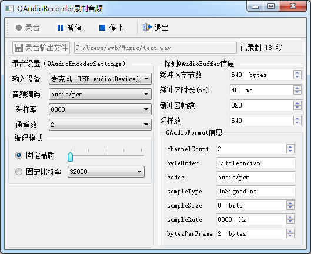
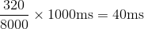
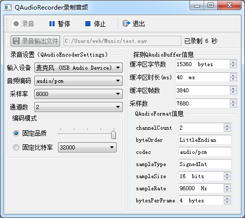

### 15.3.1　使用QAudioRecorder录制音频

#### 1．使用QAudioRecorder录制音频

QAudioRecorder是用于录制音频的类，它从QMediaRecorder类继承而来，只需要较少的代码，就可以实现音频录制并存储到文件。图15-2是使用QAudioRecorder录制音频文件的实例程序samp15_3运行时界面。


<center class="my_markdown"><b class="my_markdown">图15-2　实例samp15_3运行时界面</b></center>

QAudioRecorder需要使用一个QAudioEncoderSettings类型的变量进行输入音频设置，主要是编码格式、采样率、通道数、音频质量等高级设置，图15-2窗口左侧是音频输入设置。

设置一个输出保存文件后就可以使用QAudioRecorder录制文件，录制的数据会自动保存到文件里。音频输入设备会根据音频设置自动确定底层的采样参数，使用QAudioProbe类可以获取音频输入缓冲区的参数和原始数据。图15-2窗口右侧显示了音频输入缓冲区的数据参数，包括缓冲区字节数、帧数、采样数、采样字长、采样率等，通过这些参数就可以从缓冲区读取出原始的音频数据。

#### 2．QAudioRecorder录音功能的实现

samp15_3的主窗口从QMainWindow继承，界面采用UI设计器设计，界面组件和布局的设计不再详述。主窗口类MainWindow的定义如下（省略了UI生成的界面组件的槽函数定义）：

```css
class MainWindow : public QMainWindow
{
   Q_OBJECT
private:
   QAudioRecorder *recorder;//音频录音
   QAudioProbe *probe; //探测器
public:
   explicit MainWindow(QWidget *parent = 0);
private slots:
//自定义槽函数
   void onStateChanged(QMediaRecorder::State state);
   void onDurationChanged(qint64 duration);
   void processBuffer(const QAudioBuffer& buffer);
private:
   Ui::MainWindow *ui;
};
```

QAudioRecorder类型变量recorder用于录音，QAudioProbe类型变量probe用于探测缓冲区数据。

还定义了3个槽函数，用于与recorder和probe的信号进行关联。在窗口的构造函数里创建变量和进行信号与槽的关联。下面是窗口构造函数的代码：

```css
MainWindow::MainWindow(QWidget *parent) :   QMainWindow(parent),
   ui(new Ui::MainWindow)
{  ui->setupUi(this);
   recorder = new QAudioRecorder(this);
   connect(recorder,SIGNAL(stateChanged(QMediaRecorder::State)),
          this,SLOT(onStateChanged(QMediaRecorder::State)));
   connect(recorder, SIGNAL(durationChanged(qint64)), this,
          SLOT(onDurationChanged(qint64)));
   probe = new QAudioProbe;//探测器
   connect(probe, SIGNAL(audioBufferProbed(QAudioBuffer)),
          this, SLOT(processBuffer(QAudioBuffer)));
   probe->setSource(recorder);
   if (recorder->defaultAudioInput().isEmpty())
      return;  //无音频输入设备
   foreach (const QString &device, recorder->audioInputs())
      ui->comboDevices->addItem(device); //音频输入设备列表
   foreach (const QString &codecName, recorder->supportedAudioCodecs())
      ui->comboCodec->addItem(codecName); //支持的音频编码
   foreach (int sampleRate, recorder->supportedAudioSampleRates())
      ui->comboSampleRate->addItem(QString::number(sampleRate)); //采样率
   //channels
   ui->comboChannels->addItem("1");
   ui->comboChannels->addItem("2");
   ui->comboChannels->addItem("4");
   //quality
   ui->sliderQuality->setRange(0, int(QMultimedia::VeryHighQuality));
   ui->sliderQuality->setValue(int(QMultimedia::NormalQuality));
   //bitrates:
   ui->comboBitrate->addItem("32000");
   ui->comboBitrate->addItem("64000");
   ui->comboBitrate->addItem("96000");
   ui->comboBitrate->addItem("128000");
}
```

槽函数onStateChanged()与recorder的stateChanged()信号关联，在recorder的状态变化时控制界面上“录音”“暂停”“停止”等按钮的使能状态。

槽函数onDurationChanged()与recorder的durationChanged()信号关联，该信号在录制持续时间变化时发射，以更新界面上的时间显示。下面是这两个槽函数的代码：

```css
void MainWindow::onStateChanged(QMediaRecorder::State state)
{ //录音状态变化
   ui->actRecord->setEnabled(state!=QMediaRecorder::RecordingState);
   ui->actPause->setEnabled(state==QMediaRecorder::RecordingState);
   ui->actStop->setEnabled(state==QMediaRecorder::RecordingState);
   ui->btnGetFile->setEnabled(state==QMediaRecorder::StoppedState);
   ui->editOutputFile->setEnabled(state==QMediaRecorder::StoppedState);
}
void MainWindow::onDurationChanged(qint64 duration)
{//录音持续时间变化
   ui->LabPassTime->setText(QString("已录制 %1 秒").arg(duration / 1000));
}
```

探测器probe通过setSource()指定探测对象，这里probe的探测对象是recorder。

```css
probe->setSource(recorder);
```

QAudioProbe也可以在音频播放时进行缓冲区探测，也就是可以指定一个QMediaPlayer对象作为探测对象。

槽函数processBuffer()与probe的信号audioBufferProbed()关联，这个信号会传递一个QAudioBuffer类型的变量，这个变量里存储了缓冲区的信息和音频原始数据。

构造函数的后部分对界面上录音设置的组件的内容进行初始化，用到QAudioRecorder类的如下一些函数：

+ defaultAudioInput()函数获取缺省的音频输入设备名称；
+ audioInputs()函数获取音频输入设备列表；
+ supportedAudioCodecs()函数获取支持的音频编码列表；
+ supportedAudioSampleRates()获取支持的音频采样率列表。

选择一个录音输出文件后，就可以通过界面上“录音”“暂停”“停止”三个按钮进行录音控制，三个按钮代码如下：

```css
void MainWindow::on_actRecord_triggered()
{ //开始录音
   if (recorder->state() == QMediaRecorder::StoppedState) //已停止，重新设置
   {
     QString selectedFile=ui->editOutputFile->text().trimmed();
     if (selectedFile.isEmpty())
     {
       QMessageBox::critical(this,"错误","请先设置录音输出文件");
       return;
     }
     if (QFile::exists(selectedFile))
      if (!QFile::remove(selectedFile))
      {
       QMessageBox::critical(this,"错误","所设置录音输出文件无法删除");
       return;
      }
     recorder->setOutputLocation(QUrl::fromLocalFile(selectedFile));
     recorder->setAudioInput(ui->comboDevices->currentText()); //输入设备
     QAudioEncoderSettings settings; //音频编码设置
     settings.setCodec(ui->comboCodec->currentText());//编码
     settings.setSampleRate(ui->comboSampleRate->currentText().toInt());
     settings.setBitRate(ui->comboBitrate->currentText().toInt());//比特率
     settings.setChannelCount(ui->comboChannels->currentText().toInt());
     settings.setQuality(QMultimedia::EncodingQuality( 
              ui->sliderQuality->value()));
     if (ui->radioQuality->isChecked())//编码模式为固定品质
       settings.setEncodingMode(QMultimedia::ConstantQualityEncoding);
     else
       settings.setEncodingMode(QMultimedia::ConstantBitRateEncoding);
     recorder->setAudioSettings(settings); //音频设置
   }
   recorder->record();
}
void MainWindow::on_actPause_triggered()
{ //暂停
   recorder->pause();
}
void MainWindow::on_actStop_triggered()
{//停止
   recorder->stop();
}
```

开始、暂停和停止录音只需调用QAudioRecorder的record()、pause()和stop()函数，这会导致QAudioRecorder的state()发生变化，并发射stateChanged()信号，在关联的槽函数onStateChanged()里更新界面按钮的使能状态。

在“录音”按钮的代码里，如果是从停止状态单击“录音”，将会根据界面的输入用setOutput Location()设置保存文件；并用setAudioInput()设置音频输入设备；然后用一个QaudioEncoder Settings类型变量settings获取录音设置，设置的内容包括：

+ setCodec()设置音频编码，如“audio/pcm”是未经编码的音频格式；
+ setSampleRate()设置采样率，如8000Hz是最低的采样率，44100Hz是一般CD、MP3的采样率，96000Hz是高清晰音轨使用的采样率；
+ setChannelCount()设置通道数，常见的有单声道、立体声（双声道）和四声环绕（四声道）；
+ setBitRate()设置比特率，若用QAudioEncoderSettings::setEncodingMode()设置，编码模式为QMultimedia::ConstantBitRateEncoding，则音频输入设备采用固定的比特率采样，比特率越高，音质越好，一般较高音质如128 kbps；
+ setQuality()设置录音质量，传递的参数是表示录音质量的枚举类型QMultimedia::Encoding Quality，有“VeryLowQuality”到“VeryHighQuality”五个等级。若编码模式设置为固定质量，则音频输入设备会根据质量要求自动设置底层的采样率、字长等参数。

在配置好settings的内容后，为录音器设置音频参数，即：

```css
recorder->setAudioSettings(settings);
```

#### 3．QAudioProbe 获取音频输入缓冲区数据参数

单击“录音”按钮后，就可以根据设置进行录音，录音的数据会自动保存到指定的存储文件里。

由于使用了一个QAudioProbe类型变量probe进行录音数据的探测，在录音过程中，probe会在录音的缓冲区更新数据后发射audioBufferProbed()信号。与audioBufferProbed()信号关联的自定义槽函数processBuffer()对缓冲区的数据信息进行查询和显示，代码如下：

```css
void MainWindow::processBuffer(const QAudioBuffer &buffer)
{ //处理探测到的缓冲区
   ui->spin_byteCount->setValue(buffer.byteCount());//缓冲区字节数
   ui->spin_duration->setValue(buffer.duration()/1000);//缓冲区时长
   ui->spin_frameCount->setValue(buffer.frameCount());//缓冲区帧数
   ui->spin_sampleCount->setValue(buffer.sampleCount());//缓冲区采样数
   QAudioFormat audioFormat=buffer.format();//缓冲区格式
   ui->spin_channelCount->setValue(audioFormat.channelCount()); //通道数
   ui->spin_sampleSize->setValue(audioFormat.sampleSize());//采样大小
   ui->spin_sampleRate->setValue(audioFormat.sampleRate());//采样率
   ui->spin_bytesPerFrame->setValue(audioFormat.bytesPerFrame());
   if (audioFormat.byteOrder()==QAudioFormat::LittleEndian)
      ui->edit_byteOrder->setText("LittleEndian");//字节序
   else
      ui->edit_byteOrder->setText("BigEndian");
   ui->edit_codec->setText(audioFormat.codec());//编码格式
   if (audioFormat.sampleType()==QAudioFormat::SignedInt)//采样点类型
      ui->edit_sampleType->setText("SignedInt");
   else if(audioFormat.sampleType()==QAudioFormat::UnSignedInt)
      ui->edit_sampleType->setText("UnSignedInt");
   else if(audioFormat.sampleType()==QAudioFormat::Float)
      ui->edit_sampleType->setText("Float");
   else
      ui->edit_sampleType->setText("Unknown");
}
```

信号audioBufferProbed()传递一个QAudioBuffer类型的参数buffer，该参数存储了缓冲区的音频采样参数和音频原始数据。通过QAudioBuffer::format()函数可以获得音频格式参数。

```css
QAudioFormat audioFormat=buffer.format();
```

buffer.format()返回一个QAudioFormat类型的变量，存储了音频的格式参数信息。如果要使用音频的原始数据，需要对这些参数有所了解，结合图15-2显示的内容对QAudioFormat的一些函数表示的参数作解释。

+ channelCount()返回音频数据的实际通道数，与前面的音频设置的通道数一致。
+ sampleSize()返回采样点位数，是指一个采样数据点的量化位数，一般有8位、16位和32位。位数越多，声音的分辨率越高，保真度也越高，一般16位即可达到CD的音频质量。
+ sampleRate()返回实际的采样频率，一般等于或大于音频输入设置的采样率，也会根据设置的质量要求自动设置实际的采样率。
+ sampleType()返回采样点格式，是指一个采样点得用什么类型的数据来表示，有无符号整型（UnSignedInt）、有符号整型（SignedInt）和浮点数（Float）。
+ byteOrder()返回字节序，分为大端字节序和小端字节序。
+ codec()返回实际的编码方式。
+ bytesPerFrame()返回每帧字节数，不同音频编码格式的帧的定义不一样，PCM（Pulse Code Modulation，脉冲编码调制）编码的一帧就是各个通道的一次采样数据。

QAudioBuffer还有其他一些函数来说明缓冲区数据的信息，结合图15-2对这些参数进行解释如下。

+ frameCount()返回帧数，对于PCM格式编码的音频数据，一帧就是一次采样点，这个函数返回了缓冲区中数据点的帧数，如320帧。
+ sampleCount()返回采样数，采样数=帧数*通道数，因为是2个通道，所以采样数为640。
+ byteCount()返回缓冲区字节数，字节数=采样数*采样字节数，因为采样点位数位8位，即1个字节，所以缓冲区字节数为640。
+ duration()返回缓冲区时长，时长由帧数和采样频率决定，图中的缓冲区时长为40 ms。因为帧数为320，采样频率为8000 Hz，所以时长为：


QAudioBuffer::data()函数返回缓冲区存储的音频的原始数据，获取这些原始数据，就可以对数据进行分析或处理，如进行语音识别必须先获得这些音频原始数据。

使用QAudioRecorder进行音频输入时，由于设置的采集参数不同，如要求音频质量不同时，底层的音频采样参数会自动调整。与图15-2中的设置相似，只是将音频编码质量设置为最高质量，录音时缓冲区的信息就发生较大的变化，如图15-3所示。图中可以看到缓冲区的采样字长变为了16位，采样率变为了96000 Hz，每帧字节数变为了4字节。

所以在采用QAudioBuffer::data()读取原始数据时，需要根据QAudioBuffer::format()返回的格式参数以及缓冲区帧数、采样数等参数才能正确读取原始数据，这实现起来比较复杂，本例就不演示原始数据的读取了。


<center class="my_markdown"><b class="my_markdown">图15-3　固定品质为最高品质时录音的缓冲区参数</b></center>

