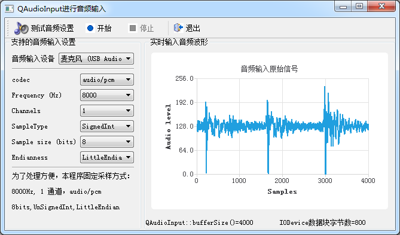

### 15.3.2　使用QAudioInput获取音频输入

#### 1．QAudioInput获取音频输入功能概述

QAudioInput类提供了接收音频设备输入数据的接口，创建QAudioInput对象实例时，需要用两个参数，一个是QAudioDeviceInfo类表示的音频设备，一个是QAudioFormat表示的音频输入格式。QAudioInput::start()函数开始音频数据输入时，需要指定一个流设备接收输入的音频数据，如可以指定一个QFile表示的文件。

QAudioInput与QaudioRecorder的不同之处如下。

+ QAudioInput创建时指定的QaudioFormat将直接作用于音频输入设备，也就是音频输入的数据将直接按照设置的参数进行采样，而QAudioRecorder不能直接控制采样字长、采样点类型等底层参数。
+ QAudioInput::start(QIODevice *device)指定一个QIODevice设备作为数据输出对象，可以是文件，也可以是其他从QIODevice继承的类。如从QIODevice继承一个类，对输入的缓冲区数据进行处理，而不是保存到文件。而QAudioRecorder只能指定文件作为保存对象。所以，QAudioInput可以实现更加底层的音频输入控制。

图15-4是使用QAudioInput实现的一个音频数据输入并实时显示原始信号波形的实例程序samp15_4的运行界面。

图15-4左侧显示的是用QAudioDeviceInfo类获取的音频设备，以及设备支持的各种参数，单击“测试音频设置”可以判断音频设备是否支持所设置的采集配置。为了更方便读取原始数据，在开始采集时采用固定的设置，即8000Hz、1通道、8位、无符号整数。

窗口右侧是一个QChart组件，采用QLineSeries作为显示序列。开始采集后，从缓冲区读取的数据将实时显示在图表上。


<center class="my_markdown"><b class="my_markdown">图15-4　使用QAudioInput获取音频输入并显示原始数据波形</b></center>

#### 2．主窗口定义与初始化

samp15_4的主窗口是基于QMainWindow的类MainWindow，窗口界面设计由UI设计器实现。主窗口类MainWindow的定义如下：

```css
class MainWindow : public QMainWindow
{
   Q_OBJECT
private:
   const qint64  displayPointsCount=4000;
   QLineSeries  *lineSeries;//曲线序列
   QList<QAudioDeviceInfo> deviceList;  //音频输入设备列表
   QAudioDeviceInfo   curDevice;//当前输入设备
   QmyDisplayDevice   *displayDevice; //用于显示的IODevice
   QAudioInput       *audioInput;//音频输入设备
   QString  SampleTypeString(QAudioFormat::SampleType sampleType);
   QString  ByteOrderString(QAudioFormat::Endian endian);
public:
   explicit  MainWindow(QWidget *parent = 0);
   ~MainWindow();
private slots:
//自定义槽函数
   void   on_IODevice_UpdateBlockSize(qint64 blockSize);
private:
   Ui::MainWindow *ui;
};
```

这里定义了较多的私有变量，其中QmyDisplayDevice是一个自定义的从QIODevice继承的类，用于读取音频输入缓冲区的数据，并在图表上显示。其具体实现在后面介绍。

MainWindow的构造函数代码如下：

```css
MainWindow::MainWindow(QWidget *parent) : QMainWindow(parent),
   ui(new Ui::MainWindow)
{
   ui->setupUi(this);
   setCentralWidget(ui->splitter);
//创建显示图表
   QChart *chart = new QChart;
   chart->setTitle("音频输入原始信号");
   ui->chartView->setChart(chart);
   lineSeries= new QLineSeries(); //序列
   chart->addSeries(lineSeries);
   QValueAxis *axisX = new QValueAxis;  //坐标轴
   axisX->setRange(0, displayPointsCount); //chart显示4000个采样点数据
   axisX->setLabelFormat("%g");
   axisX->setTitleText("Samples");
   QValueAxis *axisY = new QValueAxis;  //坐标轴
   axisY->setRange(0, 256); // UnSingedInt采样，数据范围0-255
   axisY->setTitleText("Audio level");
   chart->setAxisX(axisX, lineSeries);
   chart->setAxisY(axisY, lineSeries);
   chart->legend()->hide();
   ui->comboDevices->clear();
   deviceList=QAudioDeviceInfo::availableDevices(QAudio::AudioInput); 
   for(int i=0;i<deviceList.count();i++)
   {
      QAudioDeviceInfo device=deviceList.at(i);
      ui->comboDevices->addItem(device.deviceName());
    }
   if (deviceList.size()>0)
   {
     ui->comboDevices->setCurrentIndex(0); 
     curDevice =deviceList.at(0);//
   }
   else
   {
      ui->actStart->setEnabled(false);
      ui->actDeviceTest->setEnabled(false);
      ui->groupBoxDevice->setTitle("支持的音频输入设置(无设备)");
   }
}
```

构造函数创建了用于图表显示的QChart对象chart，创建了QLineSeries类型的序列lineSeries，创建了X和Y坐标轴；其X轴的范围等于0到显示的数据点的总数4000，Y轴的范围是0至256，采用8位无符号整数，采样数据范围是0至255。

QAudioDeviceInfo::availableDevices(QAudio::AudioInput)可以获取音频输入设备列表，设备名称被添加到窗口上的comboDevices下拉列表框里。

#### 3．音频输入设备支持的格式

在主窗口的构造函数中，向comboDevices下拉列表框中添加了系统所有的音频输入设备。在下拉列表框里选择一个设备时，发射currentIndexChanged(int index)信号，在其槽函数里获取设备支持的各种音频输入参数，包括支持的音频编码、采样率、通道数、采样点类型和采样点大小等，以此更新窗口上的组件显示。

```css
void MainWindow::on_comboDevices_currentIndexChanged(int index)
{//选择音频输入设备
  curDevice =deviceList.at(index);//当前音频设备
  ui->comboCodec->clear(); //支持的音频编码
  QStringList codecs = curDevice.supportedCodecs();
  for (int i = 0; i < codecs.size(); ++i)
   ui->comboCodec->addItem(codecs.at(i));
  ui->comboSampleRate->clear(); //支持的采样率
  QList<int> sampleRate = curDevice.supportedSampleRates();
  for (int i = 0; i < sampleRate.size(); ++i)
   ui->comboSampleRate->addItem(QString("%1").arg(sampleRate.at(i)));
  ui->comboChannels->clear();//支持的通道数
  QList<int> Channels = curDevice.supportedChannelCounts();
  for (int i = 0; i < Channels.size(); ++i)
   ui->comboChannels->addItem(QString("%1").arg(Channels.at(i)));
  ui->comboSampleTypes->clear(); //支持的采样点类型
  QList<QAudioFormat::SampleType> sampleTypes = curDevice.supportedSampleTypes();
  for (int i = 0; i < sampleTypes.size(); ++i)
   ui->comboSampleTypes->addItem(SampleTypeString(sampleTypes.at(i)), QVariant(sampleTypes.at(i)));
  ui->comboSampleSizes->clear();//采样点大小
  QList<int> sampleSizes = curDevice.supportedSampleSizes();
  for (int i = 0; i < sampleSizes.size(); ++i)
   ui->comboSampleSizes->addItem(QString("%1").arg(sampleSizes.at(i)));
  ui->comboByteOrder->clear();//字节序
  QList<QAudioFormat::Endian> endians = curDevice.supportedByteOrders();
  for (int i = 0; i < endians.size(); ++i)
   ui->comboByteOrder->addItem(ByteOrderString(endians.at(i)));
}
QString MainWindow::SampleTypeString(QAudioFormat::SampleType sampleType)
{//将QAudioFormat::SampleType类型转换为字符串
   QString result("Unknown");
   switch (sampleType) {
   case QAudioFormat::SignedInt:
      result = "SignedInt";      break;
   case QAudioFormat::UnSignedInt:
      result = "UnSignedInt";     break;
   case QAudioFormat::Float:
      result = "Float";         break;
   case QAudioFormat::Unknown:
      result = "Unknown";
   }
   return result;
}
QString MainWindow::ByteOrderString(QAudioFormat::Endian endian)
{ //将QAudioFormat::Endian  转换为字符串
  if (endian==QAudioFormat::LittleEndian)
   return "LittleEndian";
  else if (endian==QAudioFormat::BigEndian)
   return "BigEndian";
  else
   return "Unknown";
}
```

创建一个QAudioInput对象时需要传递一个QAudioFormat类型作为参数，用于指定音频输入配置，而音频设备是否支持这些配置需要进行测试。窗口上的“测试音频设置”按钮可以进行测试，代码如下：

```css
void MainWindow::on_actDeviceTest_triggered()
{//测试音频输入设备是否支持选择的设置
  QAudioFormat settings;
  settings.setCodec(ui->comboCodec->currentText());
  settings.setSampleRate(ui->comboSampleRate->currentText().toInt());
  settings.setChannelCount(ui->comboChannels->currentText().toInt());
  settings.setSampleType(QAudioFormat::SampleType(
        ui->comboSampleTypes->currentData().toInt()));
  settings.setSampleSize(ui->comboSampleSizes->currentText().toInt());
  if (ui->comboByteOrder->currentText()=="LittleEndian")
   settings.setByteOrder(QAudioFormat::LittleEndian);
  else
   settings.setByteOrder(QAudioFormat::BigEndian);
  if (curDevice.isFormatSupported(settings))
   QMessageBox::information(this,"音频测试","测试成功，输入设备支持此设置");
  else
   QMessageBox::critical(this,"音频测试","测试失败，输入设备不支持此设置");
}
```

QAudioFormat类对象settings从界面上各个组件获取设置，包括编码格式、采样率、通道数等，然后用QAudioDeviceInfo::isFormatSupported()函数测试是否支持此设置；如果不支持，还可以使用QAudioDeviceInfo的nearestFormat()函数获取最接近的配置。

#### 4．开始音频输入

单击窗口工具栏上“开始”按钮，即可开始音频数据输入，其代码如下：

```css
void MainWindow::on_actStart_triggered()
{//开始音频输入
   QAudioFormat defaultAudioFormat; //缺省格式
   defaultAudioFormat.setSampleRate(8000);
   defaultAudioFormat.setChannelCount(1);
   defaultAudioFormat.setSampleSize(8);
   defaultAudioFormat.setCodec("audio/pcm");
   defaultAudioFormat.setByteOrder(QAudioFormat::LittleEndian);
   defaultAudioFormat.setSampleType(QAudioFormat::UnSignedInt);
   if (!curDevice.isFormatSupported(defaultAudioFormat))
   {
      QMessageBox::critical(this,"测试","测试失败，输入设备不支持此设置");
      return;
   }
   audioInput = new QAudioInput(curDevice,defaultAudioFormat, this);
   audioInput->setBufferSize(displayPointsCount);
// 接收音频输入数据的流设备
   displayDevice = new QmyDisplayDevice(lineSeries, displayPointsCount,this);
   connect(displayDevice,SIGNAL(updateBlockSize(qint64)),
          this,SLOT(on_IODevice_UpdateBlockSize(qint64)));
   displayDevice->open(QIODevice::WriteOnly); 
   audioInput->start(displayDevice); 
   ui->actStart->setEnabled(false);
   ui->actStop->setEnabled(true);
}
```

为了便于解析音频输入的原始数据，音频输入的配置采用固定的简单方式，而不是根据界面上的设置进行配置。音频输入配置固定为8000 Hz采样率、1个通道、8位无符号整数、audio/pcm编码和小端字节序。

创建QAudioInput类对象audioInput时，传递defaultAudioFormat和curDevice作为参数，并设置缓冲区大小为displayPointsCount（等于4000）。

```css
audioInput = new QAudioInput(curDevice,defaultAudioFormat, this);
audioInput->setBufferSize(displayPointsCount);
```

使用setBufferSize设置的缓冲区，需要在调用start()之前设置才有效。缓冲区的大小大于每次更新输入的原始数据块的大小，在图15-4中可见缓冲区大小为4000，而每次更新的原始数据的数据字节数为800。

随后程序创建一个QmyDisplayDevice类型的IO设备displayDevice，这个类实现了流设备的writeData()函数，用于读取音频输入的数据并在曲线上显示。其构造函数接收lineSeries和displayPointsCount作为参数。再将displayDevice的信号updateBlockSize()与一个自定义槽函数关联，然后将displayDevice以只写方式打开。

最后调用QAudioInput::start()函数开始音频输入，以displayDevice作为IO流设备。

```css
audioInput->start(displayDevice);
```

自定义槽函数on_IODevice_UpdateBlockSize()用于显示缓冲区大小和数据块大小，代码如下：

```css
void MainWindow::on_IODevice_UpdateBlockSize(qint64 blockSize)
{//显示缓冲区大小和数据块大小
   ui->LabBufferSize->setText(QString::asprintf(
         "QAudioInput::bufferSize()=%d",audioInput->bufferSize()));
   ui->LabBlockSize->setText(
             QString("IODevice数据块字节数=%1").arg(blockSize));
}
```

#### 5．流设备QmyDisplayDevice的功能实现

使用QAudioInput获取音频输入数据时，需要使用一个QIODevice类型的设备作为流输出设备，一般采用QFile可以将数据记录到文件。本例中使用一个自定义的类QmyDisplayDevice，用于获取音频输入数据并在曲线上实时显示。

QmyDisplayDevice类的定义如下：

```css
#include  <QtCharts>
#include  <QIODevice>
class QmyDisplayDevice : public QIODevice
{
   Q_OBJECT
public:
   explicit QmyDisplayDevice(QXYSeries * series, qint64 pointsCount,QObject *parent = 0);
protected:
   qint64 readData(char * data, qint64 maxSize);
   qint64 writeData(const char * data, qint64 maxSize);
private:
   QXYSeries *m_series;
   qint64  range=4000;
signals:
   void  updateBlockSize(qint64 blockSize);
};
```

因为QmyDisplayDevice类从QIODevice继承，所以具有流数据读写功能。重新实现的readData()和writeData()是实现流数据读写功能的。

定义了m_series和range两个私有变量。m_series是用于图表曲线显示的QXYSeries序列，range缺省值为4000，是序列最多显示的数据点数。构造函数里接收series和pointsCount对上述两个变量进行初始化。

QmyDisplayDevice类的实现代码如下：

```css
QmyDisplayDevice::QmyDisplayDevice(QXYSeries * series, qint64 pointsCount, QObject *parent) :   QIODevice(parent)
{// 构造函数
   m_series= series;
   range=pointsCount;
}
qint64 QmyDisplayDevice::readData(char * data, qint64 maxSize)
{// 流的读操作,不处理
   Q_UNUSED(data)
   Q_UNUSED(maxSize)
   return -1;
}
qint64 QmyDisplayDevice::writeData(const char * data, qint64 maxSize)
{ //读取数据块内的数据，更新到序列
   QVector<QPointF> oldPoints = m_series->pointsVector();
   QVector<QPointF> points; //临时
   if (oldPoints.count() < range)
   { //m_series序列的数据未满4000点，
      points = m_series->pointsVector();
   }
   else
   {//将原来maxSize至4000的数据点前移
      for (int i = maxSize; i < oldPoints.count(); i++)
        points.append(QPointF(i - maxSize, oldPoints.at(i).y()));
   }
   qint64 size = points.count();
   for (int k = 0; k < maxSize; k++) //数据块内的数据填充序列的尾部
      points.append(QPointF(k + size, (quint8)data[k]));
   m_series->replace(points); 
   emit updateBlockSize(maxSize);
   return maxSize;
}
```

QmyDisplayDevice无需实现流的读操作，所以readData()函数不做什么处理，重点是流的写操作writeData()函数的实现。

writeData()传递进来的参数data是数据块的指针，maxSize是数据块的字节数，这是需要读取出来的音频输入数据。

由于音频输入配置为1通道8位无符号的整数采样，所以一个数据点就是一个字节的数据。

显示序列m_series存储的显示数据点个数限定为4000个点，大于maxSize（此例中为800），所以对于序列的数据点的更新采用FIFO（先入先出）的方式。

更新临时数据点向量points，采用序列的replace()函数替换序列原有的数据点向量，是最快的方式。

writeData()函数最后发射信号updateBlockSize(maxSize)，用于主窗口的关联槽函数on_IODevice_UpdateBlockSize()则显示数据块的大小。

