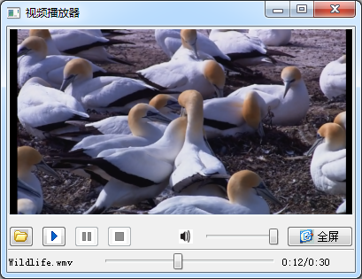

### 15.4.1　在QVideoWidget上播放视频

#### 1．视频播放器实例程序

QVideoWidget是用于显示视频的界面组件，要在项目中使用QVideoWidget，需要在项目配置文件中添加下面一行语句：

```css
****Qt += multimediawidgets
```

使用QMediaPlayer和QVideoWidget实现的一个视频播放器实例程序samp15_5运行时界面如图15-5所示。该程序没有使用QMediaPlaylist，只播放单个文件。


<center class="my_markdown"><b class="my_markdown">图15-5　使用QVideoWidget的视频播放器</b></center>

界面的主体部分是一个QmyVideoWidget类组件，是从QVideoWidget继承的自定义视频显示组件，重载了mousePressEvent()事件，鼠标单击可以暂停或继续播放；重载了keyPressEvent()事件，在全屏状态下按ESC键可以退出全屏。原始的QVideoWidget类没有这些功能。

#### 2．主窗口设计

主窗口是基于QMainWindow的类MainWindow，采用UI设计器设计界面。在设计视频显示组件时，在窗体上放置一个QWidget组件，然后提升为QmyVideoWidget类。

主窗口功能主要是使用一个QMediaPlayer组件播放单个视频文件。媒体播放类QMediaPlayer的功能在15.2节介绍音频播放时已经详细介绍。

MainWindow类定义如下（忽略了自动生成的界面组件的槽函数定义）：

```css
class MainWindow : public QMainWindow
{
   Q_OBJECT
private:
   QMediaPlayer   *player;//视频播放器
   QString  durationTime;
   QString  positionTime;
public:
   explicit MainWindow(QWidget *parent = 0);
   ~MainWindow();
private slots:
//自定义槽函数
   void onStateChanged(QMediaPlayer::State state);
   void onDurationChanged(qint64 duration);
   void onPositionChanged(qint64 position);
private:
   Ui::MainWindow *ui;
};

```

MainWindow类的功能实现代码如下，只播放单个文件，比15.2节的音频播放器功能简单，所以具体代码的功能这里不再赘述。

```css
MainWindow::MainWindow(QWidget *parent) :   QMainWindow(parent),
   ui(new Ui::MainWindow)
{//构造函数
   ui->setupUi(this);
   player = new QMediaPlayer(this);//创建视频播放器
   player->setNotifyInterval(2000);//信息更新周期2000 ms
   player->setVideoOutput(ui->videoWidget);//视频显示组件
   ui->videoWidget->setMediaPlayer(player);//设置显示组件的关联播放器
   connect(player,SIGNAL(stateChanged(QMediaPlayer::State)),
         this, SLOT(onStateChanged(QMediaPlayer::State)));
   connect(player,SIGNAL(positionChanged(qint64)),
         this, SLOT(onPositionChanged(qint64)));
   connect(player,SIGNAL(durationChanged(qint64)),
         this, SLOT(onDurationChanged(qint64)));
}
void MainWindow::onStateChanged(QMediaPlayer::State state)
{//播放器状态变化
   ui->btnPlay->setEnabled(!(state==QMediaPlayer::PlayingState));
   ui->btnPause->setEnabled(state==QMediaPlayer::PlayingState);
   ui->btnStop->setEnabled(state==QMediaPlayer::PlayingState);
}
void MainWindow::onDurationChanged(qint64 duration)
{//文件时长变化
   ui->sliderPosition->setMaximum(duration);
   int   secs=duration/1000;//秒
   int   mins=secs/60; //分钟
   secs=secs % 60;//余数秒
   durationTime=QString::asprintf("%d:%d",mins,secs);
   ui->LabRatio->setText(positionTime+"/"+durationTime);
}
void MainWindow::onPositionChanged(qint64 position)
{//文件播放位置变化
   if (ui->sliderPosition->isSliderDown())
      return; //如果正在拖动滑条，退出
   ui->sliderPosition->setSliderPosition(position);
   int   secs=position/1000;//秒
   int   mins=secs/60; //分钟
   secs=secs % 60;//余数秒
   positionTime=QString::asprintf("%d:%d",mins,secs);
   ui->LabRatio->setText(positionTime+"/"+durationTime);
}
void MainWindow::on_btnAdd_clicked()
{//打开文件
   QString curPath=QDir::homePath();//获取系统当前目录
   QString dlgTitle="选择视频文件"; //对话框标题
   QString filter="wmv文件(*.wmv);;mp4文件(*.mp4);;所有文件(*.*)";
   QString aFile=QFileDialog::getOpenFileName(this, dlgTitle, curPath, filter);
   if (aFile.isEmpty())
     return;
   QFileInfo   fileInfo(aFile);
   ui->LabCurMedia->setText(fileInfo.fileName());
   player->setMedia(QUrl::fromLocalFile(aFile));//设置播放文件
   player->play();
}
void MainWindow::on_btnPlay_clicked()
{//播放
   player->play();
}
void MainWindow::on_btnPause_clicked()
{//暂停
   player->pause();
}
void MainWindow::on_btnStop_clicked()
{//停止
   player->stop();
}
void MainWindow::on_sliderVolumn_valueChanged(int value)
{//调节音量
   player->setVolume(value);
}
void MainWindow::on_btnSound_clicked()
{//静音按钮
   bool mute=player->isMuted();
   player->setMuted(!mute);
   if (mute)
      ui->btnSound->setIcon(QIcon(":/images/images/volumn.bmp"));
   else
      ui->btnSound->setIcon(QIcon(":/images/images/mute.bmp"));
}
void MainWindow::on_sliderPosition_valueChanged(int value)
{//播放位置
   player->setPosition(value);
}
void MainWindow::on_pushButton_clicked()
{//全屏按钮
   ui->videoWidget->setFullScreen(true);
}
```

#### 3．自定义视频显示组件QmyVideoWidget

原始的QVideoWidget在全屏后无法按Esc键退出全屏状态，为了实现按键和鼠标控制功能，从QVideoWidget继承了一个类QmyVideoWidget，其定义如下：

```css
class QmyVideoWidget : public QVideoWidget
{
private:
   QMediaPlayer   *thePlayer;
protected:
   void  keyPressEvent(QKeyEvent *event);
   void  mousePressEvent(QMouseEvent *event);
public:
   QmyVideoWidget(QWidget *parent = Q_NULLPTR);
   void   setMediaPlayer(QMediaPlayer *player);
};
```

私有变量thePlayer是关联的视频播放器，在开始播放之前由主窗口程序调用setMediaPlayer()进行设置，以便在QmyVideoWidget里对播放器进行控制。

下面是QmyVideoWidget类的实现代码：

```css
void QmyVideoWidget::keyPressEvent(QKeyEvent *event)
{//按键事件，ESC退出全屏状态
   if ((event->key() == Qt::Key_Escape)&&(isFullScreen()))
   {
      setFullScreen(false);
      event->accept();
      QVideoWidget::keyPressEvent(event);
   }
}
void QmyVideoWidget::mousePressEvent(QMouseEvent *event)
{//鼠标事件，单击控制暂停和继续播放
   if (event->button()==Qt::LeftButton)
   {
      if (thePlayer->state()==QMediaPlayer::PlayingState)
        thePlayer->pause();
      else
        thePlayer->play();
   }
   QVideoWidget::mousePressEvent(event);
}
void QmyVideoWidget::setMediaPlayer(QMediaPlayer *player)
{//设置播放器
   thePlayer=player;
}
```

