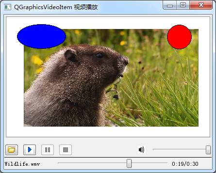

### 15.4.2　在QGraphicsVideoItem上播放视频

QMediaPlayer解码的视频还可以在QGraphicsVideoItem类组件上显示。QGraphicsVideoItem是继承自QGraphicsItem的类，是适用于Graphics/View模式的图形显示组件。所以在使用QGraphicsVideoItem显示视频时，可以在显示场景中和其他图形组件组合显示，也可以使用QGraphicsItem类的放大、缩小、拖动、旋转等功能。

图15-6所示是使用QMediaPlayer和QGraphicsVideoItem播放视频的示例程序samp15_6运行时界面。窗口主体部分是一个QGraphicsView组件，在这个图形视图中创建了一个QGraphicsVideoItem对象用于显示播放的视频，还创建了两个图形组件，这些组件都可以拖动。


<center class="my_markdown"><b class="my_markdown">图15-6　使用QGraphicsVideoItem的视频播放器</b></center>

主窗口构造函数的部分代码如下：

```css
MainWindow::MainWindow(QWidget *parent) :   QMainWindow(parent),
   ui(new Ui::MainWindow)
{
   ui->setupUi(this);
   player = new QMediaPlayer(this);
   player->setNotifyInterval(2000);
   QGraphicsScene *scene = new QGraphicsScene(this);
   ui->graphicsView->setScene(scene);
   videoItem = new QGraphicsVideoItem;
   videoItem->setSize(QSizeF(360, 240));
   videoItem->setFlags(QGraphicsItem::ItemIsMovable
                | QGraphicsItem::ItemIsSelectable
                | QGraphicsItem::ItemIsFocusable);
   scene->addItem(videoItem);
   player->setVideoOutput(videoItem);//设置视频显示图形组件
   connect(player,SIGNAL(stateChanged(QMediaPlayer::State)),
          this, SLOT(onStateChanged(QMediaPlayer::State)));
   connect(player,SIGNAL(positionChanged(qint64)),
          this, SLOT(onPositionChanged(qint64)));
   connect(player,SIGNAL(durationChanged(qint64)),
          this, SLOT(onDurationChanged(qint64)));
}
```

代码创建QGraphicsVideoItem类型变量videoItem，并且设置其为可移动、可选择、可以获得焦点。设置视频播放器player视频输出到videoItem上显示。

图15-6中程序其他功能的实现与实例samp15_5，这里不再赘述。

