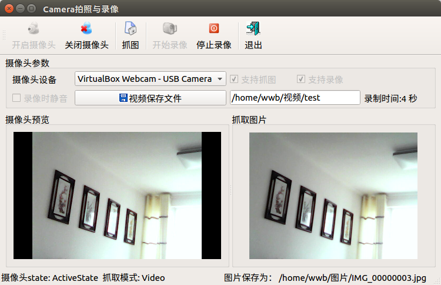

### 15.5.1　摄像头控制概述

Qt多媒体模块为摄像头控制提供了几个类，可以用于获取摄像头设备信息，通过摄像头进行拍照和录像。

（1）摄像头设备信息类QCameraInfo。

QCameraInfo用于获取系统的摄像头设备信息，有两个静态函数获取摄像头设备：

+ QList<QCameraInfo>　availableCameras()，返回QCameraInfo类的列表，表示系统可用的摄像头设备列表；
+ QCameraInfo　defaultCamera()，返回系统缺省的摄像头设备信息。

QCameraInfo有几个函数表示摄像头信息：

+ QString　description()，返回摄像头设备描述；
+ QString　deviceName()，返回摄像头设备名称；
+ QCamera::Position　position()，返回摄像头的位置，如手机设备上一般有两个摄像头，前置摄像头位置类型为QCamera::FrontFace，后置摄像头位置类型为QCamera::BackFace，未指定位置的是QCamera::UnspecifiedPosition。

（2）摄像头控制类QCamera。

QCamera是用于控制摄像头的类，创建QCamera对象时需传递一个QCameraInfo对象作为参数，QCamera主要的功能函数包括以下几个。

+ setViewfinder()，为摄像头指定一个QVideoWidget或QGraphicsVideoItem对象作为取景器，用于摄像头图像预览。
+ QCameraExposure　*exposure()，返回用于曝光控制的对象。
+ QCameraFocus　*focus()，返回用于聚焦控制的对象。
+ setCaptureMode(QCamera::CaptureModes mode)，用于设置摄像头处于不同的工作模式，QCamera::CaptureModes枚举类型的取值有：

QCamera::CaptureViewfinder，取景器模式；

QCamera::CaptureStillImage，抓取静态图片模式；

QCamera::CaptureVideo，视频录制模式。

+ bool isCaptureModeSupported(CaptureModes mode)，判断摄像头是否支持某种抓取模式。

（3）静态图片抓取类QCameraImageCapture。

QCameraImageCapture用于控制摄像头进行静态图片的抓取。

（4）视频和音频录制类QMediaRecorder。

QMediaRecorder通过摄像头和音频输入设备进行录像。

> **注意**
> 使用Qt多媒体模块的摄像头相关类无法在Windows平台上进行视频录制，只能进行静态图片抓取，但是在Linux平台上可以实现静态图片抓取和视频录制。所以，本节的实例程序在Linux平台（64位版本的Ubuntu 16.04）上测试。

Qt多媒体模块的功能实现是依赖于平台的。在Windows平台上，Qt多媒体模块依赖于两个插件，一个是使用Microsoft DirectShow API的插件，DirectShow API在Windows 98引入，在Windows XP以后就逐渐过时了；另一个是Windows Media Foundation（WMF）架构的插件，WMF插件在Windows Vista引入，用于替代DirectShow API。

Qt中的WMF插件目前无法提供摄像头支持，对摄像头的有限支持是由DirectShow插件提供的，目前只能显示取景器和抓取静态图片，其他大部分功能不支持。所以，目前在Windows平台上，Qt的摄像头控制不支持视频录制功能，也不支持底层的视频功能，如使用QVideoProbe监测视频帧。

对于这些限制的原文介绍可以参考Qt官网上“Qt Multimedia on Windows”的解释。

所以，本节的实例程序samp15_7在64位版本的Ubuntu 16.04桌面系统上测试，Ubuntu系统运行于VirtualBox虚拟机上。图15-7所示是程序运行时界面。

<b class="my_markdown">图15-7　实例samp15_7运行时界面</b>

工具栏上几个按钮的功能一目了然，“摄像头参数”里显示摄像头的参数，以及录制视频的一些设置。窗口工作区左侧的“摄像头预览”框里显示摄像头的实时图像预览，右侧“抓取图片”框里显示抓取的静态图片。

