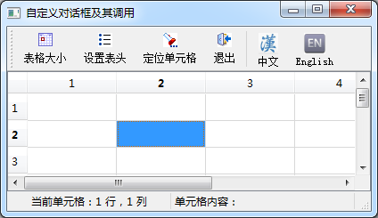

### 16.1.3　生成语言翻译文件

要生成多语言界面相关的翻译文件，除了之前所说的在对每个字符串都使用tr()函数封装之外，还需要在项目配置文件（.pro文件）中使用TRANSLATIONS定义语言翻译文件（.ts文件），并使用lupdate工具生成语言翻译文件。

作为实例，将第6章的samp6_2作为多语言界面设计实例，复制项目samp6_2的全部文件，并将项目名称更改为samp16_1。在项目的配置文件中增加如下的设置语句：

```css
TRANSLATIONS =samp16_1_cn.ts\
 samp16_1_en.ts
```

这里设置生成两个语言翻译文件“samp16_1_cn.ts”和“samp16_1_en.ts”，分别是中文和英文翻译文件。文件名称可以任意设计，只要有所区分即可。

原始的程序设计采用中文。为了便于进行语言切换，在主窗口上设置了两个工具栏按钮，分别用于切换中文和英文界面（如图16-1所示），界面语言切换的代码实现会在下一小节介绍。


<center class="my_markdown"><b class="my_markdown">图16-1　实例samp16_1运行时主窗口</b></center>

为了让lupdate工具能提取项目代码内的字符串，这里对项目程序里的字符串全部采用tr()函数封装，对于不符合tr()函数使用规则的地方进行修改。例如，之前在状态栏上显示当前单元格的行号和列号的程序是：

```css
    LabCellPos->setText(QString::asprintf("当前单元格：%d行，%d列",
                      current.row(),current.column()));
```

现在就修改为如下形式：

```css
    LabCellPos->setText(tr("当前单元格：%1 行，%2 列"
                     ).arg(current.row()).arg(current.column()));
```

在项目设计期间，任何时候都可以使用lupdate工具生成或更新翻译文件，方法是单击Qt Creator主菜单的“Tools”→“External”→“Qt 语言家”→“Update Translations(lupdate)”菜单项，若项目的源程序目录下没有samp16_1_cn.ts和samp16_1_en.ts这两个文件，就会自动生成，如果文件已经存在，则会更新这两个文件的内容。

