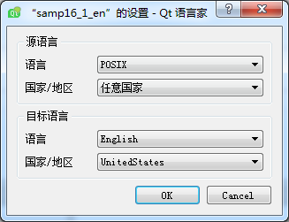
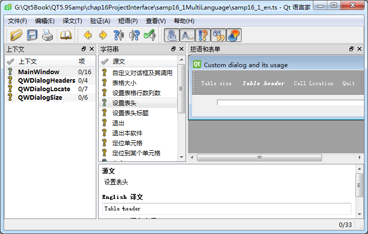

### 16.1.4　使用Qt Linguist翻译ts文件

生成的samp16_1_cn.ts和samp16_1_en.ts文件内包含了项目源程序和UI界面里的所有字符串，使用Qt Linguist可以将这些字符串翻译为需要的语言版本。在Qt安装后的程序组里可以找到Qt Linguist软件。

samp16_1_cn.ts是中文界面的翻译文件，由于源程序的界面就是用中文设计的，所以无需再翻译。samp16_1_en.ts是英文翻译文件，需要将提取的所有中文字符串翻译为英文。

在Linguist软件中打开文件samp16_1_en.ts，当第一次打开一个ts文件时，Linguist会出现如图16-2所示的语言设置对话框，用于设置目标语言和所在国家和地区。这个对话框也可以通过Linguist主菜单的“编辑”→“翻译文件设置”菜单项调出。samp16_1_en.ts是用于英文界面的翻译文件，所以选择语言“English”，国家/地区可选择“UnitedStates”。

<b class="my_markdown">图16-2　Linguist软件设置语种的对话框</b>

打开samp16_1_en.ts文件后的Linguist软件界面如图16-3所示。左侧“上下文”列表里列出了项目中的所有窗口或类，这个项目有4个窗口。“字符串”列表里列出了从项目的UI窗口和代码文件中提取的字符串，右侧“短语和表单”会显示窗口界面的预览或字符串在源程序中出现的代码段。

在“字符串”列表中选择一个源文后，在下方会出现译文编辑框，在此填写字符串对应的英文译文。Linguist可以同时打开项目的多个ts文件，在选中一个源文后，在下方会出现对应的多个语言的译文编辑框，可以同时翻译为多个语言版本。

<b class="my_markdown">图16-3　Linguist软件翻译ts文件的界面</b>

