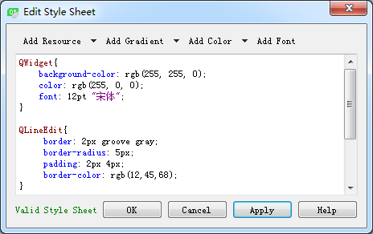

### 16.2.1　Qt样式表

Qt样式表（style sheet）是用于定制用户界面的强有力的机制，其概念、术语是受到HTML中的级联样式表（Cascading Style Sheets，CSS）启发而来的，只是Qt 样式表是应用于窗体界面的。

与HTML的CSS类似，Qt的样式表是纯文本的格式定义，在应用程序运行时可以载入和解析这些样式定义。使用样式表可以定义各种界面组件（QWidget类及其子类）的样式，从而使应用程序的界面呈现不同的效果。很多软件具有换肤功能，使用Qt的样式表就可以容易地实现这样的功能。

在UI设计器中集成了Qt样式表的编辑功能。在设计窗时，选择窗体或某个界面组件，单击鼠标右键，在弹出的快捷菜单中选择“Change styleSheet…”菜单项就可以出现样式表编辑对话框。图16-4所示是某个窗体的样式表编辑对话框，已经对窗体和一些类设置了样式定义，例如：

```css
QWidget{
    background-color: rgb(255, 255, 0);
    color: rgb(255, 0, 0);
    font: 12pt "宋体";
}
```

这定义了QWidget类的背景颜色、字体大小和名称、前景颜色。这个样式定义会应用于QWidget类及其子类。

```css
QLineEdit{
    border: 2px groove gray;
    border-radius: 5px;
    padding: 2px 4px;
    border-color: rgb(12,45,68);
}
```

这定义了QLineEdit类的显示效果，包括边框宽度、圆角边框的半径和边框颜色等。


<center class="my_markdown"><b class="my_markdown">图16-4　样式表编辑对话框</b></center>

在图16-4中的对话框内，上方有几个具有下拉菜单的按钮，可以添加一些常用的样式属性，如前景色color、背景色background-color、选中后颜色selection-color，以及背景图片background- image等。

