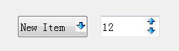
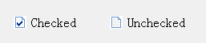
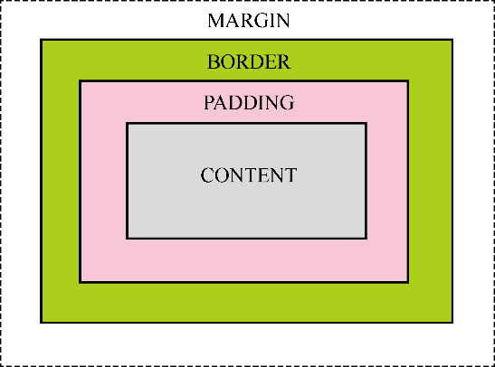

### 16.2.2　Qt样式表句法

#### 1．一般句法格式

Qt样式表的句法（syntax）与HTML的CSS句法几乎完全相同。Qt样式表包含一系列的样式法则，一个样式法则由一个选择器（selector）和一些声明（declaration）组成。例如：

```css
QPlainTextEdit{
    font: 12pt "仿宋";
    color: rgb(255, 255, 0);
    background-color: rgb(0, 0, 0);
}
```

其中，QPlainTextEdit就是选择器，表明后面花括号里的样式声明应用于QPlainTextEdit类及其子类。样式声明部分是样式法则列表，每个样式法则由属性和值组成，每条法则用分号结束。每条样式法则由“属性：值”构成，例如：

```css
font: 12pt  "仿宋";
```

表示font属性，字体大小为12pt，字体名称为“仿宋”；当一个属性有多个值时，多个值用空格隔开。

#### 2．选择器（selector）

Qt样式表支持CSS2中定义的所有选择器，表16-1显示的是一些常用的选择器。

<center class="my_markdown"><b class="my_markdown">表16-1　Qt样式表中的选择器类型</b></center>

| 选择器 | 例子 | 用途 |
| :-----  | :-----  | :-----  | :-----  | :-----  |
| 通用选择器 | * | 所有组件 |
| 类型选择器 | QPushButton | 所有QPushButton类及其子类的组件 |
| 属性选择器 | QPushButton[flat=”false”] | 所有flat 属性为false的QPushButton类及其子类的组件。如果样式表应用后组件的属性再发生变化，需要重新应用样式表才能刷新显示效果 |
| 非子类选择器 | .QPushButton | 所有QPushButton类的组件，但是不包括QPushButton的子类 |
| ID选择器 | QPushButton#btnOK | ObjectName为btnOK的QPushButton实例 |
| 从属对象选择器 | QDialog QPushButton | 所有从属于QDialog的QPushButton类的实例，即QDialog对话框里的所有QPushButton |
| 子对象选择器 | QDialog > QPushButton | 所有直接从属于QDialog的QPushButton类的实例 |

这些选择器的定义为选择界面组件提供了灵活性。选择器可以组合使用，一个样式声明可以应用于多个选择器，例如：

```css
QPlainTextEdit,QLineEdit,QPushButton,QCheckBox{
    color: rgb(255, 255, 0);
    background-color: rgb(0, 0, 0);
}
```

这个样式声明将同时应用于QPlainTextEdit、QLineEdit、QPushButton和QCheckBox的实例。

```css
QLineEdit[readOnly="true"], QCheckBox[checked="true"]
{ background-color: rgb(255, 0, 0) }
```

上面的这个样式应用于readOnly属性为true的QLineEdit和checked属性为true的QCheckBox实例，功能是使其背景颜色为红色。

在Qt中，可以为一个界面组件使用QObject::setProperty()设置一个动态属性，例如，在数据表编辑界面上，一些字段是必填字段，就可以为这些字段的关联组件设置一个required属性为true，如：

```css
editName->setProperty("required", "true");
comboSex-> setProperty("required", "true");
checkAgree-> setProperty("required", "true");
```

这样设置了三个界面组件的动态属性required为true。

那么，可以应用下面的样式将这种必填字段的背景颜色设置为亮绿色。

```css
*[required="true"] {background-color: lime}
```

#### 3．子控件（sub-controls）

对于一些组合的界面组件，需要对其子控件进行选择，如QComboBox的下拉按钮，或QSpinBox的上、下按钮。通过选择器的子控件可以对这些界面元素进行显示效果控制。例如：

```css
QComboBox::drop-down{ image: url(:/images/images/down.bmp); }
```

选择器QComboBox::drop-down选择了QComboBox的drop-down子控件，定义的样式是设置其image属性为资源文件中的图片down.bmp。

```css
QSpinBox::up-button{ image: url(:/images/images/up.bmp); }
QSpinBox::down-button{ image: url(:/images/images/down.bmp); }
```

这两条样式定义语句分别定义了QSpinBox的上、下按钮的图片，用资源文件中的图片替代了缺省的图片。

这样定义的QComboBox和QSpinBox具有如图16-5所示的显示效果。


<center class="my_markdown"><b class="my_markdown">图16-5　自定义了按钮图片的QComboBox和QSpinBox</b></center>

Qt中常用的子控件见表16-2，所有子控件的详细描述见Qt的帮助文档。

<center class="my_markdown"><b class="my_markdown">表16-2　Qt样式表中常见的子控件列表</b></center>

| 子控件名称 | 说明 |
| :-----  | :-----  | :-----  | :-----  |
| ::branch | QTreeView的分支指示器 |
| ::chunk | QProgressBar 的进度显示块 |
| ::close-button | QDockWidget或QTabBar页面的关闭按钮 |
| ::down-arrow | QComboBox，QHeaderView (排序指示器)，QScrollBar 或QSpinBox的下拉箭头 |
| ::down-button | QScrollBar或 QSpinBox的向下按钮 |
| ::drop-down | QComboBox的下拉按钮 |
| ::float-button | QDockWidget的浮动按钮 |
| ::groove | QSlider的凹槽 |
| ::indicator | QAbstractItemView，QCheckBox，QRadioButton，可勾选的QMenu 菜单项，或可勾选的QGroupBox的指示器 |
| ::handle | QScrollBar，QSplitter或QSlider的滑块 |
| ::icon | QAbstractItemView或 QMenu的图标 |
| ::item | QAbstractItemView，QMenuBar，QMenu，或QStatusBar的一个项 |
| ::left-arrow | QScrollBar的向左箭头 |
| ::menu-arrow | 具有下拉菜单的QToolButton的下拉箭头 |
| ::menu-button | QToolButton的菜单按钮 |
| ::menu-indicator | QPushButton的菜单指示器 |
| ::right-arrow | QMenu 或QScrollBar的右侧箭头 |
| ::pane | QTabWidget的面板 |
| ::scroller | QMenu 或 QTabBar的卷轴 |
| ::section | QHeaderView的分段 |
| ::separator | QMenu 或QMainWindow的分隔器 |
| ::tab | QTabBar 或QToolBox的分页 |
| ::tab-bar | QTabWidget的分页条。这个子控件只用于控制QTabBar在QTabWidget中的位置，定义分页的样式使用::tab子控件 |
| ::text | QAbstractItemView的文字 |
| ::title | QGroupBox或QDockWidget的标题 |
| ::up-arrow | QHeaderView (排序指示器)，QScrollBar或 QSpinBox的向上箭头 |
| ::up-button | QSpinBox的向上按钮 |

#### 4．伪状态（pseudo-states）

选择器可以包含伪状态，使得样式法则只能应用于界面组件的某个状态，也就是一种条件应用法则。伪状态出现在选择器的后面，用一个冒号（:）隔开。如下面的样式法则：

```css
QLineEdit:hover{
    background-color: black;
    color: yellow;
}
```

定义了当鼠标移动到QLineEdit上方时（hover），改变QLineEdit的背景色和前景色。

可以对伪状态取反，方法是在伪状态前面加一个感叹号（!），如：

```css
QLineEdit:!read-only{ background-color: rgb(235, 255, 251); }
```

这定义了readonly属性为false的QLineEdit的背景色。

伪状态可以串联使用，相当于逻辑与的计算，例如：

```css
QCheckBox:hover:checked{ color: red; }
```

这定义了当鼠标移动到一个被勾选了的QCheckBox组件上方时，其字体颜色变为红色。

伪状态可以并联使用，相当于逻辑或的计算，例如：

```css
QCheckBox:hover, QCheckBox:checked{ color: red; }
```

这表示鼠标移动到QCheckBox组件上方，或QCheckBox组件被勾选时，字体颜色变为红色。

子控件也可以使用伪状态，如：

```css
QCheckBox::indicator:checked{ image: url(:/images/images/checked.bmp);}
QCheckBox::indicator:unchecked{image: url(:/images/images/unchecked.bmp);}
```

这里定义了QCheckBox的indicator在checked和unchecked两种状态下的显示图片，可以得到如图16-6所示的效果。


<center class="my_markdown"><b class="my_markdown">图16-6　自定义图片作为QCheckBox的指示器</b></center>

Qt样式定义中常见的一些伪状态见表16-3，熟悉这些伪状态并灵活应用可以定义自己想要的界面效果。

<center class="my_markdown"><b class="my_markdown">表16-3　Qt样式表中常见的伪状态</b></center>

| 伪状态 | 描述 |
| :-----  | :-----  | :-----  | :-----  |
| :active | 当组件处于一个活动的窗体时，此状态为真 |
| :adjoins-item | QTreeView::branch与一个条目相邻时，此状态为真 |
| :alternate | 当QAbstractItemView的alternatingRowColors()属性为true时，绘制交替的行时此状态为真 |
| :bottom | 组件处于底部，如QTabBar的表头位于底部 |
| :checked | 组件被勾选，如QAbstractButton的checked属性为true |
| :closable | 组件可以被关闭，例如当QDockWidget 的DockWidgetClosable属性为true时 |
| :closed | 条目处于关闭状态，例如QTreeView的一个没有展开的条目 |
| :default | 条目是缺省的，如一个缺省的QPushButton按钮，或QMenu中一个缺省的action |
| :disabled | 条目被禁用 |
| :editable | QComboBox是可编辑的 |
| :edit-focus | 条目有编辑焦点 |
| :enabled | 条目被使能 |
| :exclusive | 条目是一个排他性组的一部分，例如一个排他性QActionGroup的一个菜单项 |
| :first | 第一个项，例如QTabBar中的第一个页 |
| :flat | 条目是flat的，例如QPushButton的flat属性设置为true时 |
| :focus | 条目具有输入焦点 |
| :has-children | 条目有子条目，例如QTreeView的一个节点具有子节点 |
| :horizontal | 条目具有水平方向 |
| :hover | 鼠标移动到条目上方时 |
| :last | 最后一个项，例如QTabBar中的最后一页 |
| :left | 条目位于左侧，例如QTabBar的页头位于左侧 |
| :maximized | 条目处于最大化，例如最大化的QMdiSubWindow窗口 |
| :minimized | 条目处于最小化，例如最小化的QMdiSubWindow窗口 |
| :movable | 条目是可移动的 |
| :off | 对于可以切换状态的条目，其状态处于”off” |
| :on | 对于可以切换状态的条目，其状态处于”on” |
| :open | 条目处于打开状态，例如QTreeView的一个展开的条目 |
| :pressed | 条目上按下了鼠标 |
| :read-only | 条目是只读或不可编辑的 |
| :right | 条目位于右侧，例如QTabBar的页头位于右侧 |
| :selected | 条目被选中，例如QTabBar中一个被选中的页，或QMenu中一个被选中的菜单项 |
| :top | 条目位于顶端，例如QTabBar的页头位于顶端 |
| :unchecked | 条目处于被被选中状态 |
| :vertical | 条目处于垂直方向 |

#### 5．属性

Qt样式表内对每一个选择器可定义多条样式规则，每个规则是一个“属性：值”对，Qt样式表中可定义的属性很多，可以在Qt的帮助文件中查找“Qt Style Sheets Reference”查看所有属性的详细说明。

在图16-4所示的样式表编辑对话框中，从上方的几个按钮的下拉菜单中可以设计常用的一些属性，如“Add Resource”按钮下三个菜单项可以从项目的资源文件中选择图片作为background- image、border-image或image属性的值；“Add Color”按钮的下拉菜单用于设置组件的各种颜色，包括前景色、背景色、边框颜色等，颜色的值可以用rgb()、rgba()函数表示，或Qt能识别的颜色常量。

使用样式表可以定义组件复杂的显示效果。每个界面组件都可以用如图16-7所示的盒子模型（Box Model）来表示，模型由四个同心矩形表示。


<center class="my_markdown"><b class="my_markdown">图16-7　组件的盒子模型（来自Qt帮助文件）</b></center>

（1）content是显示内容矩形区域，如QLineEdit用于显示文字的区域，min-width、max-width、min-height和max-height属性定义最大/最小宽度或高度，就是定义这个矩形区，例如：

```css
QLineEdit{
    min-width:50px;
    max-height:40px;
}
```

这定义QLineEdit最小宽度为50px，最大高度是40px，其中px是单位，表示像素。

（2）padding是包围content的矩形区域，通过padding属性可以定义padding的宽度，或padding-top、padding-bottom、padding-left和padding-right分别定义padding的上、下、左、右宽度，例如：

```css
QLineEdit{ padding: 0px 10px 0px 10px;}
```

这设定padding的上、右、下、左的宽度，它等效于：

```css
QLineEdit{
    padding-top:0px;
    padding-right:10px;
    padding-bottom: 0px;
    padding-left:10px;
}
```

（3）border是包围padding的边框，通过border属性（或border-width、border-style、border-color）可以定义边框的线宽、线型和颜色，也可以分别定义border的上、下、左、右的线宽和颜色。使用border-radius可以定义边框转角的圆弧半径，从而构造具有圆角矩形的编辑或按钮等组件，例如：

```css
QLineEdit{
    border-width: 2px;
    border-style: solid;
    border-color: gray;
    border-radius: 10px;
    padding: 0px 10px; 
}
```

这使得QLineEdit具有灰色边框线条、圆角矩形的效果。

通过border-radius、min-width和min-height等属性可以设计圆形的按钮，如：

```css
QPushButton {
    border: 2px groove red;
    border-radius: 30px;
    min-width:60px;
    min-height:60px;   }
```

使得边框转角半径等于content宽度或长度的一半，宽度和长度相等，就可以得到一个圆形的按钮。

使用border-image属性还可以为组件设置背景图片，图片会填充border矩形框之内的区域，一般使用材质图片设置背景，以使界面具有统一的特色，例如：

```css
QLineEdit, QPushButton{border-image: url(:/images/images/border.jpg);}
```

（4）margin是border之外与父组件之间的空白边距，可以分别定义上、下、左、右的边距大小。

缺省的情况下，margin、border-width和 padding 属性缺省值为零，这种情况下，四个同心矩形就是重合的一个矩形。

使用Qt样式表可以为界面组件设计各种美观的显示效果，美观而特殊的界面不仅需要编程的能力，更重要的是美工设计能力。

